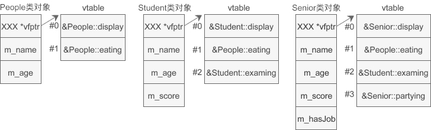

## 一、在main执行之前和之后执行的代码可能是什么？

### 1. main 函数执行之前，主要就是初始化系统相关的资源

- 初始化栈指针（栈用于存储一些需要的局部变量或者其他数据）

- 初始化**静态变量**和**全局变量**，即 `.data` 数据段的数据

  > 补充知识：
  >
  > 一个可执行C程序在内存中主要包含5个区域：代码段（text）、数据段（data）、BSS段、堆段（heap）和栈段（stack）。
  >
  > 其中（text、data、bss）是程序编译完成就存在的，此时程序并未载入内存进行执行。（heap、stack）是程序被加载到内存才存在的。
  >
  > **务必详细阅读《[C++ 堆区，栈区，数据段，bss段，代码区](https://blog.csdn.net/JACKSONMHLK/article/details/114392343)》**

- 将**未初始化部分的全局变量**赋初值，即 `.bss ` 段的内容 ：数值型 `short = 0`，`int = 0` ，`long = 0` ，`bool = FALSE` ，指针为 `NULL`等等。

- **全局对象**初始化，在 main 之前调用构造函数，这是可能会执行前的一段代码

- 将main函数的参数 `argc`，`argv` 等传递给 main 函数，然后才真正运行 main 函数

  > 补充知识：
  >
  > `argc` 是 argument count 的缩写，表示传入main函数的参数个数
  >
  > `argv` 是 argument vector 的缩写，表示传入main函数的参数序列或指针，并且第一个参数 `argv[0]` 一定是程序的名称，并且包含了程序所在的完整路径，所以确切的说需要我们输入的main函数的参数个数应该是 `argc-1` 个

- `__attribte__((constructor))`

  >补充知识：
  >
  >`__attribute__` 可用于为函数或者数据声明赋属性值，给函数分配属性的主要目的是为了让编译程序可以优化处理。分配给函数的属性位于函数原型的声明中
  >
  >参看《[C/C++编程：__attribute__((constructor))、 __attribute__((destructor))](https://blog.csdn.net/zhizhengguan/article/details/111151773)》

### 2. main 函数执行之后

- **全局对象的析构函数**会在 main 函数之后执行

- 可以用 `atexit` 注册一个函数，它会在 main 之后执行

  > 我们需要在程序退出的时候做一些诸如释放资源的操作，但程序退出的方式有很多种，比如 main 函数运行结束、在程序的某个地方用 exit() 结束程序、用户通过 Ctrl+C 或 Ctrl+break 操作来终止程序等等，因此需要有一种与程序退出方式无关的方法来进行程序退出时的必要处理。方法就是用 `atexit` 函数来注册程序正常终止时要被调用的函数。
  >
  > 参看《[C/C++程序终止时执行的函数——atexit()函数详解](http://www.51testing.com/html/38/225738-235458.html)》

-  `__attribte__((destructor))`

### 

## 二 、结构体内存对齐问题

### 1. 什么是内存对齐

理论上，在 32 位系统下，int 占 4 byte，char 占 1 byte，那么将它们放到一个结构体中应该占 4+1=5 byte；但是实际上，通过运行程序得到的结果是 8 byte，这就是内存对齐所导致的。

尽管内存是以字节为单位，但是大部分处理器并不是按字节块来存取内存的。它一般会以双字节、四字节、8 字节、16 字节甚至 32 字节为单位来存取内存，我们将上述这些存取单位称为**内存存取粒度**。

现在考虑 4 字节存取粒度的处理器取 int 类型变量（32 位系统），该处理器只能从地址为 4 的倍数的内存开始读取数据。假如没有内存对齐机制，数据可以任意存放，现在一个 int 变量存放在从地址 1 开始的联系四个字节地址中，该处理器去取数据时，要先从 0 地址开始读取第一个 4 字节块，剔除不想要的字节（0 地址），然后从地址 4 开始读取下一个 4 字节块，同样剔除不要的数据（5，6，7地址），最后留下的两块数据合并放入寄存器，这需要做很多工作。

现在有了内存对齐的，int 类型数据只能存放在按照对齐规则的内存中，比如说 0 地址开始的内存。那么现在该处理器在取数据时一次性就能将数据读出来了，而且不需要做额外的操作，提高了效率。

### 2. 内存对齐规则

结构体内成员按照声明顺序存储，第一个成员地址和整个结构体地址相同。

每个特定平台上的编译器都有自己的默认“对齐系数”（也叫对齐模数）。gcc 中默认 `#pragma pack(4)` ，可以通过预编译命令 `#pragma pack(n)`，n = 1,2,4,8,16 来改变这一系数。

**有效对齐值**：是给定值 `#pragma pack(n)` 和 结构体 中最长数据类型长度中较小的那个，即 `min(#pragma pack(n), 结构体中最长数据类型长度)`。有效对齐值也叫**对齐单位**。

原则如下：

- 结构体第一个成员的**偏移量（offset）**为 0，以后每个成员相对于结构体首地址的 offset 都是**该成员大小与有效对齐值中较小那个的整数倍**，如有需要编译器会在成员之间加上填充字节。
- **结构体的总大小**为 有效对齐值 的**整数倍**，如有需要编译器会在最末一个成员之后加上填充字节。

```cpp
// 32 位系统  #pragma pack(4)
#include<stdio.h>

struct {
    int i;    
    char c1;  
    char c2;  
} x1;

struct {
    char c1;  
    int i;    
    char c2;  
} x2;

struct {
    char c1;  
    char c2; 
    int i;    
} x3;

int main() {
    printf("%d\n",sizeof(x1));  // 输出8
    printf("%d\n",sizeof(x2));  // 输出12
    printf("%d\n",sizeof(x3));  // 输出8
    return 0;
}
```

x2 分析如下：

对齐单位： `min(#pragma pack(4), sizeof(int)) = 4`

首先使用规则1，对成员变量进行对齐：

`sizeof(c1) = 1 <= 4（对齐单位）`，按照 1 字节对齐，占用第 0 单元；

`sizeof(i) = 4 <= 4（对齐单位）`，相对于结构体首地址的偏移要为 4 的倍数，占用第 4，5，6，7 单元；

`sizeof(c2) = 1 <= 4（对齐单位）`，相对于结构体首地址的偏移要为 1 的倍数，占用第 8 单元；

然后使用规则 2，对结构体整体进行对齐：

x2 中变量 i 占用内存最大占 4 字节，而有效对齐单位也为 4 字节，两者较小值就是 4 字节。因此整体也是按照 4 字节对齐。由规则 1 得到s2占9 个字节，此处再按照规则 2 进行整体的4字节对齐，所以整个结构体占用 12 个字节。

### 3. alignas 和 alignof

C++11 以后引入的 alignas 和 alignof 。

- alignof 可以计算出类型的对齐方式
- alignas 可以指定结构体的对齐方式

```cpp
// size:16
struct  struct_Test1 {
	char c;
	int  i;
	double d;
};

// size:16
struct alignas(8) struct_Test2 {
	char c;
	int  i;
	double d;
};

// size:16
struct alignas(16) struct_Test3 {
	char c;
	int  i;
	double d;
};

// size:32
struct alignas(32) struct_Test4 {
	char c;
	int  i;
	double d;
};
```

**alignas 失效情况：**

- 若指定的 alignas 小于自然对齐的最小单位，则被忽略。

- 如果想使用单字节对齐的方式，使用 alignas 是无效的。应该使用 `#pragma pack(push,1)` 或者使用 `__attribute__((packed))`。

  ```cpp
  #if defined(__GNUC__) || defined(__GNUG__)
    #define ONEBYTE_ALIGN __attribute__((packed))
  #elif defined(_MSC_VER)
    #define ONEBYTE_ALIGN
    #pragma pack(push,1)
  #endif
  
  struct Info {
    uint8_t a;
    uint32_t b;
    uint8_t c;
  } ONEBYTE_ALIGN;
  
  #if defined(__GNUC__) || defined(__GNUG__)
    #undef ONEBYTE_ALIGN
  #elif defined(_MSC_VER)
    #pragma pack(pop)
    #undef ONEBYTE_ALIGN
  #endif
  
  std::cout << sizeof(Info) << std::endl;   // 6 1 + 4 + 1
  std::cout << alignof(Info) << std::endl;  // 1
  ```

- 确定结构体中每个元素大小可以通过下面这种方式，这种处理方式是 alignas 处理不了的。

  ```cpp
  #if defined(__GNUC__) || defined(__GNUG__)
    #define ONEBYTE_ALIGN __attribute__((packed))
  #elif defined(_MSC_VER)
    #define ONEBYTE_ALIGN
    #pragma pack(push,1)
  #endif
  
  /**
  * 0 1   3     6   8 9            15
  * +-+---+-----+---+-+-------------+
  * | |   |     |   | |             |
  * |a| b |  c  | d |e|     pad     |
  * | |   |     |   | |             |
  * +-+---+-----+---+-+-------------+
  */
  struct Info {
    uint16_t a : 1;
    uint16_t b : 2;
    uint16_t c : 3;
    uint16_t d : 2;
    uint16_t e : 1;
    uint16_t pad : 7;
  } ONEBYTE_ALIGN;
  
  #if defined(__GNUC__) || defined(__GNUG__)
    #undef ONEBYTE_ALIGN
  #elif defined(_MSC_VER)
    #pragma pack(pop)
    #undef ONEBYTE_ALIGN
  #endif
  
  std::cout << sizeof(Info) << std::endl;   // 2
  std::cout << alignof(Info) << std::endl;  // 1
  ```

### 4. offsetof 获得结构体字节偏移量

```cpp
#include <iostream>
#include <stddef.h>
using namespace std;

struct S {
	int x;
	char y;
	int z;
	double a;
};

int main() {
	cout << offsetof(S, x) << endl;
	cout << offsetof(S, y) << endl;
	cout << offsetof(S, z) << endl;
	cout << offsetof(S, a) << endl;
	return 0;
}

// 不同的编译器，不同的 #pragma pack(4) 也不一样
```


## 三、指针和引用的区别

- 指针是一个变量，存储的是一个地址；引用是原来变量的别名，本质是同一个东西

- 指针可以多级；引用只有一级

- 指针可以为空；引用不能为NULL，并且在定义的时候必须初始化

- 指针初始化之后可以改变指向（指针声明和定义可以分开）；引用在初始化之后不可再改变

- sizeof 指针得到的是指针的大小；sizeof 引用得到的是引用所指对象的大小

- 指针作为参数传递的时候，也是将实参的一个拷贝传递给形参，两者指向的地址相同，但不是同一个变量，在函数中改变这个变量的指向不影响实参；应用却可以

  > **函数内改变指针的值可作用于外部主函数内；函数内改变指针地址在该函数结束时就还原**
  >
  > ```cpp
  > void test(int *p) {
  >     int a = 2;
  >     p = &a;
  >     cout << "test: " << p << " " << *p <<endl;
  > }
  > 
  > int main(void) {
  >     int a = 1;
  >     int *p = &a;
  >     cout << "main: " << p << " " << *p <<endl;
  >     test(p);
  >     cout << "main: " << p << " " << *p <<endl;
  >     return 0;
  > }
  > 
  > /* 输出结果为：
  > main: 0x7ffdf35c04bc 1
  > test: 0x7ffdf35c0494 2
  > main: 0x7ffdf35c04bc 1
  > */
  > 
  > void test(int *p){
  >     int a = 2;
  >     *p = a;
  >     cout << "test: " << p << " " << *p <<endl;
  > }
  > 
  > int main(void) {
  >     int a = 1;
  >     int *p = &a;
  >     cout << "main: " << p << " " << *p <<endl;
  >     test(p);
  >     cout << "main: " << p << " " << *p <<endl;
  >     return 0;
  > }
  > 
  > /* 输出结果为：
  > main: 0x7ffe0eb8a13c 1
  > test: 0x7ffe0eb8a13c 2
  > main: 0x7ffe0eb8a13c 2
  > */
  > ```

  

## 四、传递函数参数中的值传递、指针传递和引用传递

### 1. 值传递、指针传递和引用传递的区别和效率

- 值传递：有一个形参向函数所属的栈拷贝数据的过程，如果值传递的对象是类对象或是大的结构体对象，将消耗一定的时间和空间（传值）
- 指针传递：同样有一个形参向函数所属的栈拷贝数据的过程，但拷贝的数据是一个固定为指针大小（4字节或8字节）的地址（传值，传递的是地址值）
- 引用传递：同样有一个形参向函数所属的栈拷贝数据的过程，但其是针对地址的，相当于为该数据所在的地址起了一个别名（传地址）

效率上讲，指针传递和引用传递比值传递效率高。一般主张使用引用传递，代码逻辑上更加紧凑、清晰。

### 2. 什么时候使用指针传递，什么时候使用引用传递

- **需要返回函数内局部变量的内存的时候使用指针**。使用指针传参需要开辟内存，用完需要释放，不然内存泄漏。而返回局部变量的引用没有意义。

  ```cpp
  void test(int *p){
      int **p2 = &p;
      cout << "test: " << p2 << " " << *p2 <<endl;
  }
  
  int main(void) {
      int a = 1;
      int *p = &a;
      int **p2 = &p;
      cout << "main: " << p2 << " " << *p2 <<endl;
      test(p);
      cout << "main: " << p2 << " " << *p2 <<endl;
      return 0;
  }
  
  /* 输出结果为：
  main: 0x7ffde69f6418 0x7ffde69f6414
  test: 0x7ffde69f63e8 0x7ffde69f6414
  main: 0x7ffde69f6418 0x7ffde69f6414
  */
  ```

- 对栈空间大小比较敏感（比如递归）的时候使用引用。使用**引用传递不需要创建临时变量**，开销要更小。

- **类对象作为参数传递的时候使用引用**，这是 C++ 类对象传递的标准方式。

用引用作为返回值最大的好处就是在内存中不产生被返回值的副本。

但是有以下的限制：

- **不能返回局部变量的引用**。因为函数返回以后局部变量就会被销毁

- **不能返回函数内部 new 分配的内存的引用**。虽然不存在局部变量的被动销毁问题，可对于这种情况（返回函数内部 new 分配内存的引用），又面临其它尴尬局面。例如，被函数返回的引用只是作为一 个临时变量出现，而没有被赋予一个实际的变量，那么这个引用所指向的空间（由 new 分配）就无法释放，造成 memory leak

- **可以返回类成员的引用，但是最好是 const**。因为如果其他对象可以获得该属性的非常量的引用，那么对该属性的单纯赋值就会破坏业务规则的完整性。

### 3. 指针参数传递和引用参数传递有什么区别？底层原理是什么？

- **指针参数传递本质上是值传递**，它所传递的是一个地址值。值传递过程中，被调函数的形式参数作为被调函数的局部变量处理，会在栈中开辟内存空间以存放由主调函数传递进来的实参值，从而形成了实参的一个副本（替身）。

  值传递的特点是，被调函数对形式参数的任何操作都是作为局部变量进行的，不会影响主调函数的实参变量的值（形参指针变了，实参指针不会变）。

- 引用参数传递过程中，被调函数的形式参数也作为局部变量在栈中开辟了内存空间，但是这时存放的是由主调函数放进来的**实参变量的地址**。被调函数对形参（本体）的任何操作都被处理成间接寻址，即通过栈中存放的地址访问主调函数中的实参变量（根据别名找到主调函数中的本体）。

  因此，被调函数对形参的任何操作都会影响主调函数中的实参变量。

**区别**

- 引用传递和指针传递是不同的，虽然他们都是在被调函数栈空间上的一个局部变量，但是**任何对于引用参数的处理都会通过一个间接寻址的方式操作到主调函数中的相关变量**。

- 而对于指针传递的参数，如果改变被调函数中的指针地址，它将应用不到主调函数的相关变量。如果想通过指针参数传递来改变主调函数中的相关变量（地址），那就得使用指向指针的指针或者指针引用。

从编译的角度来讲，程序在编译时分别将指针和引用添加到符号表上，符号表中记录的是变量名及变量所对应地址。指针变量在符号表上对应的地址值为指针变量的地址值，而引用在符号表上对应的地址值为引用对象的地址值（与实参名字不同，地址相同）。符号表生成之后就不会再改，因此指针可以改变其指向的对象（指针变量中的值可以改），而引用对象则不能修改。

### 4. 什么情况用指针当参数，什么时候用引用

**使用引用参数的主要原因有两个:**

- 程序员能修改调用函数中的数据对象

- 通过传递引用而不是整个数据对象，可以提高程序的运行速度

**对于使用引用的值而不做修改的函数：**

- 如果数据对象很小，如内置数据类型或者小型结构，则按照值传递；
- 如果数据对象是数组，则使用指针（唯一的选择），并且指针声明为指向 const 的指针；

- 如果数据对象是较大的结构，则使用 const 指针或者引用，已提高程序的效率。这样可以节省结构所需的时间和空间；

- 如果数据对象是类对象，则使用 const 引用（传递类对象参数的标准方式是按照引用传递）

**对于修改函数中数据的函数：**

- 如果数据是内置数据类型，则使用指针

- 如果数据对象是结构，则使用引用或者指针

- 如果数据是类对象，则使用引用

- 也有一种说法认为：“如果数据对象是数组，则只能使用指针”，这是不对的，比如

  ```cpp
  template<typename T, int N>
  void func(T (&a)[N]) {
      a[0] = 2;
  }
  
  int main() {
      int a[] = { 1, 2, 3 };
      func(a);
      cout << a[0] << endl;
      return 0;
  }
  ```


## 五、堆和栈的区别

- 申请方式不同：栈是系统自动分配的；堆是自己申请和释放的
- 申请大小限制不同：
  - 栈顶和栈底是之前预设好的，栈是向栈底扩展，**大小固定**，可以通过 `ulimit -a` 查看，由 `ulimit -s` 修改
  - 堆向高地址扩展，是**不连续的内存区域**，大小可以灵活调整

- 申请效率不同：
  - 栈由系统分配，速度快，不会有碎片
  - 堆由程序员分配，速度慢，且会有碎片

|              | 堆                                                           | 栈                                                           |
| ------------ | ------------------------------------------------------------ | ------------------------------------------------------------ |
| 管理方式     | 堆中资源由程序员控制（容易产生  memory leak）                | 栈资源由编译器自动管理，无需手工控制                         |
| 内存管理机制 | 系统有一个记录空闲内存地址的链表，当系统收到程序申请时，遍历该链表，寻找第一个空间大于申请空间的堆结点，删除空闲结点链表中的该结点，并将该结点空间分配给程序（大多数系统会在这块内存空间首地址记录本次分配的大小，这样delete才能正确释放本内存空间，另外系统会将多余的部分重新放入空闲链表中） | 只要栈的剩余空间大于所申请空间，系统为程序提供内存，否则报异常提示栈溢出。（这一块理解一下链表和队列的区别，不连续空间和连续空间的区别，应该就比较好理解这两种机制的区别了） |
| 空间大小     | 堆是不连续的内存区域（因为系统是用链表来存储空闲内存地址，自然不是连续的），堆大小受限于计算机系统中有效的虚拟内存（32bit 系统理论上是4G），所以堆的空间比较灵活，比较大 | 栈是一块连续的内存区域，大小是操作系统预定好的，windows下栈大小是2M（也有是1M，在编译时确定，VC 中可设置） |
| 碎片问题     | 对于堆，频繁的 new/delete 会造成大量碎片，使程序效率降低     | 对于栈，它是有点类似于数据结构上的一个先进后出的栈，进出一一对应，不会产生碎片 |
| 生长方向     | 堆向上，向高地址方向增长                                     | 栈向下，向低地址方向增长                                     |
| 分配方式     | 堆都是动态分配（没有静态分配的堆）                           | 栈有静态分配和动态分配，静态分配由编译器完成（如局部变量分配），动态分配由 alloca 函数分配，但栈的动态分配的资源由编译器进行释放，无需程序员实现 |
| 分配效率     | 堆由 C/C++ 函数库提供，机制很复杂。所以堆的效率比栈低很多    | 栈是其系统提供的数据结构，计算机在底层对栈提供支持，分配专门寄存器存放栈地址，栈操作有专门指令 |


## 六、你觉得堆快一点还是栈快一点？

毫无疑问栈快一点。

因为操作系统会在底层对栈提供支持，会分配专门的寄存器存放栈的地址，栈的入栈出栈操作有专门的指令执行，所以栈的效率比较高也比较快。

而堆的操作是由 C/C++ 函数库提供，在分配堆内存的时候需要一定的算法寻找合适大小的内存。并且获取堆的内容需要两次访问，第一次访问指针，第二次更具指针保存的地址访问内存，因此堆会比较慢。


## 七、区别以下指针类型？

### 1. 看懂 C++ 类型声明的规律

（1） 第一步，找到变量名，如果没有变量名，找到最里面的结构

（2） 第二步，向右看，读出你看到的东西，但是不要跳过括号

（3） 第三步，再向左看，读出你看到的东西，但是也不要跳过括号

（4） 第四步，如果有括号的话，跳出一层括号

（5） 第五步，重复上述过程，直到你读出最终类型

```cpp
/* int * v[5]
（1）找到变量 v
（2）向右看，数组尺寸 5，右边没东西了
（3）向左看，是一个指针
所以：v 就是一个大小为 5 的数组，每个元素是指向 int 的指针
=> v 是一个有 5 个指向 int 的指针的数组
*/

/* int (*v)[5]
（1）找到变量 v
（2）向右看，没有东西；向左看是一个指针
（3）跳过括号，数组尺寸 5，右边没东西了
（4）向左看，数组元素为 int
所以：v 是一个指针，指向的是一个大小为5的数组，数组中元素类型为 int
=> v 是一个指向有 5 个 int 的数组的指针
*/

/* 函数指针 int (*func) ();
	  func   指针 -> 函数（返回值为 int）
*/

/* int (*v[]) ();
       v  数组 -> 数组的元素是指针 -> 指针执行的是函数 ->  函数的返回值是 int
   => v 是一个 int 型函数指针组成的数组
*/

/* int (*(*v)[]) ()
       v  指针  ->  指向的是数组  -> 数组中的元素是指针  ->  数组元素中的指针指向的是函数（返回值为 int）
   => v 是一个指向 int 型函数指针组成的数组的指针
*/
```

### 2. 加入 const 之后

`int const a;` 等价于 `const int a;`

但是加入指针之后，就有了变化

```cpp
/* int const *r;  指针常量
	r   指针  -> 指向的 int const
    (*r) 不能改变
    但 r 本身不是 const ，所以可以改变
*/

/* int * const r;  常量指针
    r 是个 const 
    r 是个 const 指针  ->  指向的 int
    r 不可以改变
*/
```


## 八、new / delete 与 malloc / free 

### 1. new / delete 是如何实现的

- new 的实现过程是：首先调用名为 `operator new` 的标准库函数，分配足够大的原始未类型化的内存，以保存指定类型的一个对象；接下来运行该类型的一个构造函数，用指定初始化构造对象；最后返回指向新分配并构造后的对象的指针
- delete 的实现过程：对指针指向的对象运行适当的析构函数；然后通过调用名为 `operator delete` 的标准库函数释放该对象所用内存

### 2. new / delete 与 malloc / free 相同点

都可以用于内存的动态申请和释放

### 3. new / delete 与 malloc / free 不同点

- new / delete 是 C++ 运算符；malloc / free 是 C/C++ 语言标准库函数

- new 自动计算要分配空间大小；malloc 需要手工计算

- new 是类型安全的；malloc 不是

  ```cpp
  int *p = new float[2]; //编译错误
  int *p = (int*)malloc(2 * sizeof(double));//编译无错误
  ```

- new 调用名为 `operator new` 的标准库函数，分配足够空间并调用相关对象的构造函数，delete 对指针所指对象运行适当的析构函数，然后通过调用名为 `operator delete` 的标准库函数释放该对象所用内存；malloc / free 均没有相关调用

- new / delete 不需要库文件支持；malloc / free 需要库文件支持

- new 是封装了 malloc，直接 free 不会报错，但是这只是释放内存，而不会析构对象

### 4. 既然有了 malloc/free，C++ 中为什么还需要 new/delete 呢？

在对非基本数据类型的对象使用的时候，对象创建的时候还需要执行构造函数，销毁的时候要执行析构函数。而 malloc / free 是库函数，是已经编译的代码，所以不能把构造函数和析构函数的功能强加给 malloc / free，所以 new/delete 是必不可少的。

### 5. 被 free 回收的内存是立即返还给操作系统吗？

不是的，被 free 回收的内存会首先被 ptmalloc 使用双链表保存起来，当用户下一次申请内存的时候，会尝试从这些内存中寻找合适的返回。这样就避免了频繁的系统调用，占用过多的系统资源。同时 ptmalloc 也会尝试对小块内存进行合并，避免过多的内存碎片。

### 6. delete p、delete[] p、allocator 都有什么作用

- 动态数组管理 new 一个数组的时，[] 中必须是一个整数，但是不一定时常量整数，普通数组必须是一个常量整数

- new 动态数组返回的并不是数组类型，而是一个元素类型的指针

- delete[] 时，数组中的元素按逆序的顺序进行销毁

- new 在内存分配上面有一些局限性，new 的机制是将内存分配和对象构造组合在一起，同样的，delete 也是将对象析构和内存释放组合在一起的。allocator 将这两部分分开进行，allocator申请一部分内存，不进行初始化对象，只有当需要的时候才进行初始化操作。

  > 补充知识：
  >
  > 分配器是**负责封装堆内存管理的对象**
  >
  > 每个容器实例中都有一个 Allocator 实例。它向分配器请求存储来存储元素。分配器应具备的基本成员函数如下：
  >
  > ```cpp
  > // T* allocate(size_t n); 分配足够的存储空间来存储 T 的 n 个实例，并返回指向它的指针
  > // void deallocate(T* p, size_t n) 释放分配的内存
  > // void construct(T* p, Args ... args); 使用 p 指向的 args 参数构造一个对象,该接口在C++20 中已被移除
  > // void destroy(T* p); 调用 p 指向的对象的析构函数，该接口在 C++20 中已被移除
  > ```

### 7. new[] / delete[] 是如何实现的

- 对于简单类型，new[] 计算好大小后调用 operator new；对于复杂数据结构，new[] 先调用 operator new[]分配内存，然后在 p 的前四个字节写入数组大小 n，然后调用 n 次构造函数。**针对复杂类型，new[] 会额外存储数组大小**
  - new 表达式调用一个名为 `operator new(operator new[])` 函数，分配一块足够大的、原始的、未命名的内存空间
  - 编译器运行相应的构造函数以构造这些对象，并为其传入初始值
  - 对象被分配了空间并构造完成，返回一个指向该对象的指针
- 针对简单类型，delete 和 delete[] 等同。假设指针 p 指向 new[] 分配的内存。因为要 4 字节存储数组大小，实际分配的内存地址为 [p-4]，系统记录的也是这个地址。delete[] 实际释放的就是 p-4 指向的内存。而delete 会直接释放 p 指向的内存，这个内存根本没有被系统记录，所以会崩溃

需要在 new[] 一个对象数组时，需要保存数组的维度，C++ 的做法是在分配数组空间时多分配了 4 个字节的大小，专门保存数组的大小，在 delete[] 时就可以取出这个保存的数，就知道了需要调用析构函数多少次了

### 8. new[] / delete[] 是如何实现的

malloc/free 的操作对象都是必须明确大小的，而且不能用在动态类上。new 和 delete 会自动进行类型检查和大小，malloc/free 不能执行构造函数与析构函数，所以动态对象它是不行的。

当然从理论上说使用 malloc 申请的内存是可以通过 delete 释放的。不过一般不这样写的。而且也不能保证每个C++ 的运行时都能正常。

### 9. malloc、realloc、calloc的区别

**malloc 函数**

```cpp
void* malloc(unsigned int num_size);
int *p = malloc(20 * sizeof(int));   // 申请 20 个 int 类型的空间；
```

**calloc 函数**

省去了人为空间计算；malloc 申请的空间的值是随机初始化的，calloc 申请的空间的值是初始化为 0 的

```cpp
void* calloc(size_t n,size_t size);
int *p = calloc(20, sizeof(int));
```

**realloc 函数**

给动态分配的空间分配额外的空间，用于扩充容量

```cpp
void realloc(void *p, size_t new_size);
```

### 10. malloc 与 free 的实现原理

- 在标准 C 库中，提供了 malloc/free 函数分配释放内存，这两个函数底层是由 brk、mmap、munmap 这些系统调用实现的


- brk 是将数据段 (.data) 的最高地址指针 _edata 往高地址推，mmap 是在进程的虚拟地址空间中（堆和栈中间，称为文件映射区域的地方）找一块空闲的虚拟内存。这两种方式分配的都是虚拟内存，没有分配物理内存。在第一次访问已分配的虚拟地址空间的时候，发生缺页中断，操作系统负责分配物理内存，然后建立虚拟内存和物理内存之间的映射关系；


- malloc 小于 128k 的内存，使用 brk 分配内存，将 _edata 往高地址推；malloc 大于 128k 的内存，使用mmap 分配内存，在堆和栈之间找一块空闲内存分配；brk 分配的内存需要等到高地址内存释放以后才能释放，而 mmap 分配的内存可以单独释放。当最高地址空间的空闲内存超过 128K（可由 M_TRIM_THRESHOLD 选项调节）时，执行内存紧缩操作（trim）。在上一个步骤 free 的时候，发现最高地址空闲内存超过 128K，于是内存紧缩。


- malloc 是从堆里面申请内存，也就是说函数返回的指针是指向堆里面的一块内存。操作系统中有一个记录空闲内存地址的链表。当操作系统收到程序的申请时，就会遍历该链表，然后就寻找第一个空间大于所申请空间的堆结点，然后就将该结点从空闲结点链表中删除，并将该结点的空间分配给程序。

> 2023-03-18 看不懂

### 11. 在成员函数中调用 delete this 会出现什么问题？对象还可以使用吗？

在类对象的内存空间中，只有数据成员和虚函数表指针，并不包含代码内容，类的成员函数单独放在代码段中。在调用成员函数时，隐含传递一个 this 指针，让成员函数知道当前是哪个对象在调用它。当调用 delete this 时，类对象的内存空间被释放。在 delete this 之后进行的其他任何函数调用，只要不涉及到 this 指针的内容，都能够正常运行。一旦涉及到 this 指针，如操作数据成员，调用虚函数等，就会出现不可预期的问题。

不可预期的问题来源于：delete this 释放了类对象的内存空间，但是内存空间却并不是马上被回收到系统中，可能是缓冲或者其他什么原因，导致这段内存空间暂时并没有被系统收回。此时这段内存是可以访问的，你可以加上 100，加上 200，但是其中的值却是不确定的。当你获取数据成员，可能得到的是一串很长的未初始化的随机数；访问虚函数表，指针无效的可能性非常高，造成系统崩溃。

### 12. 如果在类的析构函数中调用 delete this，会发生什么？

会导致堆栈溢出。原因很简单，delete 的本质是 “为将被释放的内存调用一个或多个析构函数，然后，释放内存”。显然，delete this 会去调用本对象的析构函数，而析构函数中又调用 delete this，形成无限递归，造成堆栈溢出，系统崩溃。


## 九、#define、函数、typedef、const、内联函数

### 1. 宏定义 #define 和函数的区别

- 宏在预处理阶段完成替换，之后被替换的文本参与编译，相当于直接插入了代码，运行时**不存在函数调用**，执行起来更快；函数调用在运行时需要跳转到具体函数
- 宏定义属于在结构中插入代码，没有返回值；函数调用具有返回值
- 宏定义参数没有类型，不进行类型检查；函数参数具有类型，需要检查类型
- **宏定义不要再最后加分号**

### 2. 宏定义 #define 和 typedef 的区别

- #define 是**预处理器指令**；而 typedef 是 **C++ 关键字**

- #define 主要用来**定义常量，以及频繁使用的宏**，也可以用作别名；而 typedef 主要用来定义**数据类型的别名**

- #define 定义的别名只是简单的**文本替换，没有类型安全检查**；而 typedef 定义的别名是一个真正的类型，具有**类型安全检查**

- #define 不受作用域的约束，直到遇到 #undef 结束作用范围；而 typedef 存在作用域限制

- #define 不是语句，无需分号；typedef 定义的语句，需要分号

- 连续定义几个变量的时候，typedef 能够保证定义的所有变量均为同一类型；而 #define 则无法保证

  ```cpp
  #define PINT1 int*;
  P_INT1 p1,p2;  //即int *p1, p2;
  
  typedet int* PINT2;
  P_INT2 p1,p2;  //p1、p2 类型相同
  ```

### 3. 宏定义 #define 和 const 的区别

**编译阶段**

#define 是在编译的**预处理阶段**起作用；而 const 是在编译、运行的时候起作用

**安全性**

- #define 只做替换，不做类型检查和计算，也不求解，容易产生错误

- const 常量有数据类型，编译器可以对其进行类型安全检查

**内存占用**

- #define 只是将宏名称进行替换，在内存中会产生多份相同的备份；const 在程序运行中只有一份备份，且可以执行常量折叠，能将复杂的表达式计算出结果放到常量表

  > 补充知识：
  >
  > 2023-03-12不懂常量折叠，参看《[c++的常量折叠](https://blog.csdn.net/u011749929/article/details/107006922)》

- 宏定义的数据没有分配内存空间，只是替换掉；const 定义的变量只有值不能改变，但要分配内存空间

### 4. 宏定义 #define 和内联函数的区别

- 在使用时，宏只做简单字符串替换（编译前）；而内联函数可以进行参数类型检查（编译时），且具有返回值
- 内联函数在编译时直接将函数代码嵌入到目标代码中，省去函数调用的开销来提高效率，并且进行参数类型检查，具有返回值可以实现重载
- 宏定义使用时要注意书写（参数要括起来），否则容易出现歧义，内联函数不会产生歧义
- 内联函数有类型检测、语法判断等功能；而宏没有

**内联函数适用场景**

- 使用宏定义的地方都可以使用内联函数
- 内联函数作为类成员接口函数来读写类的私有成员或者保护成员，会提高效率

**不能把所有的函数写成内联函数**

内联函数以代码复杂为代价，它以省去函数调用的开销来提高执行效率。所以一方面如果内联函数体内代码执行时间相比函数调用开销较大，则没有太大的意义；另一方面每一处内联函数的调用都要复制代码，消耗更多的内存空间，因此以下情况不宜使用内联函数：

- 函数体内的代码比较长，将导致内存消耗代价
- 函数体内有循环，函数执行时间要比函数调用开销大


## 十、变量声明和定义的区别

- 声明仅仅是把变量的**声明的位置及类型提供给编译器**，并**不分配内存空间**；定义要在定义的地方为其分配存储空间
- 相同的**变量可以多处声明**（外部变量 extern），但**只能在一处定义**


## 十一、strlen 和 sizeof 区别

- **sizeof 是运算符**，并不是函数，结果在编译时得到而非运行时获得；**strlen 是处理字符的库函数**

- sizeof 的参数可以是任何数据的类型或者数据；strlen 的参数只能时候字符指针且结尾是 '\0' 的字符串

  > 数组作为参数传递给函数后，使用 sizeof 会产生问题
  >
  > ```cpp
  > #include <iostream>
  > #include <stdlib.h>
  > #include <string.h>
  >  
  > using namespace std;
  >  
  > void func(char s[], int n){
  >     cout<<"----------------- func -------------------"<<endl;
  >     cout<<"sizeof(s) = "<<sizeof(s)<<endl;
  >     cout<<"sizeof(s[0]) = "<<sizeof(s[0])<<endl;
  >     cout<<"The length of s is "<<sizeof(s)/sizeof(s[0])<<endl;
  >     cout<<"----------------- pointer -------------------"<<endl;
  >     char *p = NULL;
  >     cout<<"sizeof(p) = "<<sizeof(p)<<endl;
  > }
  >  
  > int main()
  > {
  >     cout<<"----------------- main -------------------"<<endl;
  >     char g[] = {'a', 'b', 'c', 'd', 'e'};
  >     cout<<"sizeof(g) = "<<sizeof(g)<<endl;
  >     cout<<"sizeof(g[0]) = "<<sizeof(g[0])<<endl;
  >     cout<<"The length of g is "<<sizeof(g)/sizeof(g[0])<<endl;
  >     func(g, 3);
  >     return 0;
  > }
  > 
  > /*
  > ----------------- main -------------------
  > sizeof(g) = 5
  > sizeof(g[0]) = 1
  > The length of g is 5
  > ----------------- func -------------------
  > sizeof(s) = 4
  > sizeof(s[0]) = 1
  > The length of s is 4
  > ----------------- pointer -------------------
  > sizeof(p) = 4
  > */
  > ```
  >
  > 在上面的输出中，第一部分 main 输出的信息符合预期。但是，将数组 g 作为参数传递到函数 func 时，再做同样的计算，结果就不一样了，为什么呢？
  >
  > 因为数组作为函数参数传递后，会退化为指针，所以计算 sizeof(s) = 4 ，实质等价于计算 sizeof(char *s) 的大小，指针变量大小为 4 字节（在 32 位平台上）。sizeof(s[0]) 计算的是第一个字符的字节大小，即为 1。我们可以看到指针变量 p 计算大小后也为 4。
  >
  > 所以在将数组作为参数传递到函数时，注意 sizeof() 的使用，最好的方式是一同传递一个数组元素个数的变量，比如上面例子中的 n。
  >
  > 参看《[C/C++ 数组作为参数传递到函数后，使用 sizeof 产生的问题](https://blog.csdn.net/nyist_zxp/article/details/116564651)》

- 因为 **sizeof 值在编译时确定**，所以不能用来得到动态分配（运行时分配）存储空间的大小


## 十二、a 和 &a 有什么区别

假设数组 `ina a[10]; int (*p)[10] = &a;` 其中：

- a 是数组名，是数组首元素地址，+1 表示地址值加上一个 int 类型的大小，如果 a 的值是 0x00000001，加 1 操作后变为 0x00000005。`*(a+1) = a[1]`
- &a 是数组的指针，其类型为 `int (*)[10]` ，其加 1 后，系统会认为是数组首地址加上整个数组的偏移（10 个 int 型变量），值为数组 a 尾后一个元素的地址
- 若 `int *p2 = (int *) p` ，此时输出 *p2 时，其值为 a[0] 的值，因为被转为 int * 类型，解引用时按照 int 类型大小来读取

```cpp
int main()
{
    int a[10] = {1, 2, 3, 4, 5, 6, 7, 8, 9, 10};
    int (*p)[10] = &a;
    int *p2 = (int *)p;
    
    cout << "a: " << a << " a[0]: " << a[0] << " a+1: " << a+1 << endl;
    cout << "a+9: " << a+9 << endl;
    cout << "p: " << p << " p+1: " << p+1 << " *p: " << *p << endl;
    cout << "p2: " << p2 << " *p2: " << *p2 << endl;
    
    return 0;
}

/* 输出
a: 0x7ffefd0c3480 a[0]: 1 a+1: 0x7ffefd0c3484
a+9: 0x7ffefd0c34a4
p: 0x7ffefd0c3480 p+1: 0x7ffefd0c34a8 *p: 0x7ffefd0c3480
p2: 0x7ffefd0c3480 *p2: 1
*/

// 2023-03-13 疑问 p 和 *p 的输出为什么一样？
```


## 十三、C++ 语言和其他语言的区别

### 1. C++ 和 C 的区别

- C++ 中 new 和 delete 是对内存分配的运算符，取代了 C 中的 malloc 和 free
- 标准 C++ 中的字符串类取代了标准 C 函数库头文件中的字符数组处理函数（C 中没有字符串类型）
- C++ 中用来控制台输入输出的 iostream 类库替代了标准 C 中的 stdio 函数库
- C++ 中的 try/catch/throw 异常处理机制取代了标准 C 中的 setjmp() 和 longjmp() 函数
- C++ 中可以重载；C 语言不允许
- C++ 中允许变量定义语句在程序中的任何地方，只要在使用它之前即可；C 中必须要在函数开头部分
- C++ 中除了值和指针之外，新增了引用。引用型变量是其他变量的别名
- C++ 相对与 C 增加了一些关键字，比如 bool、using、dynamic_cast、namespace 等等

### 2. C++ 和 Python 的区别

- Python是一种脚本语言，是解释执行的，而 C++ 是编译语言，是需要编译后在特定平台运行的。python 可以很方便的跨平台，但是效率没有 C++ 高
- Python 使用缩进来区分不同的代码块，C++ 使用花括号来区分
- C++ 中需要事先定义变量的类型，而 Python 不需要，Python 的基本数据类型只有数字，布尔值，字符串，列表，元组等等
- Python 的库函数比 C++ 的多，调用起来很方便

### 3. C++ 和 Java 的区别

**语言特性**

- Java 语言给开发人员提供了更为简洁的语法；完全面向对象，由于 JVM 可以安装到任何的操作系统上，所以说它的可移植性强
- Java 语言中没有指针的概念，引入了真正的数组。不同于 C++ 中利用指针实现的“伪数组”，Java 引入了真正的数组，同时将容易造成麻烦的指针从语言中去掉，这将有利于防止在 C++ 程序中常见的因为数组操作越界等指针操作而对系统数据进行非法读写带来的不安全问题
- C++ 也可以在其他系统运行，但是需要不同的编码（这一点不如 Java，只编写一次代码，到处运行），例如对一个数字，在 windows 下是大端存储，在 unix 中则为小端存储。Java 程序一般都是生成字节码，在 JVM 里面运行得到结果
- Java 用接口 (Interface) 技术取代 C++ 程序中的抽象类。接口与抽象类有同样的功能，但是省却了在实现和维护上的复杂性

**垃圾回收**

- C++ 用析构函数回收垃圾，写 C 和 C++ 程序时一定要注意内存的申请和释放
- Java 语言不使用指针，内存的分配和回收都是自动进行的，程序员无须考虑内存碎片的问题

**应用场景**

- Java 在桌面程序上不如 C++ 实用，C++ 可以直接编译成 exe 文件，指针是 c++ 的优势，可以直接对内存的操作，但同时具有危险性 （操作内存的确是一项非常危险的事情，一旦指针指向的位置发生错误，或者误删除了内存中某个地址单元存放的重要数据，后果是可想而知的）

- Java 在 Web 应用上具有 C++ 无可比拟的优势，具有丰富多样的框架

- 对于底层程序的编程以及控制方面的编程，C++ 很灵活，因为有句柄的存在

  > 补充知识：
  >
  > 参考《[C++句柄](https://blog.csdn.net/qq_28350219/article/details/113373044)》


## 十四、C++ 中 struct 和 class 的区别

**相同点**

- 两者都拥有成员函数、公有和私有部分
- 任何可以使用 class 完成的工作，同样可以使用 struct 完成

**不同点**

- 两者中如果不对成员指定公私有，struct 默认时公有，class 则默认是私有
- class 默认是 private 继承；而 struct 默认是 public 继承

**引申：C++ 和 C 的 struct 区别**

- C 语言中：struct 是用户自定义数据类型（UDT）；C++ 中 struct 是抽象数据类型（ADT），支持成员函数的定义，（C++ 中的struct 能继承，能实现多态）

- C 中 struct 是没有权限设置的，且 struct 中只能是一些变量的集合体，可以封装数据却不可以隐藏数据，而且**成员不可以是函数**

- C++ 中，struct 增加了访问权限，且可以和类一样有成员函数，成员默认访问说明符为 public（为了与 C 兼容）

- struct 作为类的一种特例是用来自定义数据结构的。一个结构标记声明后，在 C 中必须在结构标记前加上 struct，才能做结构类型名（除：`typedef struct class{};` ）；C++ 中结构体标记（结构体名）可以直接作为结构体类型名使用，此外结构体 struct 在 C++ 中被当作类的一种特例

  > ```c
  > struct Books {
  >    char  title[50];
  >    char  author[50];
  >    char  subject[100];
  >    int   book_id;
  > };
  > 
  > int main(){
  >     struct Books Book;        /* 声明 Book1，类型为 Books */
  > }
  > ```

**引申：C/C++ 中 struct 和 union 区别**

- struct 和 union 都是由多个不同的数据类型成员组成，但在**任何同一时刻，union 中只存放了一个被选中的成员**，而 struct 的所有成员都存在。在 struct 中，各成员都占有自己的内存空间，它们是同时存在的。

- 一个 struct 变量的总长度等于所有成员长度之和（但需要注意内存对齐问题）。在 union 中，所有成员不能同时占用它的内存空间，它们不能同时存在。**union 变量的长度等于最长的成员的长度**。

- 对于 union 的不同成员赋值，将会对其它成员重写，原来成员的值就不存在了，而对于 struct 的不同成员赋值是互不影响的。


## 十五、C++ 中 const 和 static 的区别

### 1. static 

**不考虑类的情况**

- 所有**不加 static 的全局变量和函数具有全局可见性，可以在其他文件中使用**，加了 static 之后只能在**该文件所在的编译模块中使用**
- 默认初始化为 0，或者未初始化的全局静态变量和局部静态变量，都存在全局未初始化区
- 静态变量在函数内定义，始终存在，且只进行一次初始化具有记忆性，起作用范围与局部变量相同，函数退出后仍然存在，但不能使用

**考虑类的情况**

- static 成员变量：只与类关联，不与类的对象关联。定义时要分配空间，**不能在类声明中初始化**，必须在类定义体外部初始化，初始化时不需要标识为 static。可以被非 static 成员函数任意访问

- static 成员函数：**不具有 this 指针，无法访问类对象的非 static 成员变量和非 static 成员函数。不能被声明为 const，虚函数和 volatile**。可以被非 static 成员函数任意访问

  > 补充知识：
  >
  > 对于一个定义为 const 的函数，传递的是 const 的 this 指针，说明不能更改对象的属性，而对 static 成员的函数不需传递 this 指针，所有就不需要用 const 来修饰 static 的成员函数了！就说 const 属性的作用就是对被传递的 this 指针加以限定，而对 static 成员函数的调用根本不传递 this 指针，所有不需 const 来修饰 static 的成员函数

### 2. const 

**不考虑类的情况**

- const 常量在定义时必须初始化，之后无法更改

- const 形参可以接受 const 和非 const 类型的实参

- const 修饰变量也是于 static 有一样的隐藏作用。只能在该文件使用，其他文件不可以引用声明引用

  > ```cpp
  > void fun(const int& i) { //.... }
  > 
  > int main() {
  >         int a = 1;
  >         const int b = 2;
  >         fun(a);
  >         fun(b);
  > }
  > ```

**考虑类的情况**

- const 成员变量：只能通过构造函数**初始化列表进行初始化**，并且**必须有构造函数**。不同类对其 const 数据成员的值可以不同，所以**不能再类中声明时初始化**
- const 成员函数：常对象只能调用常成员函数。非 const 对象都可以调用。不可以改变非 mutable（用该关键字声明的变量可以在 const 成员函数中被修改）数据的值


## 十六、顶层 const 和 底层 const

### 1. 概念区分

- 顶层 const：指的是 const 修饰的**变量本身**是一个常量
- 底层 const：指的是 const 修斯和的**变量所指向的对象**是一个常量

```cpp
int a = 10;
int* const b1 = &a;        //顶层 const，b1 本身是一个常量
const int* b2 = &a;        //底层 const，b2 本身可变，所指的对象是常量
const int b3 = 20; 		   //顶层 const，b3 是常量不可变
const int* const b4 = &a;  //前一个 const 为底层，后一个为顶层，b4 不可变
const int& b5 = a;		   //用于声明引用变量，都是底层 const
```

### 2. 区分作用

- 执行对象拷贝时有限制，常量的底层 const 不能赋值给非常量的底层 const

  > ```cpp
  > int num_c = 3;
  > const int *p_c = &num_c;  //p_c为底层const的指针
  > //int *p_d = p_c;  //错误，不能将底层const指针赋值给非底层const指针
  > const int *p_d = p_c; //正确，可以将底层const指针复制给底层const指针
  > ```

- 使用命名的强制类型转换函数 const_cast 时，需要能够分辨底层 const 和顶层 const，因为 const_cast 只能改变运算对象的底层 const

  > ```cpp
  > int num_e = 4;
  > const int *p_e = &num_e;
  > //*p_e = 5;  //错误，不能改变底层 const 指针指向的内容
  > int *p_f = const_cast<int *>(p_e);  //正确，const_cast 可以改变运算对象的底层 const。但是使用时一定要知道num_e 不是 const 的类型。
  > *p_f = 5;  //正确，非底层 const 指针可以改变指向的内容
  > cout << num_e;  //输出 5
  > ```


## 十七、数组和指针的区别

### 1. 数组名和指针（指向数组首元素的指针）的区别

- 二者都可以通过增减偏移量来访问数组中的元素
- 数组名不是真正意义上的指针，可以理解为常指针，所以数组名没有自增、自减等操作
- 当数组名当作形参传递给调用函数后，就失去了原有特性，退化为一般指针，多了自增、自减操作， sizeof 运算符不能得到原数组的大小了

### 2.  数组和指针的区别

- 数组在内存中是连续存放的，开辟一块连续的内存空间；数组所占存储空间：sizeof（数组名）；数组大小：sizeof（数组名）/sizeof（数组元素数据类型）。

- 用运算符 sizeof 可以计算出数组的容量（字节数）。sizeof(p)，p 为指针得到的是一个指针变量的字节数，而不是 p 所指的内存容量。

- 编译器为了简化对数组的支持，实际上是利用指针实现了对数组的支持。具体来说，就是将表达式中的数组元素引用转换为指针加偏移量的引用。

- 在向函数传递参数的时候，如果实参是一个数组，那用于接受的形参为对应的指针。也就是传递过去是数组的首地址而不是整个数组，能够提高效率。

- 在使用下标的时候，两者的用法相同，都是原地址加上下标值，不过数组的原地址就是数组首元素的地址是固定的，指针的原地址就不是固定的。


## 十八、final 和 override 的区别

### 1. override

当在父类中使用了虚函数时候，如果需要对这个虚函数进行重写，以下方法都可以：

```cpp
class A {
    virtual void foo();
};

class B : public A {
    void foo(); // OK
    virtual void foo(); // OK
    void foo() override; // OK
};
```

如果不使用 override，当手一抖将 `foo()` 写成了 `f00()` 会怎么呢？结果是编译器并不会报错，因为它并不知道你的目的是重写虚函数，而是把它当成了新的函数。如果这个虚函数很重要的话，那就会对整个程序不利。所以 override 的作用就出来了，它指定了子类的这个虚函数是重写的父类的，如果函数名拼写错误编译器无法通过：

```cpp
class A{
    virtual void foo();
};

class B : public A{
    virtual void f00(); // OK，这个函数是 B 新增的，不是继承的
    virtual void f0o() override; // Error, 加了 override 之后，这个函数一定是继承自 A 的，A 找不到就报错
};
```

### 2. final

当不希望某个类被继承，或不希望某个虚函数被重写，可以在类名和虚函数后添加 final 关键字，添加 final 关键字后被继承或重写，编译器会报错。

```cpp
class Base {
    virtual void foo();
};
 
class A : public Base {
    void foo() final; // foo 被override并且是最后一个override，在其子类中不可以重写
};

class B final : A {  // 指明B是不可以被继承的
    void foo() override; // Error: 在A中已经被final了
};
 
class C : B { // Error: B is final
};
```


## 十九、初始化

- 默认初始化
- 值初始化
- 拷贝初始化
- 直接初始化
- 列表初始化

### 1. 拷贝初始化和直接初始化

当用于类类型对象时，初始化的拷贝形式和直接形式有所不同：

- 直接初始化：直接调用与实参匹配的构造函数（在对象初始化时，通过括号给对象提供一定的参数，并且要求编译器使用普通的函数匹配来选择与我们提供的参数最匹配的构造函数）
- 拷贝初始化：总是调用拷贝构造函数（拷贝初始化首先使用指定构造函数创建一个临时对象，然后用拷贝构造函数将那个临时对象拷贝到正在创建的对象）
  - 使用赋值运算符定义变量
  - 将对象作为实参传递给一个非引用类型的形参
  - 返回类型为非引用类型的函数返回一个对象
  - 用花括号列表初始化一个数组中的元素或一个聚合类中的成员

```cpp
string str1("I am a string");//语句1 直接初始化
string str2(str1);//语句2 直接初始化，str1是已经存在的对象，直接调用拷贝构造函数对str2进行初始化
string str3 = "I am a string";//语句3 拷贝初始化，先为字符串”I am a string“创建临时对象，再把临时对象作为参数，使用拷贝构造函数构造str3
string str4 = str1;//语句4 拷贝初始化，这里相当于隐式调用拷贝构造函数，而不是调用赋值运算符函数
```

为了提高效率，允许编译器跳过创建临时对象这一步，直接调用构造函数构造要创建的对象，这样就完全等价于直接初始化（语句 1 和语句 3 等价），但是需要辨别两种情况：

- 当拷贝构造函数为 private 时：语句 3 和语句 4 在编译时会报错

- 使用 explicit 修饰构造函数时：如果构造函数存在隐式转换时，编译时会报错

  > 补充知识：
  >
  > C++ 中的 explicit 关键字主要是用来修饰类的构造函数，表明该构造函数是显式的，禁止单参数构造函数的隐式转换。
  >
  > 隐式转换：将构造函数**一个值**（其类型为构造函数对应的数据类型）转换为一个**类对象**。
  >
  > 如果C++类的构造函数**只有一个参数**，那么在编译的时候就会有一个缺省的转换操作：将该构造函数对应数据类型的数据转换为该类对象

### 2. 类成员初始化方式

- 赋值初始化：通过在函数体内进行赋值初始化
- 列表初始化：在冒号后使用初始化列表进行初始化

这两种方式的主要区别在于：

对于在函数体中初始化，是在所有的数据成员被分配内存空间后才进行的。

列表初始化是给数据成员分配内存空间时就进行初始化，就是说分配一个数据成员只要冒号后有此数据成员的赋值表达式（此表达式必须是括号赋值表达式），那么分配了内存空间后在进入函数体之前给数据成员赋值，就是说初始化这个数据成员此时函数体还未执行。

方法一是在构造函数当中做赋值的操作，而方法二是做纯粹的初始化操作。我们都知道，C++ 的赋值操作是会产生临时对象的。临时对象的出现会降低程序的效率。

> 补充知识：
>
> 
>
> 
>
> 

### 3. 有哪些情况必须用到成员列表初始化？作用是什么？

**必须使用成员初始化的四种情况：**

- 当初始化一个引用成员时
- 当初始化一个常量成员时
- 当调用一个基类的构造函数，而它拥有一组参数时
- 当调用一个成员类的构造函数，而它拥有一组参数时

**成员初始化列表做了什么：**

- 编译器会一一操作初始化列表，以适当的顺序在构造函数之内安插初始化操作，并且在任何显示用户代码之前
- 初始化顺序是由类中的成员声明顺序决定的，不是由初始化列表的顺序决定的

**成员初始化列表为什么快：**

用初始化列表会快一些的原因是，对于类型，它少了一次调用构造函数的过程，而在函数体中赋值则会多一次调用。**对于内置数据类型则没有差别**。

由于对象成员变量的初始化动作发生在进入构造函数之前，对于内置类型没什么影响，但**如果有些成员是类**，那么在进入构造函数之前，会先调用一次默认构造函数，进入构造函数后所做的事其实是一次赋值操作（对象已存在），所以**如果是在构造函数体内进行赋值的话，等于是一次默认构造加一次赋值，而初始化列表只做一次赋值操作。**


## 二十、初始化和赋值的区别

- 对于简单类型来说，初始化和赋值没什么区别
- 对于类和复杂数据类型来说，初始化和赋值区别较大，具体如下

```cpp
class A {
public:
    int num1;
    int num2;
public:
    A (int a = 0, int b = 0): num1(a), num2(b) {}
    A (const A& a) {}
    // 重载 = 号操作符函数
    A& operator= (const A& a) {
        num1 = a.num1 + 1;
        num2 = a.num2 + 1;
        return *this;
    }
};

int main() {
    A a(1, 1);
    A a1 = a; // 拷贝初始化操作，调用拷贝构造函数
    A b;
    b = a; // 赋值操作，对象 a 中，num1 = 1, num2 = 1; 对象 b 中，num1 = 2, num2 = 2
    return 0;
}
```


## 二一、extern "C" 的用法

为了能够正确的在 C++ 代码中调用 C 语言的代码：在程序中加上 extern "C" 后，相当于告诉编译器这部分代码是 C 语言写的，因此要按照 C 语言进行编译，而不是 C++

**哪些情况下使用 extern "C"：**

- C++ 代码中调用 C 语言代码
- 在 C++ 中的头文件中使用
- 在多个人协同开发时，可能有人擅长 C 语言，有人擅长 C++

C++ 中调用 C 代码：

```cpp
#ifndef __MY_HANDLE_H__
#define __MY_HANDLE_H__

extern "C"{
    typedef unsigned int result_t;
    typedef void* my_handle_t;
    
    my_handle_t create_handle(const char* name);
    result_t operate_on_handle(my_handle_t handle);
    void close_handle(my_handle_t handle);
}
```

C 语言不支持 extern "C" 声明，在.c文件中包含了extern "C"时会出现编译语法错，使用 extern "C" 全部放于 cpp 程序相关文件或其头文件中

> 补充知识：
>
> `void*` 为 “无类型指针”，`void*` 指针变量可以指向任意变量的内存空间，任何类型指针变量都可以转为 `void*`
>
> ```cpp
> int num = 10;
> void* p = &num;
> int* p_num = &num;
> void* p1 = p_num;
> ```
>
> 不要对 void* 指针变量做解引用和算术运算，如果想通过 `void*` 指针变量取出内容，必须进行强制类型转换

总结如下形式：

1. C++ 调用 C 函数

   ```cpp
   //xx.h
   extern int add(...)
   
   //xx.c
   int add(){
       
   }
   
   //xx.cpp
   extern "C" {
       #include "xx.h"
   }
   ```

2. C 调用 C++ 函数

   ```cpp
   //xx.h
   extern "C"{
       int add();
   }
   
   //xx.cpp
   int add(){    
   }
   
   //xx.c
   extern int add();
   ```

   

## 二二、野指针和悬空指针

都是指向无效内存区域（不安全不可控）的指针，访问行为将会导致未定义行文。

### 1. 野指针

野指针：指的是未初始化过的指针

```cpp
int main(void) { 
    
    int* p;     // 未初始化
    std::cout<< *p << std::endl; // 未初始化就被使用
    
    return 0;
}
```

因此为了防止出错，对于指针初始化时都是赋值为 nullptr，这样在使用时编译器就不会直接报错，产生非法内存访问

### 2. 悬空指针

悬空指针：指针最初指向的内存已经被释放了的一种指针

```cpp
int main(void) { 
  int* p = nullptr;
  int* p2 = new int;
  
  p = p2;

  delete p2;
}
```

此时 p 和 p2 就是悬空指针，指向的内存已经被释放。继续使用这两个指针，行为不可预料。需要设置为 `p=p2=nullptr`。此时再使用，编译器会直接保错。 

避免野指针比较简单，但悬空指针比较麻烦。C++ 引入了智能指针，C++ 智能指针的本质就是避免悬空指针的产生。

### 3. 产生原因及解决办法

野指针：指针变量未及时初始化 => 定义指针变量及时初始化，要么置空

悬空指针：指针 free 或 delete 之后没有及时置空 => 释放操作后立即置空


## 二三、C 和 C++ 的内存安全

### 1. 什么是类型安全

类型安全很大程度上可以等价于内存安全，类型安全的代码不会试图访问自己没有授权的内存区域。“类型安全” 常被用来形容编程语言，其根据在于该门编程语言是否提供保障类型安全的机制；有的时候也用 “类型安全” 形容某个程序，判别的标准在于该程序是否隐含类型错误。

类型安全的编程语言与类型安全的程序之间，没有必然联系。好的程序员可以使用类型不那么安全的语言写出类型相当安全的程序，相反的，差一点的程序员可能使用类型相当安全的语言写出类型不太安全的程序。

绝对类型安全的编程语言暂时还没有。

### 2. C 的类型安全

C 只在局部上下文中表现出类型安全，比如试图从一种结构体的指针转换成另一种结构体的指针时，编译器将会报告错误，除非使用显式类型转换。然而，C 中相当多的操作是不安全的。

**printf 格式输出**

```cpp
#include <stdio.h>

int main()
{
    printf("整型输出: %d\n", 10);
    printf("浮点型输出: %f\n", 10);

    return 0;
}

/* 输出格式
整型输出: 10
浮点型输出: 0.000000
*/
```

上述代码中，使用 `%d` 控制整型数字的输出，没有问题，但是改成 `%f` 时，明显输出错误，再改成 `%s` 时，运行直接报 segmentation fault 错误

**malloc 函数的返回值**

malloc 是 C 中进行内存分配的函数，它的返回类型是 `void*` 即空类型指针，常常有这样的用法
`char* pStr = (char*)malloc(100 * sizeof(char))`，这里明显做了显式的类型转换。

类型匹配尚且没有问题，但是一旦出现 `int* pInt = (int*)malloc(100 * sizeof(char))` 就很可能带来一些问题，而这样的转换 C 并不会提示错误。

### 3. C++ 的类型安全

C++ 提供了一些新的机制保障类型安全：

- 操作符 new 返回的指针类型严格与对象匹配，而不是 `void*`
- C 中很多以 `void*` 为参数的函数可以改写为 C++ 模板函数，而模板函数是支持类型检查的
- 引入 const 关键字代替 #define constants，const 是有类型、有作用域的；而 #define constants 只是简单的文本替换
- 一些 #define 宏可以改写为 inline 函数，结合函数的重载，可在类型安全的前提下支持多种类型，当然改写为模板也能保证类型安全
- C++ 提供 dynamic_cast 关键字，使得转换过程更加安全，因为 dynamic_cast 比 static_cast 涉及更多具体的类型检查

**使用 `void *` 进行类型转换**

```cpp
#include <iostream>
using namespace std;

int main() {
    int i = 5;
    void* pInt = &i;
    double d = (*(double *)pInt);
    cout << "转换后输出: " << d << endl;

    return 0;
}

/*
输出：
转换后输出: -7.04429e+258
*/
```

**不同类型指针之间转换**

```cpp
#include<iostream>
using namespace std;
 
class Parent{};
class Child1 : public Parent
{
public:
	int i;
	Child1(int e):i(e){}
};
class Child2 : public Parent
{
public:
	double d;
	Child2(double e):d(e){}
};

int main()
{
	Child1 c1(5);
	Child2 c2(4.1);
	Parent* pp;
	Child1* pc1;
 	
	pp = &c1;
	pc1 = (Child1*)pp;   // 类型向下转换 强制转换，由于类型仍然为Child1*，不造成错误
	cout << pc1->i << endl;  // 输出：5
 
	pp = &c2;
	pc1 = (Child1*)pp;   // 强制转换，且类型发生变化，将造成错误
	cout << pc1->i << endl;  // 输出：1717986918
	return 0;
}
```

上面两个例子之所以引起类型不安全的问题，是因为程序员使用不得当。第一个例子用到了空类型指针 `void*`，第二个例子则是在两个类型指针之间进行强制转换。因此，想保证程序的类型安全性，应尽量避免使用空类型指针 `void*` ，尽量不对两种类型指针做强制转换。


## 二四、C++ 中的重载、重写和隐藏的区别

### 1. 重载（overload）

重载是指在**同一范围定义中的同名成员函数才存在重载关系**。主要特点是函数名相同，参数类型和数目有所不同，但仅仅依靠返回值不同不能称之为重载。重载和函数成员是否是虚函数无关。

```cpp
class A{
    // ...
    virtual int fun();
    void fun(int);
    void fun(double, double);
    static int fun(char);
    // ...
}
```

### 2. 重写（override）

重写指的是在派生类中覆盖基类中的同名函数，**重写就是重写函数体，要求基类函数必须是虚函数**且与基类的虚函数有相同的参数个数、参数类型和返回值类型

```cpp
// 父类
class A{
public:
    virtual int fun(int a){}
}

// 子类
class B : public A{
public:
    // 重写,一般加 override 可以确保是重写父类的函数
    virtual int fun(int a) override{}
}
```

**重载和重写的区别**

- 重写是父类和子类之间的垂直关系，重载是不同函数之间的水平关系
- 重写要求参数列表相同，重载则要求参数列表不同，返回值不要求
- 重写关系中，调用方法根据对象类型决定，重载根据调用时实参表与形参表的对应关系来选择函数体

### 3. 隐藏（hide）

隐藏指的是某些情况下，派生类中的函数屏蔽了基类中的同名函数，包括以下情况：

- 两个函数参数相同，但是基类函数不是虚函数。此时和重写的区别在于基类函数是否是虚函数。

  ```cpp
  // 父类
  class A {
  public:
      void fun(int a) {
  		cout << "A中的fun函数" << endl;
  	}
  };
  
  // 子类
  class B : public A {
  public:
      // 隐藏父类的 fun 函数
      void fun(int a) {
  		cout << "B中的fun函数" << endl;
  	}
  };
  
  int main() {
      B b;
      b.fun(2); // 调用的是 B 中的 fun 函数
      b.A::fun(2); // 调用 A 中 fun 函数
      return 0;
  }
  ```

- 两个函数参数不同，无论基类函数是不是虚函数，都会被隐藏。此时和重载的区别在于两个函数不在同一个类中

  ```cpp
  // 父类
  class A{
  public:
      virtual void fun(int a){
  		cout << "A中的fun函数" << endl;
  	}
  };
  
  // 子类
  class B : public A{
  public:
      // 隐藏父类的 fun 函数
     virtual void fun(char* a){
  	   cout << "A中的fun函数" << endl;
     }
  };
  
  int main(){
      B b;
      b.fun(2); // 报错，调用的是 B 中的 fun 函数，参数类型不对
      b.A::fun(2); // 调用 A 中 fun 函数
      return 0;
  }
  ```

  补充一下：

  ```cpp
  // 父类
  class A {
  public:
      virtual void fun(int a) { // 虚函数
          cout << "This is A fun " << a << endl;
      }  
      void add(int a, int b) {
          cout << "This is A add " << a + b << endl;
      }
  };
  
  // 子类
  class B: public A {
  public:
      void fun(int a) override {  // 覆盖
          cout << "this is B fun " << a << endl;
      }
      void add(int a) {   // 隐藏
          cout << "This is B add " << a + a << endl;
      }
  };
  
  int main() {
      // 基类指针指向派生类对象时，基类指针可以直接调用到派生类的覆盖函数，也可以通过 :: 调用到基类被覆盖的虚函数；而基类指针只能调用基类的被隐藏函数，无法识别派生类中的隐藏函数。
  
      A *p = new B();
      p->fun(1);      // 调用子类 fun 覆盖函数
      p->A::fun(1);   // 调用父类 fun
      p->add(1, 2);
      // p->add(1);      // 错误，识别的是 A 类中的 add 函数，参数不匹配
      // p->B::add(1);   // 错误，无法识别子类 add 函数
      return 0;
  }
  ```


## 二五、构造函数

- 默认构造函数
- 初始化构造函数（有参数）
- 拷贝构造函数
- 移动构造函数
- 委托构造函数
- 转换构造函数

**移动构造函数：**

当临时对象在被复制后，就不再利用了。我们完全可以把临时对象的资源直接移动，这样就避免了多余的复制操作。

C++11 标准中提供了一种新的构造方法：移动构造。C++11 之前如果要对源对象的状态转移到目标对象只能通过复制。在某些情况下我们没必要复制对象——只需要移动它们。

```cpp
class_name ( class_name && )
```

移动构造函数的参数和拷贝构造函数不同，拷贝构造函数的参数是一个左值引用，但是移动构造函数的初值是一个右值引用。意味着，移动构造函数的参数是一个右值或者将亡值的引用。也就是说，只用一个右值，或者将亡值初始化另一个对象的时候，才会调用移动构造函数。而那个 move 语句，就是将一个左值变成一个将亡值。

**委托构造函数：**

类中往往有多个构造函数，只是参数表和初始化列表不同，其初始化算法都是相同的，这时，为了避免代码重复，可以使用委托构造函数。

委托构造函数使用类的其他构造函数执行初始化过程

```cpp
Clock(int newH, int newM, int newS): hour(newH), minute(newM), second(newS){}
Clock(): Clock(0, 0, 0) { }
```

**转换构造函数：**

如果构造函数可以只传递一个参数，那么这个构造函数又叫做类型转换构造函数。常见于把其他类型转换为该类型。

```cpp
#include <iostream>
using namespace std;

class Student {
public:
    Student() { // 默认构造函数，没有参数
        this->age = 20;
        this->num = 1000;
    };  
    Student(int a, int n):age(a), num(n) {};  // 初始化构造函数，有参数和参数列表
    Student(const Student& s){  // 拷贝构造函数，这里与编译器生成的一致
        this->age = s.age;
        this->num = s.num;
    }; 
    Student(int r) {    // 转换构造函数,形参是其他类型变量，且只有一个形参
        this->age = r;
		this->num = 1002;
    };
    ~Student() {}
public:
    int age;
    int num;
};

int main() {
    Student s1;
    Student s2(18,1001);
    int a = 10;
    Student s3(a);
    Student s4(s3);
    
    printf("s1 age:%d, num:%d\n", s1.age, s1.num);
    printf("s2 age:%d, num:%d\n", s2.age, s2.num);
    printf("s3 age:%d, num:%d\n", s3.age, s3.num);
    printf("s2 age:%d, num:%d\n", s4.age, s4.num);
    return 0;
}

// 运行结果
// s1 age:20, num:1000
// s2 age:18, num:1001
// s3 age:10, num:1002
// s2 age:10, num:1002
```

- 默认构造函数和初始化构造函数在定义类的对象，完成对象的初始化工作
- 复制构造函数用于复制本类的对象
- 转换构造函数用于将其他类型的变量，隐式转换为本类对象

### 1. 什么情况下会调用拷贝构造函数

- 用类的一个实例化对象去初始化另一个对象的时候

- 函数的参数是类的对象时（非引用传递）

  > 调用函数时先根据传入的实参产生临时对象，再用拷贝构造去初始化这个临时对象，在函数中与形参对应，函数调用结束后析构临时对象

- 函数的返回值是函数体内局部对象的类的对象时，此时虽然发生（Named return Value优化）NRV 优化，但是由于返回方式是值传递，所以会在返回值的地方调用拷贝构造函数

  > 即使发生 NRV 优化的情况下，Linux + g++的环境是不管值返回方式还是引用方式返回的方式都不会发生拷贝构造函数，而Windows + VS2019在值返回的情况下发生拷贝构造函数，引用返回方式则不发生拷贝构造函数。
  >
  > 在 C++ 编译器发生 NRV 优化，如果是引用返回的形式则不会调用拷贝构造函数，如果是值传递的方式依然会发生拷贝构造函数。
  >
  > 
  >
  > 理论的执行过程是：产生临时对象，调用拷贝构造函数把返回对象拷贝给临时对象，函数执行完先析构局部变量，再析构临时对象， 依然会调用拷贝构造函数


### 2. 派生类构造函数的执行顺序

① 虚基类的构造函数（多个虚基类则按继承的顺序执行构造函数）

② 基类的构造函数（多个普通基类也按照继承的顺序执行构造函数）

③ 类类型的成员对象的构造函数（按照初始化顺序）

④ 派生类自己的构造函数

### 3. 如何禁止程序自动生成拷贝构造函数

- 为了阻止编译器默认生成拷贝构造函数和拷贝赋值函数，我们需要手动去重写这两个函数，某些情况下，为了避免调用拷贝构造函数和拷贝赋值函数，我们需要将他们设置成 private，防止被调用。

- 类的成员函数和 friend 函数还是可以调用 private 函数，如果这个 private 函数只声明不定义，则会产生一个连接错误。

针对上述两种情况，我们可以定一个 base 类，在 base 类中将拷贝构造函数和拷贝赋值函数设置成 private，那么派生类中编译器将不会自动生成这两个函数，且由于 base 类中该函数是私有的，因此，派生类将阻止编译器执行相关的操作。


## 二六、浅拷贝和深拷贝

### 1. 浅拷贝

浅拷贝（位拷贝）：只是拷贝了基本类型的数据，而引用类型数据复制后也是会发生引用，我们把这种拷贝叫做 “浅拷贝（浅复制）”，换句话说浅复制仅仅是指向被复制的内存地址，如果原地址中对象被改变了，那么浅拷贝出来的对象也会相应改变

### 2. 深拷贝

**深拷贝不仅拷贝值，还开辟出一块新的空间用来存放新的值**，即使原先的对象被析构掉，释放内存了也不会影响到深拷贝得到的值。在自己实现拷贝赋值的时候，如果有指针变量的话是需要自己实现深拷贝的。

```cpp
#include <iostream>  
#include <string.h>
using namespace std;
 
class Student {
private:
	int num;
	char *name;
public:
	Student() {
        name = new char(20);
		cout << "Student" << endl;
    };
	~Student() {
        cout << "~Student " << &name << endl;
        delete name;
        name = NULL;
    };
	Student(const Student &s) {  // 拷贝构造函数
        // 浅拷贝，当对象的name和传入对象的name指向相同的地址
        name = s.name;
        // 深拷贝
        // name = new char(20);
        // memcpy(name, s.name, strlen(s.name));
        cout << "copy Student" << endl;
    };
};
 
int main() {
	{ // 花括号让s1和s2变成局部对象，方便测试
		Student s1;
		Student s2(s1);// 复制对象
	}
	system("pause");
	return 0;
}

//浅拷贝执行结果：
//Student
//copy Student
//~Student 0x7fffed0c3ec0
//~Student 0x7fffed0c3ed0
//*** Error in `/tmp/815453382/a.out': double free or corruption (fasttop): 0x0000000001c82c20 ***

//深拷贝执行结果：
//Student
//copy Student
//~Student 0x7fffebca9fb0
//~Student 0x7fffebca9fc0
```

从执行结果可以看出，浅拷贝在对象的拷贝创建时存在风险，即被拷贝的对象析构释放资源之后，拷贝对象析构时会再次释放一个已经释放的资源，深拷贝的结果是两个对象之间没有任何关系，各自成员地址不同。


## 二七、public、protected 和 private 访问权限和继承权限的区别

- public 的变量和函数在类的内部外部都可以访问
- protected 的变量和函数只能在类的内部和其派生类中访问
- private 修饰的元素只能在类内访问

### 1. 访问权限

| 访问权限  | 外部 | 派生类 | 内部 |
| --------- | ---- | ------ | ---- |
| public    | √    | √      | √    |
| protected | ×    | ×      | √    |
| private   | ×    | ×      | √    |

### 2. 继承权限

- 派生类继承自基类的成员权限有四种状态：public、protected、private 和不可见
- 派生类对基类成员的访问权限取决于两点：① 继承方式；② 基类成员在基类中的访问权限
- 派生类对基类成员的访问权限是取以上两点中的**更小的访问权限**

public 继承  +   private 权限  =>   private

private 继承  +   protected 权限  =>   private

private 继承 + private 成员 => 不可见


## 二八、如何用代码判断大小端存储

大端存储：字数据的高字节存储在低地址中

小端存储：字数据的低字节存储在低地址中

**在Socket编程中，往往需要将操作系统所用的小端存储的IP地址转换为大端存储，这样才能进行网络传输**

例如：32bit 的数字 0x12345678


```cpp
#include <iostream>
using namespace std;
int main()
{
    int a = 0x1234;
    // 由于int和char的长度不同，借助int型转换成char型，只会留下低地址的部分
    char c = (char)(a);
    
    if (c == 0x12)
        cout << "big endian" << endl;
    else if(c == 0x34)
        cout << "little endian" << endl;
}
```


## 二九、volatile、mutable 和 explicit 关键字的用法

### 1. volatile

volatile 关键字是一种类型修饰符，用**它声明的类型变量表示可以被某些编译器未知的因素更改**。比如：操作系统、硬件或者其它线程等。遇到这个关键字声明的变量，编译器对访问该变量的代码就不再进行优化，从而可以提供对特殊地址的稳定访问。

volatile 的本意是“易变的”，用于提示编译器使用 volatile 声明的变量随时有可能改变，因此编译器在代码编译时就不会对该变量进行某些激进的优化 ，故而编译生成的程序在每次存储或读取该变量时，都会直接从内存地址中读取数据，而不是读寄存器内的备份。即使它前面的指令刚刚从该处读取过数据。**多线程中被几个任务共享的变量需要定义为 volatile 类型。**

volatile 用在如下的几个地方：

- 中断服务程序中修改的供其它程序检测的变量需要加volatile；

- 多任务环境下各任务间共享的标志应该加volatile；

- 存储器映射的硬件寄存器通常也要加volatile说明，因为每次对它的读写都可能由不同意义

例如下面这个例子：

```cpp
#include <iostream>
#include <chrono>
void delay() {
    using namespace std::chrono;
    const auto start = std::chrono::system_clock::now();
    // volatile int i = INT_MAX;
    int i = INT_MAX;
    while (i--){}
    std::cout << duration_cast<microseconds>(std::chrono::system_clock::now() - start).count() << std::endl;

}

int main() {
    delay();
    return 0;
}

// 结果输出
// 0

// 如果加上 volatile 关键字给变量 i
// 结果输出
// 4193990 ns
```

**volatile 指针**

volatile 指针和 const 修饰词类似，const 有常量指针和指针常量的说法，volatile 也有相应的概念

```cpp
volatile char* vpch;
char* volatile pchv;
```

- 可以把一个非 volatile int 赋给 volatile int，但是不能把非 volatile 对象赋给一个 volatile 对象。
- 除了基本类型外，对用户定义类型也可以用 volatile 类型进行修饰。
- C++ 中一个有 volatile 标识符的类只能访问它接口的子集，一个由类的实现者控制的子集。用户只能用 const_cast 来获得对类型接口的完全访问。此外，volatile 向 const 一样会从类传递到它的成员。

**多线程下的 volatile**

有些变量是用 volatile 关键字声明的。当两个线程都要用到某一个变量且该变量的值会被改变时，应该用 volatile声明，**该关键字的作用是防止优化编译器把变量从内存装入 CPU 寄存器中。**如果变量被装入寄存器，那么两个线程有可能一个使用内存中的变量，一个使用寄存器中的变量，这会造成程序的错误执行。

### 2. mutable

mutable 的意思是 “可变的、易变的”，跟 constant（C++ 中的 const）是反义词。在 C++ 中，mutable 也是为了突破 const 的限制而设置的。被 mutable 修饰的变量，将永远处于可变的状态，即使在一个 const 函数中。如果类的成员函数不会改变对象的状态，那么这个成员函数一般会声明成const的。但是，有些时候，我们需要**在const函数里面修改一些跟类状态无关的数据成员，那么这个函数就应该被mutable来修饰，并且放在函数后后面关键字位置**。

```cpp
class person {
    int m_A;
    mutable int m_B; // 特殊变量 在常函数里值也可以被修改
public:
    void add() const { // 在函数里不可修改 this 指针指向的值 常量指针
        m_A=10; //错误  不可修改值，this 已经被修饰为常量指针
        m_B=20; //正确
    }
};

int main() {
    const person p; //修饰常对象 不可修改类成员的值
    p.m_A=10; //错误，被修饰了指针常量
    p.m_B=200; //正确，特殊变量，修饰了 mutable
}
```

### 3. explicit

explicit 关键字用来修饰类的构造函数，被修饰的构造函数的类，不能发生相应的隐式类型转换，只能以**显示的方式进行类型转换**

- explicit 关键字只能用于类内部的构造函数声明上
- explicit 关键字作用于单个参数的构造函数
- 被 explicit 修饰的构造函数的类，不能发生相应的隐式类型转换


## 三十、C++ 中有几种类型的 new

在 C++ 中，new 有三种典型的使用方法：plain new，nothrow new 和 placement new

### 1. plain new

plain new 就是我们常用的 new，在 C++ 中定义如下：

```cpp
void* operator new(std::size_t) throw(std::bad_alloc);
void operator delete(void *) throw();
```

因此 plain new 在空间分配失败的情况下，抛出异常 `std::bad_alloc` 而不是返回 NULL，因此通过判断返回值是否为 NULL 是徒劳的，举个例子：

```cpp
#include <iostream>
#include <string>
using namespace std;

int main() {
    try {
        char *p = new char[10e11];
        delete p;
    } catch (const std::bad_alloc &ex) {
        cout << ex.what() << endl;
    }
    
    return 0;
}

// 输出结果
// bad allocation
```

### 2. nothrow new

nothrow new 在空间分配失败的情况下是不抛出异常，而是返回 NULL，定义如下：

```cpp
void * operator new(std::size_t, const std::nothrow_t&) throw();
void operator delete(void*) throw();
```

举个例子：

```cpp
#include <iostream>
#include <string>
using namespace std;

int main() {
	char *p = new(nothrow) char[10e11];
	if (p == NULL) {
		cout << "alloc failed" << endl;
	}
	delete p;
	return 0;
}

// 运行结果
// alloc failed
```

### 3. **placement** new

这种 new 允许在一块已经分配成功的内存上重新构造对象或对象数组，placement new 不用担心内存分配失败，因为它根本不分配内存，它做的唯一一件事就是调用对象的构造函数。定义如下：

```cpp
void* operator new(size_t, void*);
void operator delete(void*, void*);
```

使用 placement new 需要注意两点：

- placement new 的主要用途就是**反复使用一块较大的动态分配的内存来构造不同类型的对象或者它们的数组**
- placement new 构造起来的对象数组，要显示的调用它们的析构函数来销毁（析构函数并不释放对象的内存），千万不要使用 delete，这是因为 placement new 构造起来的对象或数组大小并不一定等于原来分配的大小，使用 delete 会造成内存泄漏或者之后释放内存时出现运行时错误。

```cpp
#include <iostream>
#include <string>
using namespace std;
class ADT {
	int i;
	int j;
public:
	ADT() {
		i = 10;
		j = 100;
		cout << "ADT construct i=" << i << "j="<<j <<endl;
	}
	~ADT() {
		cout << "ADT destruct" << endl;
	}
};
int main() {
    // sizeof 可以省略括号
	char *p = new(nothrow) char[sizeof ADT + 1];
	if (p == NULL) {
		cout << "alloc failed" << endl;
	}
	ADT *q = new(p) ADT;  // placement new:不必担心失败，只要 p 所指对象的的空间足够 ADT 创建即可
	// delete q;  // 错误!不能在此处调用 delete q;
	q->ADT::~ADT();  // 显示调用析构函数
	delete[] p;
	return 0;
}

// 输出结果：
// ADT construct i=10j=100
// ADT destruct
```


## 三一、C++ 的异常处理方法

在程序执行过程中，由于程序员的疏忽或是系统资源紧张等因素都有可能导致异常，任何程序都无法保证绝对的稳定，常见的异常有：

- 数组下标越界
- 除法计算时除数为 0
- 动态分配空间时空间不足
- ...

如果不及时对这些异常进行处理，程序多数情况下都会崩溃

### 1. try、throw 和 catch 关键字

C++ 中的异常处理机制主要使用 try、throw 和 catch 三个关键字，其在程序中的用法如下：

```cpp
#include <iostream>
using namespace std;
int main() {
    double m = 1, n = 0;
    try {
        cout << "before dividing." << endl;
        if (n == 0)
            throw - 1;  //抛出 int 型异常
        else if (m == 0)
            throw - 1.0;  //拋出 double 型异常
        else
            cout << m / n << endl;
        cout << "after dividing." << endl;
    }
    catch (double d) {
        cout << "catch (double)" << d << endl;
    }
    catch (...) {
        cout << "catch (...)" << endl;
    }
    cout << "finished" << endl;
    return 0;
}

// 运行结果
// before dividing.
// catch (...)
// finished
```

catch 根据 throw 抛出的数据类型进行精确捕获（不会出现类型转换），如果匹配不到就直接报错，可以使用catch(...) 的方式捕获任何异常（不推荐）。

当然，如果 catch 了异常，当前函数如果不进行处理，或者已经处理了想通知上一层的调用者，可以在 catch 里面再 throw 异常。

### 2. 函数的异常声明列表

有时候，程序员在定义函数的时候知道函数可能发生的异常，可以在函数声明和定义时，指出所能抛出异常的列表，写法如下：

```cpp
int fun() throw(int,double,A,B,C) {...};
```

这种写法表名函数可能会抛出 int、double 型或者 A、B、C 三种类型的异常，如果 throw 中为空，表明不会抛出任何异常，如果没有 throw 则可能抛出任何异常

### 3. C++ 标准异常类

C++ 标准库中有一些类代表异常，这些类都是从 exception 类派生而来的，如下图：


- bad_typeid：使用 typeid 运算符，如果其操作数是一个多态类的指针，而该指针的值为 NULL，则会拋出此异常

  > 补充知识：
  >
  > typeid 运算符：typeid 运算符用来获取一个表达式的类型信息
  >
  > - 对于基本类型的数据，类型信息所包含的内容比较简单，主要是指数据的类型。
  > - 对于类类型的数据，类型信息是指对象所属的类、所包含的成员、所在的继承关系等。
  >
  > typeid 的操作对象既可以是表达式，也可以是数据类型。typeid 会把获取到的类型信息保存到一个 type_info 类型的对象里面，并返回该对象的常引用；当需要具体的类型信息时，可以通过成员函数来提取。
  >
  > ```cpp
  > #include <iostream>
  > #include <typeinfo>
  > using namespace std;
  > 
  > class A {
  > public:
  >   virtual ~A();
  > };
  > 
  > int main() {
  > 	A* a = NULL;
  > 	try {
  >   		cout << typeid(*a).name() << endl; // Error condition
  >   	}
  > 	catch (bad_typeid){
  >   		cout << "Object is NULL" << endl;
  >   	}
  >     return 0;
  > }
  > 
  > // 运行结果
  > // bject is NULL
  > ```

- bad_cast：在用 dynamic_cast 进行从多态基类对象（或引用）到派生类的引用的强制类型转换时，如果转换是不安全的，则会拋出此异常

- bad_alloc：在用 new 运算符进行动态内存分配时，如果没有足够的内存，则会引发此异常
- out_of_range：用 vector 或 string 的 at 成员函数根据下标访问元素时，如果下标越界，则会拋出此异常

### 4. C++ 如何处理多个异常的？

**C++ 中的异常情况**

- 语法错误（编译错误）：比如变量未定义、括号不匹配、关键字拼写错误等等编译器在编译时能发现的错误，这类错误可以及时被编译器发现，而且可以及时知道出错的位置及原因，方便改正。

- 运行时错误：比如数组下标越界、系统内存不足等等。这类错误不易被程序员发现，它能通过编译且能进入运行，但运行时会出错，导致程序崩溃。

为了有效处理程序运行时错误，C++中引入异常处理机制来解决此问题。

**C++ 异常处理机制**

异常处理基本思想：执行一个函数的过程中发现异常，可以不用在本函数内立即进行处理， 而是抛出该异常，让函数的调用者直接或间接处理这个问题。 C++ 异常处理机制由 3 个模块组成：try、throw、catch 抛出异常的语句格式为：throw 表达式；如果 try 块中程序段发现了异常则抛出异常。

```cpp
try  {  // 可能抛出异常的语句；（检查） 
  // 可能抛出异常的语句；（检查） 
} 
catch(类型名[形参名]){ // 捕获特定类型的异常  
  // 处理1； 
} 
catch(类型名[形参名]){ // 捕获特定类型的异常 
  // 处理2； 
} 
catch(...){  // 捕获所有类型的异常 
}
```


## 三二、static

### 1. static 的用法和作用

**作用一：隐藏（static 函数，static 变量均可）**

当同时编译多个文件时，所有未知 static 前缀的全局变量和函数都是全局可见性。

**作用二：保持变量内容的持久**

存储在静态数据区的变量会在程序刚开始运行时就完成初始化，也是唯一的一次初始化。共有两种变量存储在静态存储区：全局变量和static变量，只不过和全局变量比起来，static可以控制变量的可见范围，说到底static还是用来隐藏的。

**作用三：默认初始化为 0（static变量）**

其实全局变量也具备这一属性，因为全局变量也存储在静态数据区。在静态数据区，内存中所有的字节默认值都是 0x00，某些时候这一特点可以减少程序员的工作量。

**作用四：类成员声明为 static 的作用如下**

- 函数体内 static 变量的作用范围为该函数体，不同于 auto 变量，该变量的内存只被分配一次，因此其值在下次调用时仍维持上次的值
- 在模块内的 static 全局变量可以被模块内所有函数访问，但不能被模块外其它函数访问。在模块内的 static 函数只可被这一模块内的其他函数调用，这个函数的使用范围被限制在声明它的模块内
- 在类中的 static 成员变量属于整个类所拥有，对类的所有对象只有一份拷贝。
- static 修饰的变量先于对象存在，所以 static 修饰的变量要在类外初始化
- 由于 static 修饰的类成员属于类，不属于对象，因此 static 类成员函数是没有 this 指针的，this 指针是指向本对象的指针。所以 **static 类成员函数不能访问非 static 的类成员，只能访问 static 修饰的类成员**
- **static 成员函数不能被 virtual 修饰**，static 成员不属于任何对象或实例，所以加上 virtual 没有任何实际意义；静态成员函数没有 this 指针，虚函数的实现是为每一个对象分配一个 vptr 指针，而 vptr 是通过 this 指针调用的，所以不能为 virtual；虚函数的调用关系，this->vptr->ctable->virtual function

### 2. 静态变量什么时候初始化

- 初始化只有一次，但可以多次赋值，在主程序之前，编译器已经为其分配好了内存
- 静态局部变量和全局变量一样，数据都存放在全局区域，所以在主程序之前编译器已经为其分配好了内存，但在 C 和 C++ 中静态局部变量的初始化节点又有点不太一样：
  - 在 C 中，初始化发生在代码执行之前，编译阶段分配好内存之后就会进行初始化，所以我们看到在 C 语言中无法使用变量对静态局部变量进行初始化，在程序运行结束后变量所处的全局内存会被全部回收
  - 在 C++ 中，初始化时在执行相关代码时才会进行初始化，主要是由于 C++ 引入对象后，要进行初始化必须执行相应构造函数和析构函数，在构造函数或析构函数中经常会需要进行某些程序中需要进行的特定操作，并非简单地分配内存。所以 **C++ 标准定为全局或静态对象是有首次用到时才会进行构造，并通过atexit() 来管理。在程序结束，按照构造顺序反方向进行逐个析构**。所以在 C++ 中是可以使用变量对静态局部变量进行初始化的

### 3. 静态成员与普通成员的区别是什么？

**生命周期**

- 静态成员变量从类被加载开始到类被卸载，一直存在

- 普通成员变量只有在类创建对象后才开始存在，对象结束，它的生命期结束

**共享方式**

- 静态成员变量是全类共享
- 普通成员变量是每个对象单独享用的

**定义位置**

- 静态成员变量存储在静态全局区
- 普通成员变量存储在栈或堆

**初始化位置**

- 静态成员变量在类外初始化
- 普通成员变量在类中初始化

**默认实参**

可以使用静态成员变量作为默认实参


## 三三、形参和实参的区别

- 形参变量只有在被调用时才分配内存空间，在调用结束后即刻释放所分配的内存单元。因此，**形参只有在函数内部有效**，函数调用结束返回主调函数后则不能再使用该形参变量
- 实参可以是常量、变量、表达式和函数等，无论实参是何种类型的量，**在进行函数调用时，它们都必须具有确定的值**，以便把这些值传送给形参。因此应先用赋值、输入等办法使实参获得确定值，会产生一个临时变量。
- 实参和形参在数量上、类型上、顺序上应严格一致，否则会发生 “类型不匹配” 的错误
- 函数调用中发生的数据传送是单向的
- 当形参和实参不是指针类型时，在该函数运行时，形参和实参是不同的变量，他们在内存中位于不同的位置，形参将实参的内容复制一份，在该函数运行结束的时候形参被释放，而实参内容不会改变


## 三四、const 关键字的作用有哪些

- 阻止一个变量被改变，可以使用 const 关键字。在定义该 const 变量时，通常需要对它进行初始化。
- 对指针来说，可以指定指针本身为 const，也可以指定指针所指的数据为 const，或二者同时指定为 const
- 在一个函数声明中，const 可以修饰形参，表明它是一个输入参数，在函数内部不能改变其值
- 对于类的成员函数，若指定其为 const 类型，则表明其是一个常函数，不能修改类的成员变量，类的常对象只能访问类的常成员函数。
- 对于类的成员函数，有时候必须指定其返回值为 const 类型，以使得其返回值不为 “左值”
- const 成员函数可以访问非 const 对象的非 const 数据成员、const 数据成员，也可以访问 const 对象内的所有数据成员；非 const 成员函数可以访问非 const 对象的非 const 数据成员、const 数据成员，但不可以访问 const 对象的任意数据成员
- 一个没有明确声明为 const 的成员函数被看作是将要修改对象中数据成员的函数，而且编译器不允许它为一个 const 对象所调用。因此 const 对象只能调用 const 成员函数
- const 类型变量可以通过类型转换符 const_cast 将 const 类型转换为非 const 类型
- const 类型变量必须定义的时候进行初始化，因此也导致如果类的成员变量有 const 类型的变量，那么该变量必须在类的初始化列表中进行初始化
- 对于函数值传递的情况，因为参数传递是通过复制实参创建一个临时变量传递进函数的，函数内只能改变临时变量，但无法改变实参。则这个时候无论加不加 const 对实参不会产生任何影响。但是在引用或指针传递函数调用中，因为传进去的是一个引用或指针，这样函数内部可以改变引用或指针所指向的变量，这时const 才是实实在在地保护了实参所指向的变量。因为在编译阶段编译器对调用函数的选择是根据实参进行的，所以，只有引用传递和指针传递可以用是否加 const 来重载。一个拥有顶层 const 的形参无法和另一个没有顶层 const 的形参区分开来


## 三五、C++ 中新增了 string，它与 C 语言中的 `char *` 有什么区别吗？它是如何实现的？

string 继承自 basic_string，其实是对 `char*` 进行了封装，封装的 string 包含了 `char*` 数组，容量，长度等等属性。

string 可以进行动态扩展，在每次扩展的时候另外申请一块原空间大小两倍的空间（2*n），然后将原字符串拷贝过去，并加上新增的内容。


## 三六、什么是内存泄漏，如何检测和避免

### 1. 内存泄漏

一般常说的内存泄漏是指**堆内存的泄漏**。堆内存是指程序从堆中分配的，大小任意的（内存块的大小可以在程序运行期决定）内存块，使用完后必须显式释放的内存。应用程序般使用 malloc、realloc、 new 等函数从堆中分配到块内存，使用完后，程序必须负责相应的调用 free 或 delete 释放该内存块，否则，这块内存就不能被再次使用，我们就说这块内存泄漏了

### 2. 避免内存泄漏的几种方式

- 计数法：使用 new 或者 malloc 时，让该数 +1。delete 或 free 时，该数 -1，程序执行完打印这个计数，如果不为 0 则表示内存泄漏
- 一定要将基类的析构函数为虚函数
- 对象数组的释放一定要用 delete[]
- 有 new 就有 delete，有 malloc 就有 free，保证它们一定成对出现
- 智能指针

### 3. 检测工具

- Linux 下可以使用 Valgrind 工具
- Windows 下可以使用 CRT库


## 三七、对象复用、零拷贝

### 1. 对象复用

对象复用其本质是一种设计模式：Flyweight 享元模式

通过将**对象存储到 “对象池” 中实现对象的重复利用**，这样就可以避免多次创建重复的对象开销，节约系统资源

### 1. 零拷贝

零拷贝就是一种避免 CPU 将数据从一块存储拷贝到另外一块存储的技术。

零拷贝技术可以减少数据拷贝和共享总线操作的次数。

在 C++ 中，vector 的一个成员函数 `emplace_back()` 很好地体现了零拷贝技术，它跟 `push_back()` 函数一样可以将一个元素插入容器尾部，区别在于：**使用 `push_back()` 函数需要调用拷贝构造函数和转移构造函数，而使用 `emplace_back()` 插入的元素原地构造，不需要触发拷贝构造和转移构造**，效率更高。

```cpp
#include <vector>
#include <string>
#include <iostream>
using namespace std;

struct Person {
    string name;
    int age;
    // 初始构造函数
    Person(string p_name, int p_age): name(std::move(p_name)), age(p_age) {
         cout << "I have been constructed" <<endl;
    }
    // 拷贝构造函数
    Person(const Person& other): name(std::move(other.name)), age(other.age) {
         cout << "I have been copy constructed" <<endl;
    }
    // 转移构造函数
    Person(Person&& other): name(std::move(other.name)), age(other.age) {
         cout << "I have been moved"<<endl;
    }
};

int main() {
    vector<Person> e;
    cout << "emplace_back:" <<endl;
    e.emplace_back("Jane", 23); //不用构造类对象

    vector<Person> p;
    cout << "push_back:"<<endl;
    p.push_back(Person("Mike",36));
    return 0;
}

// 输出结果：
// emplace_back:
// I have been constructed
// push_back:
// I have been constructed
// I am being moved.

```


## 三八、面向对象三大特性

### 1. 继承

**让某种类型对象获得另一个类型对象的属性和方法。**

它可以使用现有类的所有功能，并在无需重新编写原来的类的情况下对这些功能进行扩展

常见的继承有三种方式：

- 实现继承：指使用基类的属性和方法而无需额外编码的能力
- 接口继承：指仅使用属性和方法的名称、但是子类必须提供实现的能力
- 可视继承：指子窗体（类）使用基窗体（类）的外观和实现代码的能力（C++ 里好像不怎么用）

### 2. 封装

数据和代码捆绑在一起，避免外界干扰和不确定性访问。

封装，也就是**把客观事物封装成抽象的类**，并且类可以把自己的数据和方法只让可信的类或者对象操作，对不可信的进行信息隐藏，例如：将公共的数据或方法使用 public 修饰，而不希望被访问的数据或方法采用 private 修饰。

### 3. 多态

同一事物表现出不同事物的能力，即向不同对象发送同一消息，不同的对象在接收时会产生不同的行为**（重载实现编译时多态，虚函数实现运行时多态）**。

多态性是允许你将父对象设置成为和一个或更多的他的子对象相等的技术，赋值之后，父对象就可以根据当前赋值给它的子对象的特性以不同的方式运作。**简单一句话：允许将子类类型的指针赋值给父类类型的指针**

实现多态有二种方式：覆盖（override），重载（overload）。

覆盖：是指子类重新定义父类的虚函数的做法。

重载：是指允许存在多个同名函数，而这些函数的参数表不同（或许参数个数不同，或许参数类型不同，或许两者都不同）。


## 三九、强制转换 reinterpret_cast、const_cast、static_cast、dynamic_cast

### 1. reinterpret_cast

```cpp
reinterpret_cast<type-id> (expression)
```

type-id 必须是一个**指针**、引用、算术类型、函数指针或者成员指针。它可以用于类型之间进行强制转换。

### 2. const_cast

```cpp
const_cast<type-id> (expression)
```

该运算符用来修改类型的 const 或 volatile 属性。除了const 或 volatile 修饰之外， type_id 和 expression 的类型是一样的。用法如下：

- 常量指针被转化成非常量的指针，并且仍然指向原来的对象
- 常量引用被转换成非常量的引用，并且仍然指向原来的对象
- const_cast 一般用于修改底层指针。如 `const char *p` 形式

### 3. static_cast

```cpp
static_cast<type-id> (expression)
```

该运算符把 expression 转换为 type-id 类型，但**没有运行时类型检查来保证转换的安全性**。它主要有如下几种用法：

- 用于类层次结构中基类（父类）和派生类（子类）之间指针或引用的转换
  - 进行上行转换（把派生类的指针或引用转换成基类表示）是安全的
  - 进行下行转换（把基类指针或引用转换成派生类表示）时，由于没有动态类型检查，所以是不安全的
- 用于基本数据类型之间的转换，如把 int 转换成 char，把 int 转换成 enum。这种转换的安全性也要开发人员来保证。
- 把空指针转换成目标类型的空指针
- 把任何类型的表达式转换成 void 类型

注意：static_cast 不能转换掉 expression 的 const、volatile、或者 __unaligned 属性。

### 4. dynamic_cast

```cpp
dynamic_cast<type-id> (expression)
```

type-id 必须是类的指针、类的引用或者 `void*`。如果 type-id 是类指针类型，那么 expression 也必须是一个指针，如果 type-id 是一个引用，那么 expression 也必须是一个引用。

**有类型检查**，基类向派生类转换比较安全，但是派生类向基类转换则不太安全。

dynamic_cast 运算符可以在执行期决定真正的类型，也就是说 expression 必须是多态类型。如果下行转换是安全的（也就说，如果基类指针或者引用确实指向一个派生类对象）这个运算符会传回适当转型过的指针。如果下行转换不安全，这个运算符会传回空指针（也就是说，基类指针或者引用没有指向一个派生类对象）

dynamic_cast 主要用于类层次间的上行转换和下行转换，还可以用于类之间的交叉转换

在类层次间进行上行转换时，dynamic_cast 和 static_cast 的效果是一样的

在进行下行转换时，dynamic_cast 具有类型检查的功能，比 static_cast 更安全

```cpp
#include <bits/stdc++.h>
using namespace std;

class Base {
public:
	Base():b(1) {}
	virtual void fun() {};
	int b;
};

class Son : public Base {
public:
	Son():d(2) {}
	int d;
};

int main() {
	int n = 97;

	// reinterpret_cast
	int *p = &n;
	// 以下两者效果相同
	char *c = reinterpret_cast<char*> (p); 
	char *c2 = (char*)(p);
	cout << "reinterpret_cast 输出：" << *c2 << endl;
    
	// const_cast
	const int *p2 = &n;
	int *p3 = const_cast<int*>(p2);
	*p3 = 100;
	cout << "const_cast 输出：" << *p3 << endl;
	
	Base* b1 = new Son;
	Base* b2 = new Base;

	// static_cast
	Son* s1 = static_cast<Son*>(b1); // 同类型转换
	Son* s2 = static_cast<Son*>(b2); // 下行转换，不安全
	cout << "static_cast 输出：" << endl;
	cout << s1->d << endl;
	cout << s2->d << endl; // 下行转换，原先父对象没有 d 成员，输出垃圾值

	// dynamic_cast
	Son* s3 = dynamic_cast<Son*>(b1); //同类型转换
	Son* s4 = dynamic_cast<Son*>(b2); //下行转换，安全
	cout << "dynamic_cast 输出：" << endl;
	cout << s3->d << endl;
	if(s4 == nullptr)
		cout << "s4 指针为 nullptr" << endl;
	else
		cout << s4->d << endl;
	
	
	return 0;
}

// 输出结果
// reinterpret_cast 输出：a
// const_cast 输出：100
// static_cast 输出：
// 2
// -33686019
// dynamic_cast 输出：
// 2
// s4 指针为 nullpt
```


## 四十、函数调用

### 1. C++ 函数调用的压栈过程

```cpp
#include <iostream>
using namespace std;

int f(int n) {
	cout << n << endl;
	return n;
}

void func(int param1, int param2) {
	int var1 = param1;
	int var2 = param2;
    // 如果将 printf 换为 cout 进行输出，输出结果则刚好相反
	printf("var1=%d,var2=%d", f(var1), f(var2)); 
}

int main(int argc, char* argv[]) {
	func(1, 2);
	return 0;
}

// 输出结果
// 2
// 1
// var1=1,var2=2
```

当函数从入口函数 main 函数开始执行时，编译器会将我们操作系统的运行状态，main 函数的返回地址、main 的参数、mian 函数中的变量、进行依次压栈；

当 main 函数开始调用 func() 函数时，编译器此时会将 main 函数的运行状态进行压栈，再将 func() 函数的返回地址、func() 函数的参数从右到左、func() 定义变量依次压栈；

当 func() 调用 f() 的时候，编译器此时会将 func() 函数的运行状态进行压栈，再将的返回地址、f() 函数的参数从右到左、f() 定义变量依次压栈

从代码的输出结果可以看出，函数 f(var1)、f(var2) 依次入栈，而后先执行 f(var2)，再执行 f(var1)，最后打印整个字符串，将栈中的变量依次弹出，最后主函数返回。

**函数的调用过程：**

1）从栈空间分配存储空间

2）从实参的存储空间复制值到形参栈空间

3）进行运算

形参在函数未调用之前都是没有分配存储空间的，在函数调用结束之后，形参弹出栈空间，清除形参空间。

数组作为参数的函数调用方式是地址传递，形参和实参都指向相同的内存空间，调用完成后，形参指针被销毁，但是所指向的内存空间依然存在，不能也不会被销毁。

当函数有多个返回值的时候，不能用普通的 return 的方式实现，需要通过传回地址的形式进行，即地址/指针传递。

### 2. C++ 函数调用过程栈的变化，返回值和参数变量哪个先入栈？

- 调用者函数把被调函数所需要的参数按照与被调函数的形参顺序相反的顺序压入栈中，即：从右向左依次把被调函数所需要的参数压入栈;

- 调用者函数使用 call 指令调用被调函数，并把 call 指令的下一条指令的地址当成返回地址压入栈中（这个压栈操作隐含在 call 指令中）

- 在被调函数中,被调函数会先保存调用者函数的栈底地址（push ebp），然后再保存调用者函数的栈顶地址，即：当前被调函数的栈底地址（mov ebp，esp）

- 在被调函数中，从 ebp 的位置处开始存放被调函数中的局部变量和临时变量，并且这些变量的地址按照定义时的顺序依次减小，即：这些变量的地址是按照栈的延伸方向排列的，先定义的变量先入栈，后定义的变量后入栈


## 四一、coredump 怎么调试

coredump 是程序由于异常或者 bug 在运行时异常退出或者终止，在一定的条件下生成的一个叫做 core 的文件，这个 core 文件会记录程序在运行时的内存，寄存器状态，内存指针和函数堆栈信息等等。对这个文件进行分析可以定位到程序异常的时候对应的堆栈调用信息。

**使用 gdb 命令对 core 文件进行调试**

在 Linux 上编写一段代码并导致 segment fault 并产生 core 文件

```shell
mkdir coredumpTest
vim coredumpTest.cpp
```

```cpp
// coredumpTest.cpp
#include<stdio.h>
int main(){
    int i;
    scanf("%d",i); // 正确的应该是&i,这里使用i会导致segment fault
    printf("%d\n",i);
    return 0;
}
```

```shell
# 编译
g++ coredumpTest.cpp -g -o coredumpTest

# 运行
./coredumpTest

# 使用 gdb 调试 coredump
gdb [可执行文件名] [core文件名]
```


## 四二、C++ 中将临时变量作为返回值时的处理过程

临时变量，在函数调用过程中是被压到程序进程的栈中的，当函数退出时临时变量出栈，即临时变量已经被销毁，临时变量占用的内存空间没有被清空，但是被分配给其它变量，所以有可能在函数退出时，该内存已经被修改了，对于临时变量说已经是没有意义的值了。

C 语言里规定：16bit 程序中，返回值保存在 ax 寄存器中，32bit 程序中，返回值保持在 eax 寄存器中，如果是64bit 返回值，edx 寄存器保存高 32bit，eax 寄存器保存低 32bit

由此可见，函数调用结束后，返回值被临时存储到寄存器中，并没有放到堆或栈中，也就是说与内存没有关系了。当退出函数的时候，临时变量可能被销毁，但是返回值却被放到寄存器中与临时变量的生命周期没有关系

如果我们需要返回值，一般使用赋值语句就可以了。


## 四三、静态类型和动态类型，静态绑定和动态绑定

### 1. 概念

- 静态类型：对象在声明时采用的类型，在编译期既已确定
- 动态类型：通常是指一个指针或引用目前所指对象的类型，是在运行期决定的
- 静态绑定：绑定的是静态类型，所对应的函数或属性依赖于对象的静态类型，发生在编译期
- 动态绑定：绑定的是动态类型，所对应的函数或属性依赖于对象的动态类型，发生在运行期

从上面的定义也可以看出，非虚函数一般都是静态绑定，而虚函数都是动态绑定（如此才可实现多态性）

```cpp
#include <iostream>
using namespace std;

class A {
public:
	virtual void func() { std::cout << "A::func()\n"; }
};

class B : public A {
public:
	void func() { std::cout << "B::func()\n"; }
};

class C : public A {
public:
	void func() { std::cout << "C::func()\n"; }
};

int main()
{
	C* pc = new C(); // pc 的静态类型是它声明的类型 C*，动态类型也是 C*；
	B* pb = new B(); // pb 的静态类型和动态类型也都是 B*；
	A* pa = pc;      // pa 的静态类型是它声明的类型 A*，动态类型是 pa 所指向的对象 pc 的类型 C*；
	pa = pb;         // pa 的动态类型可以更改，现在它的动态类型是 B*，但其静态类型仍是声明时候的 A*；
	C *pnull = NULL; // pnull 的静态类型是它声明的类型 C*, 没有动态类型，因为它指向了 NULL；
    
    pa->func();      // A::func() pa 的静态类型永远都是A*，不管其指向的是哪个子类，都是直接调用A::func()；
	pc->func();      // C::func() pc 的动、静态类型都是 C*，因此调用 C::func()；
	pnull->func();   // C::func() 不用奇怪为什么空指针也可以调用函数，因为这在编译期就确定了，和指针空不空没关系；
	return 0;
}

// 如果将 A 类中的 virtual 注释去掉，则运行结果是
pa->func();      // B::func() 因为有了 virtual 虚函数特性，pa 的动态类型指向 B*，因此先在 B 中查找，找到后直接调用；
pc->func();      // C::func() pc 的动、静态类型都是 C*，因此也是先在 C 中查找；
pnull->func();   // 空指针异常，因为是 func 是 virtual 函数，因此对 func 的调用只能等到运行期才能确定，然后才发现 pnull 是空指针；
```

在上面的例子中：

- 如果基类 A 中的 func 不是 virtual 函数，那么不论 pa、pb、pc 指向哪个子类对象，对 func 的调用都是在定义 pa、pb、pc 时的静态类型决定，早已在编译期确定了。
- 同样的空指针也能够直接调用 no-virtual 函数而不报错（这也说明一定要做空指针检查啊！），因此静态绑定不能实现多态；
- **如果 func 是虚函数，那所有的调用都要等到运行时根据其指向对象的类型才能确定**，比起静态绑定自然是要有性能损失的，但是却能实现多态特性；

上述代码里都是针对指针的情况来分析的，但是对于引用的情况同样适用。

至此总结一下静态绑定和动态绑定的区别：

- 静态绑定发生在编译期，动态绑定发生在运行期；
- 对象的动态类型可以更改，但是静态类型无法更改；
- 要想实现动态，必须使用动态绑定；
- 在继承体系中只有虚函数使用的是动态绑定，其他的全部是静态绑定；

**建议：**

绝对不要重新定义继承而来的非虚（non-virtual）函数（《Effective C++ 第三版》条款36），因为这样导致函数调用由对象声明时的静态类型确定了，而和对象本身脱离了关系，没有多态，也这将给程序留下不可预知的隐患和莫名其妙的 BUG；另外，在动态绑定也即在 virtual 函数中，要注意默认参数的使用。当缺省参数和 virtual 函数一起使用的时候一定要谨慎，不然出了问题怕是很难排查。 看下面的代码：

```cpp
#include <iostream>
using namespace std;

class E {
public:
	virtual void func(int i = 0) {
		std::cout << "E::func()\t" << i << "\n";
	}
};
class F : public E {
public:
	virtual void func(int i = 1) {
		std::cout << "F::func()\t" << i << "\n";
	}
};

void test2() {
	F* pf = new F();
	E* pe = pf;
	pf->func(); // F::func() 1  正常，就该如此；
	pe->func(); // F::func() 0  哇哦，这是什么情况，调用了子类的函数，却使用了基类中参数的默认值！
}
int main() {
	test2();
	return 0;
}
```

### 2. 引用是否能实现动态绑定，为什么可以实现？

可以。

引用在创建的时候必须初始化，在访问虚函数时，编译器会根据其所绑定的对象类型决定要调用哪个函数。注意只能调用虚函数。

```cpp
#include <iostream>
using namespace std;

class Base  {
public:
	virtual void  fun() {
		cout << "base :: fun()" << endl;
	}
};

class Son : public Base {
public:
	virtual void  fun() {
		cout << "son :: fun()" << endl;
	}
	void func() {
		cout << "son :: not virtual function" <<endl;
	}
};

int main()
{
	Son s;
	Base& b = s; // 基类类型引用绑定已经存在的 Son 对象，引用必须初始化
	s.fun(); // son::fun()
	b.fun(); // son :: fun()
	return 0;
}
```

**需要说明的是虚函数才具有动态绑定**，上面代码中，Son 类中还有一个非虚函数 func()，这在 b 对象中是无法调用的，如果使用基类指针来指向子类也是一样的。


## 四四、全局变量和局部变量有什么区别

生命周期不同：全局变量随主程序创建和创建，随主程序销毁而销毁；局部变量在局部函数内部，甚至局部循环体等内部存在，退出就不存在；

使用方式不同：通过声明后全局变量在程序的各个部分都可以用到；局部变量分配在堆栈区，只能在局部使用。

操作系统和编译器通过内存分配的位置可以区分两者，全局变量分配在全局数据段并且在程序开始运行的时候被加载。局部变量则分配在堆栈里面 。


## 四五、指针加减计算要注意什么？

指针加减本质是对其所指地址的移动，移动的步长跟指针的类型是有关系的，因此在涉及到指针加减运算需要十分小心，加多或者减多都会导致指针指向一块未知的内存地址，如果再进行操作就会很危险。

```cpp
#include <iostream>
using namespace std;

int main() {
	int *a, *b, c;
	a = (int*)0x500;
	b = (int*)0x520;
	c = b - a;
	printf("%d\n", c); // 8
	a += 0x020;
	c = b - a;
	printf("%d\n", c); // -24
	return 0;
}
```

首先变量 a 和 b 都是以十六进制的形式初始化，将它们转成十进制分别是 `1280（5*16^2=1280）`和`1312（5*16^2+2*16=1312)` ， 那么它们的差值为 32，也就是说 a 和 b 所指向的地址之间间隔32个位，但是考虑到是 int 类型占 4 位，所以 c 的值为 `32/4=8`

a 自增十六进制 0x20 之后，其实际地址变为 `1280 + 2*16*4 = 1408`，（因为一个 int 占 4 位，所以要乘 4），这样它们的差值就变成了`1312 - 1280 = -96`，所以 c 的值就变成了 `-96/4 = -24`

遇到指针的计算，**需要明确的是指针每移动一位，它实际跨越的内存间隔是指针类型的长度，建议都转成十进制计算，计算结果除以类型长度取得结果**


## 四六、怎么判断两个浮点数是否相等

对两个浮点数判断大小和是否相等不能直接用 == 来判断，会出错。明明相等的两个数比较反而是不相等，对于两个浮点数比较只能通过相减并与预先设定的精度比较，记得要取绝对值。浮点数与 0 的比较也应该注意。与浮点数的表示方式有关。

```cpp
// 第一种方式
const double EPS = 0.0000001;
if (abs(a - b) < EPS)

// 第二种方式
if (!(a > b || a < b))
```


## 四七、方法调用的原理（栈，汇编）

1. 机器用栈来传递过程参数、存储返回信息、保存寄存器用于以后恢复，以及本地存储。而为单个过程分配的那部分栈称为帧栈；帧栈可以认为是程序栈的一段，它有两个端点，一个标识起始地址，一个标识着结束地址，两个指针结束地址指针 esp，开始地址指针 ebp；

2. 由一系列栈帧构成，这些栈帧对应一个过程，而且每一个栈指针 +4 的位置存储函数返回地址；每一个栈帧都建立在调用者的下方，当被调用者执行完毕时，这一段栈帧会被释放。由于栈帧是向地址递减的方向延伸，因此如果我们将栈指针减去一定的值，就相当于给栈帧分配了一定空间的内存。如果将栈指针加上一定的值，也就是向上移动，那么就相当于压缩了栈帧的长度，也就是说内存被释放了。

3. 过程实现

   ① 备份原来的帧指针，调整当前的栈帧指针到栈指针位置；

   ② 建立起来的栈帧就是为被调用者准备的，当被调用者使用栈帧时，需要给临时变量分配预留内存；

   ③ 使用建立好的栈帧，比如读取和写入，一般使用 mov，push 以及 pop 指令等等。

   ④ 恢复被调用者寄存器当中的值，这一过程其实是从栈帧中将备份的值再恢复到寄存器，不过此时这些值可能已经不在栈顶了

   ⑤ 恢复被调用者寄存器当中的值，这一过程其实是从栈帧中将备份的值再恢复到寄存器，不过此时这些值可能已经不在栈顶了。

   ⑥ 释放被调用者的栈帧，释放就意味着将栈指针加大，而具体的做法一般是直接将栈指针指向帧指针，因此会采用类似下面的汇编代码处理。

   ⑦ 恢复调用者的栈帧，恢复其实就是调整栈帧两端，使得当前栈帧的区域又回到了原始的位置。

   ⑧ 弹出返回地址，跳出当前过程，继续执行调用者的代码。

4. 过程调用和返回指令

   ① call 指令

   ② leave 指令

   ③ ret 指令

> 2023-3-21 不理解


## 四八、类如何实现只能静态分配和只能动态分配

建立类的对象有两种方式：

① 静态建立，静态建立一个类对象，就是由编译器为对象在栈空间中分配内存；

② 动态建立，`A *p = new A();` 动态建立一个类对象，就是使用 new 运算符为对象在堆空间中分配内存。这个过程分为两步，第一步执行 operator new() 函数，在堆中搜索一块内存并进行分配；第二步调用类构造函数构造对象。

前者是把 new、delete 运算符重载为 private 属性。后者是把构造、析构函数设为 protected 属性，再用子类来动态创建

只有使用 new 运算符，对象才会被建立在堆上，因此只要限制 new 运算符就可以实现类对象只能建立在栈上，可以将 new 运算符设为私有。


## 四九、如果想将某个类用作基类，为什么该类必须定义而非声明？

派生类中包含并且可以使用它从基类继承而来的成员，为了使用这些成员，派生类必须知道他们是什么。

所以必须定义而非声明。


## 五十、继承机制中对象之间如何转换？指针和引用之间如何转换？

向上类型转换：将派生类指针或引用转换为基类的指针或引用被称为向上类型转换，向上类型转换会自动进行，而且向上类型转换是安全的。

向下类型转换：将基类指针或引用转换为派生类指针或引用被称为向下类型转换，向下类型转换不会自动进行，因为一个基类对应几个派生类，所以向下类型转换时不知道对应哪个派生类，所以在向下类型转换时必须加动态类型识别技术。RTTI 技术，用 dynamic_cast 进行向下类型转换。


## 五一、C++ 继承和组合

### 1. 继承

继承是 Is a 的关系，比如说 Student 继承 Person，则说明 Student is a Person。继承的优点是**子类可以重写父类的方法来方便地实现对父类的扩展**。

继承的缺点有以下几点：

①：父类的内部细节对子类是可见的。

②：子类从父类继承的方法在编译时就确定下来了，所以无法在运行期间改变从父类继承的方法的行为。

③：如果对父类的方法做了修改的话（比如增加了一个参数），则子类的方法必须做出相应的修改。所以说子类与父类是一种高耦合，违背了面向对象思想。

### 2. 组合

组合也就是设计类的时候把要组合的类的对象加入到该类中作为自己的成员变量。

组合的优点：

①：当前对象只能通过所包含的那个对象去调用其方法，所以所包含的对象的内部细节对当前对象是不可见的。

②：当前对象与包含的对象是一个低耦合关系，如果修改包含对象的类中代码不需要修改当前对象类的代码。

③：当前对象可以在运行时动态的绑定所包含的对象。可以通过 set 方法给所包含对象赋值。

组合的缺点：①：容易产生过多的对象。②：为了能组合多个对象，必须仔细对接口进行定义。


## 五二、函数指针

### 1. 什么是函数指针

函数指针指向的是特殊的数据类型，函数的类型是由其返回的数据类型和其参数列表共同决定的，而函数的名称则不是其类型的一部分。

一个具体函数的名字，如果后面不跟调用符号（即括号），则该名字就是该函数的指针（注意：大部分情况下，可以这么认为，但这种说法并不很严格）。

### 2. 函数指针的声明方法

```cpp
int (*pf)(const int&, const int&);
```

上面的 pf 就是一个函数指针，指向所有返回类型为 int，并带有两个 `const int&` 参数的函数。注意 `*pf` 两边的括号是必须的，否则上面的定义就变成了：

```cpp
int *pf(const int&, const int&);
```

而这声明了一个函数 pf，其返回类型为 `int*` ， 带有两个 `const int&` 参数v

### 3. 函数指针的作用

函数与数据项相似，函数也有地址。我们希望在**同一个函数中通过使用相同的形参在不同的时间使用产生不同的效果**。

**一个函数名就是一个指针，它指向函数的代码**

一个函数地址是该函数的进入点，也就是调用函数的地址。函数的调用可以通过函数名，也可以通过指向函数的指针来调用。函数指针还允许将函数作为变元传递给其他函数。

两种方法赋值

`指针名 = 函数名; 指针名 = &函数名;`


## 五三、结构体变量比较是否相等

```cpp
struct foo {
  int a;
  int b;
  bool operator== (const foo& rhs) {
    return( a == rhs.a) && (b == rhs.b);
  }
};
```

重载了 "==" 操作符。元素的话，一个个比。指针直接比较，如果保存的是同一个实例地址，则 `(p1==p2)` 为真


## 五四、为什么模板类一般都是在一个 h 文件中

模板定义很特殊。由 template<…> 处理的任何东西都意味着编译器在当时不为它分配存储空间，它一直处于等待状态直到被一个模板实例告知。在编译器和连接器的某一处，有一机制能去掉指定模板的多重定义。所以为了容易使用，几乎总是在头文件中放置全部的模板声明和定义。

在分离式编译的环境下，编译器编译某一个 .cpp 文件时并不知道另一个 .cpp 文件的存在，也不会去查找（当遇到未决符号时它会寄希望于连接器）。这种模式在没有模板的情况下运行良好，但遇到模板时就傻眼了，因为模板仅在需要的时候才会实例化出来。所以，当编译器只看到模板的声明时，它不能实例化该模板，只能创建一个具有外部连接的符号并期待连接器能够将符号的地址决议出来。然而当实现该模板的 .cpp 文件中没有用到模板的实例时，编译器懒得去实例化，所以，整个工程的 .obj 中就找不到一行模板实例的二进制代码，于是连接器也黔驴技穷了。


## 五六、cout 和 printf 有什么区别

`cout<<` 是一个函数，`cout<<` 后可以跟不同的类型是因为 `cout<<` 已存在针对各种类型数据的重载，所以会自动识别数据的类型。输出过程会首先将输出字符放入缓冲区，然后输出到屏幕：

```cpp
cout << "abc " << endl; 
// 或
cout << "abc\n ";
cout << flush;
```

flush 立即强迫缓冲输出。printf 是行缓冲输出，不是无缓冲输出


## 五七、重载运算符

### 1. 基本原则

- 我们只能重载已有的运算符，而无权发明新的运算符；对于一个重载的运算符，其优先级和结合律与内置类型一致才可以；不能改变运算符操作数个数；

- 两种重载方式：**成员运算符**和**非成员运算符**，成员运算符比非成员运算符少一个参数；**下标运算符、箭头运算符必须是成员运算符**；

- 引入运算符重载，是为了实现类的多态性；

- 当重载的运算符是成员函数时，this 绑定到左侧运算符对象。成员运算符函数的参数数量比运算符对象的数量少一个；至少含有一个类类型的参数；

- 从参数的个数推断到底定义的是哪种运算符，当运算符既是一元运算符又是二元运算符（+，-，*，&）；

- 下标运算符必须是成员函数，下标运算符通常以所访问元素的引用作为返回值，同时最好定义下标运算符的常量版本和非常量版本；

- 箭头运算符必须是类的成员，解引用通常也是类的成员；重载的箭头运算符必须返回类的指针；

> 2023-3-21 待补充

### 2. 当程序中有函数重载时，函数的匹配原则和顺序是什么？

① 名字查找

② 确定候选函数

③ 寻找最佳匹配


## 五八、说一下你理解的 ifdef endif 代表着什么？

一般情况下，源程序中所有的行都参加编译。但是有时希望对其中一部分内容只在满足一定条件才进行编译，也就是对一部分内容指定编译的条件，这就是“条件编译”。**有时，希望当满足某条件时对一组语句进行编译，而当条件不满足时则编译另一组语句**。

条件命令最常见的形式为：

```cpp
#ifdef 标识符  
// 程序段1  
#else  
// 程序段2  
#endif
```

它的作用是：当标识符已经被定义过（一般是用 #define 命令定义），则对程序段 1 进行编译，否则编译程序段 2。 其中#else 部分也可以没有。

在一个大的软件工程里面，可能会有多个文件同时包含一个头文件，当这些文件编译链接成一个可执行文件上时，就会出现大量 “重定义” 错误。在头文件中使用 #define、#ifndef、#ifdef、#endif 能避免头文件重定义。


## 五九、隐式转换，如何消除隐私转换

- C++ 的基本类型中并非完全的对立，部分数据类型之间是可以进行隐式转换的。所谓隐式转换，是指不需要用户干预，编译器私下进行的类型转换行为。很多时候用户可能都不知道进行了哪些转换。
- C++ 面向对象的多态特性，就是通过父类的类型实现对子类的封装。通过隐式转换，你可以直接将一个子类的对象使用父类的类型进行返回。在比如，数值和布尔类型的转换，整数和浮点数的转换等。某些方面来说，隐式转换给C++ 程序开发者带来了不小的便捷。C++ 是一门强类型语言，类型的检查是非常严格的。
- 基本数据类型：基本数据类型的转换以取值范围的作为转换基础（保证精度不丢失）。隐式转换发生在从小到大的转换中。比如从 char 转换为 int。从 int->long。自定义对象：子类对象可以隐式的转换为父类对象。
- C++ 中提供了 explicit 关键字，在构造函数声明的时候加上 explicit 关键字，能够禁止隐式转换。
- 如果构造函数只接受一个参数，则它实际上定义了转换为此类类型的隐式转换机制。可以通过将构造函数声明为explicit 加以制止隐式类型转换，关键字 explicit 只对一个实参的构造函数有效，需要多个实参的构造函数不能用于执行隐式转换，所以无需将这些构造函数指定为 explicit。


## 六十、如何在不使用额外空间的情况下，交换两个数

```cpp
// 1)  算术
x = x + y;
y = x - y;
x = x - y; 

// 2)  异或
x = x^y; // 只能对int,char..
y = x^y;
x = x^y;
x ^= y ^= x;
```


## 六一、strcpy 、strncpy、sprintf 和 memcpy

### 1. strcpy 、sprintf 和 memcpy 的区别

**操作对象不同**

- strcpy 的两个操作对象均为字符串

- sprintf 的操作源对象可以是多种数据类型，目的操作对象是字符串

- memcpy 的两个对象就是两个任意可操作的内存地址，并不限于何种数据类型

**执行效率不同**

memcpy 最高，strcpy 次之，sprintf 的效率最低

**实现功能不同**

- strcpy 主要实现字符串变量间的拷贝

- sprintf 主要实现其他数据类型格式到字符串的转化

- memcpy 主要是内存块间的拷贝

### 2. strcpy函数和strncpy函数的区别？哪个函数更安全？

函数原型

```cpp
char* strcpy(char* dest, const char* src)
char* strncpy(char* dest, const char* src, size_t n)
```

strcpy 函数：如果参数 dest 所指的内存空间不够大，可能会造成缓冲溢出（buffer Overflow）的错误情况，在编写程序时请特别留意，或者用 strncpy() 来取代。

strncpy 函数：用来复制源字符串的前 n 个字符，src 和 dest 所指的内存区域不能重叠，且 dest 必须有足够的空间放置 n 个字符。

- 如果目标长 > 指定长 > 源长，则将源长全部拷贝到目标长，自动加上 ’\0’
- 如果指定长 < 源长，则将源长中按指定长度拷贝到目标字符串，不包括 ’\0’
- 如果指定长 > 目标长，运行时错误 


## 六二、如果有一个空类，默认会添加哪些函数

```cpp
Empty(); // 缺省构造函数
Empty( const Empty& ); // 拷贝构造函数
~Empty(); // 析构函数
Empty& operator=( const Empty& ); // 赋值运算符
```


## 六三、C++ 中标准库是什么

C++ 标准库可以分为两部分：

标准函数库： 这个库是由通用的、独立的、不属于任何类的函数组成的。函数库继承自 C 语言。

面向对象类库： 这个库是类及其相关函数的集合。

- 输入/输出 I/O、字符串和字符处理、数学、时间、日期和本地化、动态分配、其他、宽字符函数

- 标准的 C++ I/O 类、String 类、数值类、STL 容器类、STL 算法、STL 函数对象、STL 迭代器、STL 分配器、本地化库、异常处理类、杂项支持库


## 六四、`const char*` 与 string 之间的关系

string 是 c++ 标准库里面其中一个，封装了对字符串的操作，实际操作过程我们可以用 `const char*` 给 string 类初始化

三者的转化关系如下所示：

```cpp
// string 转 const char* 
string s = “abc”; 
const char* c_s = s.c_str(); 

// const char* 转 string，直接赋值即可 
const char* c_s = “abc”; 
string s(c_s); 

// string 转 char* 
string s = “abc”; 
char* c; 
const int len = s.length(); 
c = new char[len+1]; 
strcpy(c,s.c_str()); 

// char* 转 string 
char* c = “abc”; 
string s(c); 

// const char* 转 char* 
const char* cpc = “abc”; 
char* pc = new char[strlen(cpc)+1]; 
strcpy(pc,cpc);

// char* 转 const char*，直接赋值即可 
char* pc = “abc”; 
const char* cpc = pc;
```


## 六五、如何设计一个计算仅单个子类的对象个数

① 为类设计一个 static 静态变量 count 作为计数器

② 类定义结束后初始化 count

③ 在构造函数中对 count 进行 +1

④ 设计拷贝构造函数，在进行拷贝构造函数中进行 count +1 操作

⑤ 设计赋值构造函数，在进行赋值函数中对 count+1 操作

⑥ 在析构函数中对 count 进行 -1


## 六六、怎么快速定位错误出现的地方

如果是简单的错误，可以直接双击错误列表里的错误项或者生成输出的错误信息中带行号的地方就可以让编辑窗口定位到错误的位置上。

对于复杂的模板错误，最好使用生成输出窗口。多数情况下出发错误的位置是最靠后的引用位置。如果这样确定不了错误，就需要先把自己写的代码里的引用位置找出来，然后逐个分析了。


## 六七、如何阻止一个类被实例化？有哪些方法？

- 将类定义为抽象基类或者将构造函数声明为 private
- 不允许类外部创建类对象，只能在类内部创建对象


## 六八、Debug 和 Release 的区别

- 调试版本：包含调试信息，所以容量比 Release 大很多，并且不进行任何优化（优化会使调试复杂化，因为源代码和生成的指令间关系会更复杂），便于程序员调试。Debug 模式下生成两个文件，除了 .exe 或 .dll 文件外，还有一个 .pdb 文件，该文件记录了代码中断点等调试信息。
- 发布版本：对源代码进行调试，编译时对应用程序的速度进行优化，使得程序在代码大小和运行速度上都是最优的。（调试信息可在单独的 PDB 文件中生成）。Release 模式下生成一个文件 .exe 或 .dll 文件。

实际上，Debug 和 Release 并没有本质的界限，他们只是一组编译选项的集合，编译器只是按照预定的选项行动。事实上，我们甚至可以修改这些选项，从而得到优化过的调试版本或是带跟踪语句的发布版本。


## 六九、main 函数的返回值有什么考究之处吗

程序运行过程入口点 main 函数，main() 函数返回值类型必须是 int，这样返回值才能传递给程序激活者（如操作系统）表示程序正常退出。

`main(int args, char **argv)` 参数的传递。参数的处理，一般会调用 getopt() 函数处理，但实践中，这仅仅是一部分，不会经常用到的技能点。


## 七十、写一个比较大小的模板函数

```cpp
#include<iostream> 
using namespace std; 

template<typename type1, typename type2> // 函数模板 
type1 Max(type1 a,type2 b) { 
   return a > b ? a : b; 
} 

void main() { 
  cout << "Max = " << Max(5.5, 'a') << endl; 
} 
```

其实该模板有个比较隐晦的 bug，那就是 a、b 只有在能进行转型的时候才能进行比较，否则 a > b 这一步是会报错的。

这个时候往往需要对于 > 号进行重载，这代码量瞬间上来了。


## 七一、成员函数里 `memset(this, 0, sizeof(*this))`会发生什么

有时候类里面定义了很多 int，char，struct 等 C 语言里的那些类型的变量，我习惯在构造函数中将它们初始化为0，但是一句句的写太麻烦，所以直接就 `memset(this, 0, sizeof *this);` 将整个对象的内存全部置为 0。对于这种情形可以很好的工作，但是下面几种情形是不可以这么使用的：

- 类含有虚函数表：这么做会破坏虚函数表，后续对虚函数的调用都将出现异常
- 类中含有 C++ 类型的对象：例如，类中定义了一个 list 的对象，由于在构造函数体的代码执行之前就对 list 对象完成了初始化，假设 list 在它的构造函数里分配了内存，那么我们这么一做就破坏了 list 对象的内存

> 补充知识：
>
> ```cpp
> // 复制字符 c（一个无符号字符）到参数 str 所指向的字符串的前 n 个字符。
> void *memset(void *str, int c, size_t n);
> 
> // str -- 指向要填充的内存块。
> // c -- 要被设置的值。该值以 int 形式传递，但是函数在填充内存块时是使用该值的无符号字符形式。
> // n -- 要被设置为该值的字符数。
> ```


## 七二、回调函数

- 当发生某种事件时，系统或其他函数将会自动调用你定义的一段函数；

- 回调函数就相当于一个中断处理函数，由系统在符合你设定的条件时自动调用。为此，你需要做三件事：① 声明；② 定义；③ 设置触发条件，就是在你的函数中把你的回调函数名称转化为地址作为一个参数，以便于系统调用；

- 回调函数就是一个通过函数指针调用的函数。如果你把函数的指针（地址）作为参数传递给另一个函数，当这个指针被用为调用它所指向的函数时，我们就说这是回调函数；

- 因为可以把调用者与被调用者分开。调用者不关心谁是被调用者，所有它需知道的，只是存在一个具有某种特定原型、某些限制条件（如返回值为 int）的被调用函数。


## 七三、什么是一致性哈希

### 1. 一致性哈希

一致性哈希是一种哈希算法，就是在**移除或者增加一个结点的时候，能够尽可能小的改变已存在 key 的映射关系**

尽可能少的改变已有的映射关系，一般是沿着顺时针进行操作，回答之前可以先想想，真实情况如何处理。

一致性哈希将整个哈希值空间**组织成一个虚拟的圆环**，假设哈希函数的值空间为 0~2^32-1，整个哈希空间环如下左图所示


一致性哈希的基本思想就是使用相同的 hash 算法将数据和结点都映射到图中的环形哈希空间中，上右图显示了 4 个数据 object1-object4 在环上的分布图

### 1. 结点和数据映射

假如有一批服务器，可以根据 IP 或者主机名作为关键字进行哈希，根据结果映射到哈希环中，3 台服务器分别是 nodeA-nodeC

现在有一批的数据 object1-object4 需要存在服务器上，则可以使用相同的哈希算法对数据进行哈希，其结果必然也在环上，可以沿着顺时针方向寻找，找到一个结点（服务器）则将数据存在这个结点上，这样数据和结点就产生了一对一的关联。

**移除节点**

如果一台服务器出现问题，如下左图中的 nodeB ，则受影响的是其逆时针方向至下一个结点之间的数据，只需将这些数据映射到它顺时针方向的第一个结点上即可，下左图


**添加结点**

如果新增一台服务器 nodeD，受影响的是其逆时针方向至下一个结点之间的数据，将这些数据映射到 nodeD 上即可，见上右图

**虚拟结点**

假设仅有 2 台服务器：nodeA 和 nodeC，nodeA 映射了 1 条数据，nodeC 映射了 3 条，这样数据分布是不平衡的。引入虚拟结点，假设结点复制个数为 2，则 nodeA 变成：nodeA1 和 nodeA2，nodeC变成：nodeC1和nodeC2，映射情况变成如下：


这样数据分布就均衡多了，平衡性有了很大的提高


## 七四、C++ 从代码到可执行程序经历了什么

### 1. 预编译

主要处理源代码文件中的以 “#” 开头的预编译指令。处理规则如下：

- 删除所有的 #define，展开所有的宏定义

- 处理所有的条件预编译指令，如 #if、#endif、#ifdef、#elif 和 #else

- 处理 #include 预编译指令，将文件内容替换到它的位置，这个过程是递归进行的，文件中包含其他文件

- 删除所有的注释

- 保留所有的 #pragma 编译器指令，编译器需要用到它们

  如 #pragma once 是为了防止有文件被重复引用

- 添加行号和文件标识，便于编译时编译器产生调试用的行号信息，和编译时产生的编译错误或警告时能够显示行号

### 2. 编译

把预编译之后生成的 xxx.i 或 xxx.ii 文件，进行一系列词法分析、语法分析、语义分析及优化后，生成相应的汇编代码文件。

- **词法分析**：利用类似于 “有限状态机” 的算法，将源代码程序输入到扫描机中，将其中的字符序列分割成一系列的记号。
- **语法分析**：语法分析器对由扫描器产生的记号，进行语法分析，产生语法树。由语法分析器输出的语法树是一种以表达式为节点的树。
- **语义分析**：语法分析器只是完成了对表达式语法层面的分析，语义分析器则对表达式是否有意义进行判断，其分析的语义是静态语义——在编译期能分期的语义，相对应的动态语义是在运行期才能确定的语义。
- **优化**：源代码级别的一个优化过程。
- **目标代码生成**：由代码生成器将中间代码转换成目标机器代码，生成一系列的代码序列——汇编语言表示。
- **目标代码优化**：目标代码优化器对上述的目标机器代码进行优化：寻找合适的寻址方式、使用位移来替代乘法运算、删除多余的指令等。

### 3. 汇编

将汇编代码转变成机器可以执行的指令（机器码文件）。汇编器的汇编过程相对于编译器来说更简单，没有复杂的语法，也没有语义，更不需要做指令优化，只是根据汇编指令和机器指令的对照表一一翻译过来，汇编过程有汇编器 as 完成。经汇编之后，产生目标文件（与可执行文件格式几乎一样）xxx.o（Linux 下）、xxx.obj（Window下）。

### 4. 链接

将不同的源文件产生的目标文件进行链接，从而形成一个可以执行的程序。链接分为静态链接和动态链接。

**静态链接**

函数和数据被编译进一个二进制文件。在使用静态库的情况下，在编译链接可执行文件时，链接器从库中复制这些函数和数据并把它们和应用程序的其它模块组合起来创建最终的可执行文件。

空间浪费：因为每个可执行程序中对所有需要的目标文件都要有一份副本，所以如果多个程序对同一个目标文件都有依赖，会出现同一个目标文件都在内存存在多个副本；

更新困难：每当库函数的代码修改了，这个时候就需要重新进行编译链接形成可执行程序。

运行速度快：但是静态链接的优点就是，在可执行程序中已经具备了所有执行程序所需要的任何东西，在执行的时候运行速度快。

**动态链接**

动态链接的基本思想是把程序按照模块拆分成各个相对独立部分，在程序运行时才将它们链接在一起形成一个完整的程序，而不是像静态链接一样把所有程序模块都链接成一个单独的可执行文件。

共享库：就是即使需要每个程序都依赖同一个库，但是该库不会像静态链接那样在内存中存在多分，副本，而是这多个程序在执行时共享同一份副本；

更新方便：更新时只需要替换原来的目标文件，而无需将所有的程序再重新链接一遍。当程序下一次运行时，新版本的目标文件会被自动加载到内存并且链接起来，程序就完成了升级的目标。

性能损耗：因为把链接推迟到了程序运行时，所以每次执行程序都需要进行链接，所以性能会有一定损失。


## 七五、动态编译与静态编译

- 静态编译：编译器在编译可执行文件时，把需要用到的对应动态链接库中的部分提取出来，连接到可执行文件中去，使可执行文件在运行时不需要依赖于动态链接库；

- 动态编译：动态编译的可执行文件需要附带一个动态链接库，在执行时，需要调用其对应动态链接库的命令。所以其优点一方面是缩小了执行文件本身的体积，另一方面是加快了编译速度，节省了系统资源。缺点是哪怕是很简单的程序，只用到了链接库的一两条命令，也需要附带一个相对庞大的链接库；二是如果其他计算机上没有安装对应的运行库，则用动态编译的可执行文件就不能运行。


## 七六、hello.c 程序的编译过程

```cpp
#include <stdio.h>

int main()  {
    printf("hello, world\n");
    return 0;
}
```

在 Unix 系统上，由编译器把源文件转换为目标文件。

```shell
gcc hello.c -o hello
```

这个过程大致如下：


- 预处理阶段：处理以 # 开头的预处理命令；
- 编译阶段：翻译成汇编文件；
- 汇编阶段：将汇编文件翻译成可重定位目标文件；
- 链接阶段：将可重定位目标文件和 printf.o 等单独预编译好的目标文件进行合并，得到最终的可执行目标文件。

**静态链接**

静态链接器以一组可重定位目标文件为输入，生成一个完全链接的可执行目标文件作为输出。链接器主要完成以下两个任务：

- 符号解析：每个符号对应于一个函数、一个全局变量或一个静态变量，符号解析的目的是将每个符号引用与一个符号定义关联起来。
- 重定位：链接器通过把每个符号定义与一个内存位置关联起来，然后修改所有对这些符号的引用，使得它们指向这个内存位置。


**目标文件**

- 可执行目标文件：可以直接在内存中执行；
- 可重定位目标文件：可与其它可重定位目标文件在链接阶段合并，创建一个可执行目标文件；
- 共享目标文件：这是一种特殊的可重定位目标文件，可以在运行时被动态加载进内存并链接；

**动态链接**

静态库有以下两个问题：

- 当静态库更新时那么整个程序都要重新进行链接；
- 对于 printf 这种标准函数库，如果每个程序都要有代码，这会极大浪费资源。

共享库是为了解决静态库的这两个问题而设计的，在 Linux 系统中通常用 .so 后缀来表示，Windows 系统上它们被称为 DLL。它具有以下特点：

- 在给定的文件系统中一个库只有一个文件，所有引用该库的可执行目标文件都共享这个文件，它不会被复制到引用它的可执行文件中；
- 在内存中，一个共享库的 .text 节（已编译程序的机器代码）的一个副本可以被不同的正在运行的进程共享。


**源代码－－>预处理－－>编译－－>优化－－>汇编－－>链接-->可执行文件**

1. 预处理

读取 C 源程序，对其中的伪指令（以 # 开头的指令）和特殊符号进行处理。包括宏定义替换、条件编译指令、头文件包含指令、特殊符号。 预编译程序所完成的基本上是对源程序的 “替代” 工作。经过此种替代，生成一个没有宏定义、没有条件编译指令、没有特殊符号的输出文件。.i 预处理后的 C 文件，.ii 预处理后的 C++ 文件。

2. 编译阶段

编译程序所要作得工作就是通过词法分析和语法分析，在确认所有的指令都符合语法规则之后，将其翻译成等价的中间代码表示或汇编代码。.s 文件

3. 汇编过程

汇编过程实际上指把汇编语言代码翻译成目标机器指令的过程。对于被翻译系统处理的每一个 C 语言源程序，都将最终经过这一处理而得到相应的目标文件。目标文件中所存放的也就是与源程序等效的目标的机器语言代码。.o 目标文件

4. 链接阶段

链接程序的主要工作就是将有关的目标文件彼此相连接，也即将在一个文件中引用的符号同该符号在另外一个文件中的定义连接起来，使得所有的这些目标文件成为一个能够诶操作系统装入执行的统一整体。


## 七七、锁

### 1. 读写锁

- 多个读者可以同时进行读
- 写者必须互斥（只允许一个写者写，也不能读者写者同时进行）
- 写者优先于读者（一旦有写者，则后续读者必须等待，唤醒时优先考虑写者）

### 2. 互斥锁

一次只能一个线程拥有互斥锁，其他线程只有等待

互斥锁是在抢锁失败的情况下主动放弃 CPU 进入睡眠状态直到锁的状态改变时再唤醒，而操作系统负责线程调度，为了实现锁的状态发生改变时唤醒阻塞的线程或者进程，需要把锁交给操作系统管理，所以互斥锁在加锁操作时涉及上下文的切换。互斥锁实际的效率还是可以让人接受的，加锁的时间大概 100ns 左右，而实际上互斥锁的一种可能的实现是先自旋一段时间，当自旋的时间超过阀值之后再将线程投入睡眠中，因此在并发运算中使用互斥锁（每次占用锁的时间很短）的效果可能不亚于使用自旋锁

### 3. 条件变量

互斥锁一个明显的缺点是他只有两种状态：锁定和非锁定。而条件变量通过允许线程阻塞和等待另一个线程发送信号的方法弥补了互斥锁的不足，他常和互斥锁一起使用，以免出现竞态条件。当条件不满足时，线程往往解开相应的互斥锁并阻塞线程然后等待条件发生变化。一旦其他的某个线程改变了条件变量，他将通知相应的条件变量唤醒一个或多个正被此条件变量阻塞的线程。总的来说互斥锁是线程间互斥的机制，条件变量则是同步机制。

### 4. 自旋锁

如果进线程无法取得锁，进线程不会立刻放弃 CPU 时间片，而是一直循环尝试获取锁，直到获取为止。如果别的线程长时期占有锁那么自旋就是在浪费 CPU 做无用功，但是自旋锁一般应用于加锁时间很短的场景，这个时候效率比较高。


## 七八、为什么C++没有垃圾回收机制

- 首先，实现一个垃圾回收器会带来额外的空间和时间开销。你需要开辟一定的空间保存指针的引用计数和对他们进行标记 mark。然后需要单独开辟一个线程在空闲的时候进行 free 操作。
- 垃圾回收会使得 C++ 不适合进行很多底层的操作。


## 七九、类的对象存储空间

- 非静态成员变量的数据类型大小之和，静态成员不占据类的空间，成员函数也不占据类的空间大小
- 编译器加入的额外成员变量，如指向虚函数表的指针
- 内存对齐另外分配的空间大小，类内的数据也是需要进行内存对齐操作的
- 当该类是某类的派生类，那么派生类继承的基类部分的数据成员也会存在在派生类中的空间中，也会对派生类进行扩展

空类（无非静态数据成员）的对象的 size 为 1，当作为基类时，size 为 0

**一个类对象的地址就是类所包含的这一片内存空间的首地址，这个首地址也就对应具体某一个成员变量的地址。**

```cpp
#include <iostream>
using namespace std;

class Person
{
public:
    Person() {
        this->age = 23;
    }
    void printAge() {
        cout << this->age <<endl;
    }
    ~Person(){}
public:
    int age;
};

int main() {
    Person p;
    cout << "对象地址："<< &p <<endl;
    cout << "age地址："<< &(p.age) <<endl;
    cout << "对象大小："<< sizeof(p) <<endl;
    cout << "age大小："<< sizeof(p.age) <<endl;
    return 0;
}

// 输出结果
// 对象地址：0x7fffec0f15a8
// age 地址：0x7fffec0f15a8
// 对象大小：4
// age 大小：4
```

从代码运行结果来看，对象的大小和对象中数据成员的大小是一致的，也就是说，成员函数不占用对象的内存。这是因为所有的函数都是存放在代码区的，不管是全局函数，还是成员函数。

要是成员函数占用类的对象空间，那么将是多么可怕的事情：定义一次类对象就有成员函数占用一段空间。

我们再来补充一下静态成员函数的存放问题：**静态成员函数与一般成员函数的唯一区别就是没有 this 指针**，因此不能访问非静态数据成员。

就像我前面提到的，**所有函数都存放在代码区，静态函数也不例外。所有有人一看到 static 这个单词就主观的认为是存放在全局数据区，那是不对的。**

### 1. 你知道空类的大小是多少吗？

1. C++ 空类的大小不为 0，不同编译器设置不一样，vs 设置为1；
2. C++ 标准指出，不允许一个对象（当然包括类对象）的大小为 0，不同的对象不能具有相同的地址；
3. 带有虚函数的 C++ 类大小不为 1，因为每一个对象会有一个 vptr 指向虚函数表，具体大小根据指针大小确定；
4. C++ 中要求对于类的每个实例都必须有独一无二的地址，那么编译器自动为空类分配一个字节大小，这样便保证了每个实例均有独一无二的内存地址。

### 2. 请说一下以下几种情况下，下面几个类的大小各是多少

```cpp
// 片段 1
class A {};
int main() {
  cout << sizeof(A) << endl;// 输出 1;
  A a; 
  cout << sizeof(a) << endl;// 输出 1;
  return 0;
}
```

空类同样可以被实例化，并且每个实例在内存中都有独一无二的地址，因此，编译器会给空类隐含加上一个字节，这样空类实例化之后就会拥有独一无二的内存地址。当该空白类作为基类时，该类的大小就优化为 0 了，子类的大小就是子类本身的大小。这就是所谓的空白基类最优化。

空类的实例大小就是类的大小，所以 `sizeof(a)=1` 字节，如果 a 是指针，则 sizeof(a) 就是指针的大小，即 4 字节。

```cpp
// 片段 2
class A { virtual Fun(){} };
int main() {
  cout << sizeof(A) << endl;// 输出 4(32位机器)/8(64位机器);
  A a; 
  cout << sizeof(a) << endl;// 输出 4(32位机器)/8(64位机器);
  return 0;
}
```

因为有虚函数的类对象中都有一个虚函数表指针 __vptr，其大小是 4 字节

```cpp
// 片段 3
class A { static int a; };
int main() {
  cout << sizeof(A) << endl;// 输出 1;
  A a; 
  cout << sizeof(a) << endl;// 输出 1;
  return 0;
}

```

静态成员存放在静态存储区，不占用类的大小, 普通函数也不占用类大小。


## 八十、C++ 内存分配

### 1. C 语言中内存分配

- 栈（stack）：用来存放**函数形参**和函数内的**局部变量**。由**编译器分配空间**，在函数执行完后由编译器自动释放

- 堆（heap）：用来存放由动态分配函数（如 malloc）分配的空间。是由程序员自己手动分配和需要手动 free，容易导致内存泄露

- 全局区/静态区：用来存放**全局变量**和**静态变量**。程序结束时由系统释放，分为全局初始区和全局未初始化区；存在于**程序的整个运行期间，是由编译器分配和释放**的

- 文字常量区：常量字符串放于此，程序结束时由系统释放。也**由编译器分配和释放**

  > `char * c = "123456";` 则 "123456" 为文字常量，存放于文字常量区

- 程序代码区：用来存放程序的二进制代码

示例1：

```c
int a = 0; // 全局初始化区
char *p1; // 全局未初始化区

void main() {
    int b;  // 栈
    char s[] = "abc";  // s 在栈，"abc\0" 在文字常量区
    char *p2;  // 栈
    char *p3 = "123456";  // p3 在栈，"123456\0" 在文字常量区
    static int c = 0;   // 全局区
    p1 = (char *) malloc(10);  // p1 在栈，分配的 10 个字节在堆
    p2 = (char *) malloc(20);  // p2 在栈，分配的 10 个字节在堆
    strcpy(p1, "123456");  // ”123456“ 在文字常量区，编译器可能会有优化为和 p3 的指向同一块区域
}
```

示例2：

```c
char *f() {
    char s[4] = {'1', '2', '3', '0'};  // s 数组存放在栈上
    return s; // 返回 s 数组的地址，但程序运行完 s 数组就释放了
}

void main() {
    char *s;
    s = f();
    printf(%s, s);  // 打印出来乱码。因为 s 所指向地址已经没有数据
}
```

### 2. C++ 中内存分配

- 栈：由编译器自动分配和释放。通常存放**局部变量**和**函数参数**

- 堆：由 malloc 等分配的内存块，和堆十分类似，不过它由 free 来结束自己的生命

- 自由存储区：由 new 分配的内存块，由应用程序控制申请和释放。如果程序员没有释放掉，那么程序结束后，操作系统会自动回收

  > 内存泄漏不是系统无法回收那片内存，而是你自己的应用程序无法使用那片内存。当你程序结束时，你所有分配的内存自动都被系统回收，不存在泄漏问题。但是在你**程序的生命期内**，如果你分配的内存都不回收，你将很快没内存使用

- 全局/静态存储区：**全局变量**和**静态变量**被分配到同一块内存中。在 C 语言中，全局变量又分为初始化和未初始化的，在 C++ 里面没有这个区分了，它们共用同一块内存区。

- 常量存储区：这是一块特殊的存储区，他们里面存放的是常量，不允许修改（非正当手段可以修改）


**《Unix 环境高级编程》中提出 C 程序的内存布局： Text、Data、BSS、Stack，Heap**

- Text 是程序的代码段
- Data 是程序中初始化了的全局、静态数据变量
- BSS 是程序中未初始化的全局/静态数据变量。即使全局、静态数据变量初始化为 0 仍然是属于 BSS 段 （未初始化的数据段）
- Stack 是程序中的局部变量，栈向下，向低地址方向增长
- Heap 是 malloc 调用动态分配的内存，堆向上，向向高地址方向增长


详细参看《[C++ 堆区，栈区，数据段，bss段，代码区](https://blog.csdn.net/JACKSONMHLK/article/details/114392343)》


**金山 C++ 培训内存分配**


**阿秀的学习笔记**


## 八一、什么是内存池

### 1. 为什么要用内存池

C++ 程序默认的内存管理（new，delete，malloc，free）会频繁地在堆上分配和释放内存，导致性能的损失，产生大量的**内存碎片**，降低内存的利用率。默认的内存管理因为被设计的比较通用，所以在性能上并不能做到极致。

因此，很多时候需要根据业务需求设计专用内存管理器，便于针对特定数据结构和使用场合的内存管理，比如：内存池。

### 2. 内存池原理

内存池的思想是，在真正使用内存之前，**预先申请分配**一定数量、大小预设的内存块留作备用。当有新的内存需求时，就从内存池中分出一部分内存块，若内存块不够再继续申请新的内存，当内存释放后就回归到内存块留作后续的复用，使得内存使用效率得到提升，一般也不会产生不可控制的内存碎片。

### 3. 内存池设计

算法原理：

1. 预申请一个内存区 chunk，将内存中按照对象大小划分成多个内存块 block
2. 维持一个空闲内存块链表，通过指针相连，标记头指针为第一个空闲块
3. 每次新申请一个对象的空间，则将该内存块从空闲链表中去除，更新空闲链表头指针
4. 每次释放一个对象的空间，则重新将该内存块加到空闲链表头
5. 如果一个内存区占满了，则新开辟一个内存区，维持一个内存区的链表，同指针相连，头指针指向最新的内存区，新的内存块从该区内重新划分和申请

如图所示：


### 4.《STL源码剖析》中的内存池实现机制

一般是一次 20*2 个的申请，先用一半，留着一半，为什么也没个说法，侯捷在 STL 那边书里说好像是 C++ 委员会成员认为 20 是个比较好的数字，既不大也不小。

1. 首先客户端会调用 malloc() 配置一定数量的区块（固定大小的内存块，通常为 8 的倍数），假设 40 个32bytes 的区块，其中 20 个区块（一半）给程序实际使用，1 个区块交出，另外 19 个处于维护状态。剩余20 个（一半）留给内存池，此时一共有（`20*32byte`）
2. 客户端之后有有内存需求，想申请（`20*64bytes`）的空间，这时内存池只有（`20*32bytes`），就先将（`10*64bytes`)个区块返回，1 个区块交出，另外 9 个处于维护状态，此时内存池空空如也.
3. 接下来如果客户端还有内存需求，就必须再调用 malloc() 配置空间，此时新申请的区块数量会增加一个随着配置次数越来越大的附加量，同样一半提供程序使用，另一半留给内存池。申请内存的时候用永远是先看内存池有无剩余，有的话就用上，然后挂在 0-15 号某一条链表上，要不然就重新申请。
4. 如果整个堆的空间都不够了，就会在原先已经分配区块中寻找能满足当前需求的区块数量，能满足就返回，不能满足就向客户端报 bad_alloc 异常

allocator 就是用来分配内存的，最重要的两个函数是 allocate 和 deallocate，就是用来申请内存和回收内存的，外部（一般指容器）调用的时候只需要知道这些就够了。

内部实现，目前的所有编译器都是直接调用的 `::operator new()` 和 `::operator delete()`，说白了就是和直接使用 new 运算符的效果是一样的，所以老师说它们都没做任何特殊处理。


## 八二、this 指针

- this 指针是类的指针，指向对象的首地址
- this 指针只能在类的非静态成员函数中使用，在全局函数、静态成员函数中都不能用 this
- this 指针只有在非静态成员函数中才有定义，且存储位置会因编译器不同有不同存储位置。

### 1. this 指针的好处

一个对象的 this 指针并不是对象本身的一部分，不会影响 `sizeof(对象)` 的结果。this 作用域是在类内部，当在类的**非静态成员函数**中访问类的**非静态成员**的时候（全局函数，静态函数中不能使用 this 指针），编译器会自动将对象本身的地址作为一个隐含参数传递给函数。也就是说，即使你没有写上 this 指针，编译器在编译的时候也是加上 this 的，它作为非静态成员函数的隐含形参，对各成员的访问均通过 this 进行。

### 2. this 指针的使用

- 一种情况就是，在类的非静态成员函数中返回类对象本身的时候，直接使用 `return *this;`

- 另外一种情况是当形参数与成员变量名相同时用于区分，如 `this->n = n `（不能写成n = n）

### 3. this 指针特点

- this 只能在成员函数中使用，全局函数、静态函数都不能使用 this。实际上，传入参数为当前对象地址，成员函数第一个参数为 `T* const this`

  ```cpp
  class A{public:	int func(int p){}};
  // 其中，func的原型在编译器看来应该是
  int func(A * const this,int p);
  ```

- **this 在成员函数的开始前构造，在成员函数的结束后清除**。这个生命周期同任何一个函数的参数是一样的，没有任何区别。当调用一个类的成员函数时，编译器将类的指针作为函数的this 参数传递进去。

  ```cpp
  A a;a.func(10); //此处，编译器将会编译成：A::func(&a,10);
  ```

  看起来和静态函数没差别，对吗？不过，区别还是有的。编译器通常会对 this 指针做一些优化，因此，this 指针的传递效率比较高，例如 VC 通常是通过 ecx（计数寄存器）传递 this 参数的。

### 4. this 指针是什么时候创建的？

this 在成员函数的开始执行前构造，在成员的执行结束后清除。

但是如果 class 或者 struct 里面没有方法的话，它们是没有构造函数的，只能当做 C 语言的 struct 使用。采用 TYPE xx 的方式定义的话，在栈里分配内存，这时候 this 指针的值就是这块内存的地址。采用new的方式创建对象的话，在堆里分配内存，new 操作符通过 eax（累加寄存器）返回分配的地址，然后设置给指针变量。之后去调用构造函数（如果有构造函数的话），这时将这个内存块的地址传给 ecx。

### 5. this 指针存放在何处？堆、栈、全局变量，还是其他？

this 指针会因编译器不同而有不同的放置位置。可能是栈，也可能是寄存器，甚至全局变量。在汇编级别里面，一个值只会以 3 种形式出现：立即数、寄存器值和内存变量值。不是存放在寄存器就是存放在内存中，它们并不是和高级语言变量对应的。

### 6. this 指针是如何传递类中的函数的？绑定？还是在函数参数的首参数就是 this 指针？那么，this 指针又是如何找到“类实例后函数的”？

大多数编译器通过 ecx 寄存器传递 this 指针。事实上，这也是一个潜规则。一般来说，不同编译器都会遵从一致的传参规则，否则不同编译器产生的 obj 就无法匹配了。

在 call 之前，编译器会把对应的对象地址放到 eax 中。**this 是通过函数参数的首参来传递的。this 指针在调用之前生成**，至于 “类实例后函数”，没有这个说法。类在实例化时，只分配类中的变量空间，并没有为函数分配空间。自从类的函数定义完成后，它就在那儿，不会跑的。

### 7. 我们只有获得一个对象后，才能通过对象使用 this 指针。如果我们知道一个对象 this 指针的位置，可以直接使用吗？

**this指针只有在成员函数中才有定义。**因此，你获得一个对象后，也不能通过对象使用 this 指针。所以，我们无法知道一个对象的 this 指针的位置（只有在成员函数里才有 this 指针的位置）。当然，在成员函数里，你是可以知道 this 指针的位置的（可以通过 &this 获得），也可以直接使用它。

### 8. 每个类编译后，是否创建一个类中函数表保存函数指针，以便用来调用函数？

普通的类函数（不论是成员函数，还是静态函数）都不会创建一个函数表来保存函数指针。只有虚函数才会被放到函数表中。但是，即使是虚函数，如果编译期就能明确知道调用的是哪个函数，编译器就不会通过函数表中的指针来间接调用，而是会直接调用该函数。正是由于 this 指针的存在，用来指向不同的对象，从而确保不同对象之间调用相同的函数可以互不干扰。

### 9. this 指针调用成员变量时，堆栈会发生什么变化？

当在类的非静态成员函数访问类的非静态成员时，编译器会自动将对象的地址传给作为隐含参数传递给函数，这个隐含参数就是 this 指针。

即使你并没有写 this 指针，编译器在链接时也会加上 this 的，对各成员的访问都是通过 this 的。

例如你建立了类的多个对象时，在调用类的成员函数时，你并不知道具体是哪个对象在调用，此时你可以通过查看 this 指针来查看具体是哪个对象在调用。this 指针首先入栈，然后成员函数的参数从右向左进行入栈，最后函数返回地址入栈。


## 八三、auto 和 decltype

### 1. auto

**auto 让编译器通过初始值来进行类型推演。从而获得定义变量的类型，所以说 auto 定义的变量必须有初始值。**

```cpp
//普通；类型
int a = 1, b = 3;
auto c = a + b;// c为int型

//const类型
const int i = 5;
auto j = i; // 变量i是顶层const, 会被忽略, 所以j的类型是int
auto k = &i; // 变量i是一个常量, 对常量取地址是一种底层const, 所以k的类型是const int*
const auto l = i; //如果希望推断出的类型是顶层const的, 那么就需要在auto前面加上cosnt

//引用和指针类型
int x = 2;
int& y = x;
auto z = y; //z是int型不是int& 型
auto& p1 = y; //p1是int&型
auto p2 = &x; //p2是指针类型int*
```

**auto 使用限制**

- auto 不能在函数的参数中使用
- auto 不能作用于类的非静态成员变量（也就是没有 static 关键字修饰的成员变量）中。静态中只能用于 const 相关的操作
- auto 关键字不能定义数组
- auto 不能用于模板

### 2. decltype

有的时候我们还会遇到这种情况，**我们希望从表达式中推断出要定义变量的类型，但却不想用表达式的值去初始化变量。**还有可能是函数的返回类型为某表达式的值类型。在这些时候 auto 显得就无力了，所以 C++11 又引入了第二种类型说明符 decltype，**它的作用是选择并返回操作数的数据类型。在此过程中，编译器只是分析表达式并得到它的类型，却不进行实际的计算表达式的值。**

```cpp
int func() {return 0};

// 普通类型
decltype(func()) sum = 5; // sum的类型是函数func()的返回值的类型int, 但是这时不会实际调用函数func()
int a = 0;
decltype(a) b = 4; // a的类型是int, 所以b的类型也是int

// 不论是顶层const还是底层const, decltype都会保留   
const int c = 3;
decltype(c) d = c; // d的类型和c是一样的, 都是顶层const
int e = 4;
const int* f = &e; // f是底层const
decltype(f) g = f; // g也是底层const

// 引用与指针类型
// 1. 如果表达式是引用类型, 那么decltype的类型也是引用
const int i = 3, &j = i;
decltype(j) k = 5; // k的类型是 const int&

// 2. 如果表达式是引用类型, 但是想要得到这个引用所指向的类型, 需要修改表达式:
int i = 3, &r = i;
decltype(r + 0) t = 5; // 此时是int类型

// 3. 对指针的解引用操作返回的是引用类型
int i = 3, j = 6, *p = &i;
decltype(*p) c = j; // c是int&类型, c和j绑定在一起

// 4. 如果一个表达式的类型不是引用, 但是我们需要推断出引用, 那么可以加上一对括号, 就变成了引用类型了
int i = 3;
decltype((i)) j = i; // 此时j的类型是int&类型, j和i绑定在了一起
```

decltype 的应用场景通常如下：

- 如果 exp 是一普通变量或普通表达式/类表达式的时候，这种情况下 decltype 推导出的类型和表达式的类型是一致的。
- 返回类型后置：在函数名和参数列表后面指定返回类型，常用于模板泛型编程。

**decltype(auto)**

decltype(auto) 是 C++14 新增的类型指示符，可以用来声明变量以及指示函数返回类型。在使用时，会将 “=” 号右边的表达式替换掉 auto，再根据 decltype 的语法规则来确定类型

```cpp
int e = 4;
const int* f = &e;  // f 是底层 const
decltype(auto) j = f; // j 的类型是 const int* 并且指向的是 e
```


## 八四、C++ 中 NULL 和 nnullptr 区别

NULL 来自 C 语言，一般由宏定义实现，而 nullptr 则是 C++11 的新增关键字。

在 C 语言中，NULL 被定义为 `(void*)0`，而在 C++ 语言中，NULL 则被定义为整数 0。编译器一般对其实际定义如下：

```cpp
#ifdef __cplusplus
#define NULL 0
#else
#define NULL ((void *)0)
#endif
```

在 C++ 中指针必须有明确的类型定义。但是将 NULL 定义为 0 带来的另一个问题是无法与整数的0 区分。因为 C++ 中允许有函数重载，所以可以试想如下函数定义情况：

```cpp
#include <iostream>
using namespace std;

void fun(char* p) {
	cout << "char*" << endl;
}

void fun(int p) {
	cout << "int" << endl;
}

int main() {
	fun(NULL);
	return 0;
}
// 输出结果：int
```

那么**在传入 NULL 参数时，会把 NULL 当做整数 0 来看，如果我们想调用参数是指针的函数，该怎么办呢?。nullptr 在 C++11 被引入用于解决这一问题，nullptr 可以明确区分整型和指针类型，能够根据环境自动转换成相应的指针类型，但不会被转换为任何整型，所以不会造成参数传递错误。**


## 八五、智能指针

智能指针是一个类，用来存储指向动态分配对象的指针，负责自动释放动态分配的对象，防止堆内存泄漏。动态分配的资源，交给一个类对象去管理，当类对象声明周期结束时，自动调用析构函数释放资源。

RAII 全称是 “Resource Acquisition is Initialization”，直译过来是 “资源获取即初始化”，也就是说在构造函数中申请分配资源，在析构函数中释放资源。

智能指针即 RAII 最具代表的实现，使用智能指针，可以实现自动的内存管理，再也不需要担心忘记 delete 造成的内存泄漏。

### 1. shared_ptr

实现原理：采用引用计数器的方法，允许多个智能指针指向同一个对象，每当多一个指针指向该对象时，指向该对象的所有智能指针内部的引用计数加 1，每当减少一个智能指针指向对象时，引用计数会减 1，当计数为 0 的时候会自动的释放动态分配的资源。

- 智能指针将一个计数器与类指向的对象相关联，引用计数器跟踪共有多少个类对象共享同一指针
- 每次创建类的新对象时，初始化指针并将引用计数置为 1
- 当对象作为另一对象的副本而创建时，拷贝构造函数拷贝指针并增加与之相应的引用计数
- 对一个对象进行赋值时，赋值操作符减少左操作数所指对象的引用计数（如果引用计数为减至 0，则删除对象），并增加右操作数所指对象的引用计数
- 调用析构函数时，构造函数减少引用计数（如果引用计数减至 0，则删除基础对象）


```cpp
// 智能指针 shared_ptr 代码实现
template<typename T>
class SharedPtr
{
public:
	SharedPtr(T* ptr = NULL):_ptr(ptr), _pcount(new int(1))
	{}

	SharedPtr(const SharedPtr& s):_ptr(s._ptr), _pcount(s._pcount){
		(*_pcount)++;
	}

	SharedPtr<T>& operator=(const SharedPtr& s){
		if (this != &s)
		{
			if (--(*(this->_pcount)) == 0)
			{
				delete this->_ptr;
				delete this->_pcount;
			}
			_ptr = s._ptr;
			_pcount = s._pcount;
			*(_pcount)++;
		}
		return *this;
	}
	T& operator*()
	{
		return *(this->_ptr);
	}
	T* operator->()
	{
		return this->_ptr;
	}
	~SharedPtr()
	{
		--(*(this->_pcount));
		if (*(this->_pcount) == 0)
		{
			delete _ptr;
			_ptr = NULL;
			delete _pcount;
			_pcount = NULL;
		}
	}
private:
	T* _ptr;
	int* _pcount;//指向引用计数的指针
};
```

### 2. unique_ptr

unique_ptr 采用的是独享所有权语义，一个非空的 unique_ptr 总是拥有它所指向的资源。**转移一个 unique_ptr 将会把所有权全部从源指针转移给目标指针，源指针被置空**；所以 unique_ptr不支持普通的拷贝和赋值操作，不能用在 STL 标准容器中；局部变量的返回值除外（因为编译器知道要返回的对象将要被销毁）；如果你拷贝一个 unique_ptr，那么拷贝结束后，这两个unique_ptr 都会指向相同的资源，造成在结束时对同一内存指针多次释放而导致程序崩溃。

### 3. weak_ptr

weak_ptr 弱引用。 引用计数有一个问题就是互相引用形成环（环形引用），这样两个指针指向的内存都无法释放，需要使用 weak_ptr 打破环形引用。

weak_ptr 是一个弱引用，它是为了配合shared_ptr 而引入的一种智能指针，它指向一个由 shared_ptr 管理的对象而不影响所指对象的生命周期，也就是说，它只引用，不计数。

如果一块内存被 shared_ptr 和 weak_ptr 同时引用，当所有 shared_ptr 析构了之后，不管还有没有 weak_ptr 引用该内存，内存也会被释放。所以weak_ptr 不保证它指向的内存一定是有效的，在使用之前使用函数 lock() 检查 weak_ptr 是否为空指针。

### 4. auto_ptr

主要是为了解决“有异常抛出时发生内存泄漏”的问题 。因为发生异常而无法正常释放内存。

auto_ptr 有拷贝语义，拷贝后源对象变得无效，这可能引发很严重的问题；而unique_ptr则无拷贝语义，但提供了移动语义，这样的错误不再可能发生，因为很明显必须使用std::move()进行转移。

auto_ptr 不支持拷贝和赋值操作，不能用在 STL 标准容器中。STL 容器中的元素经常要支持拷贝、赋值操作，在这过程中 auto_ptr 会传递所有权，所以不能在 STL 中使用。

1. auto_ptr 的出现，主要是为了解决 “有异常抛出时发生内存泄漏”的问题；抛出异常，将导致指针 p 所指向的空间得不到释放而导致内存泄漏；
2. auto_ptr 构造时取得某个对象的控制权，在析构时释放该对象。我们实际上是创建一个auto_ptr<Type> 类型的局部对象，该局部对象析构时，会将自身所拥有的指针空间释放，所以不会有内存泄漏；
3. auto_ptr 的构造函数是 explicit，阻止了一般指针隐式转换为 auto_ptr 的构造，所以不能直接将一般类型的指针赋值给 auto_ptr 类型的对象，必须用 auto_ptr 的构造函数创建对象；
4. 由于 auto_ptr 对象析构时会删除它所拥有的指针，所以使用时避免多个 auto_ptr 对象管理同一个指针；
5. auto_ptr 内部实现，析构函数中删除对象用的是 delete 而不是 delete[]，所以 auto_ptr 不能管理数组；
6. auto_ptr 支持所拥有的指针类型之间的隐式类型转换。
7. 可以通过 * 和 -> 运算符对 auto_ptr 所有用的指针进行提领操作；
8. `T* get()` 获得 auto_ptr 所拥有的指针；`T* release()` 释放 auto_ptr 的所有权，并将所有用的指针返回。


## 八六、什么是 STL

C++ STL 从广义来讲包括了三类：算法，容器和迭代器。

- 算法包括排序，复制等常用算法，以及不同容器特定的算法。
- 容器就是数据的存放形式，包括序列式容器和关联式容器，序列式容器就是list，vector等，关联式容器就是 set，map 等。
- 迭代器就是在不暴露容器内部结构的情况下对容器的遍历。

| STL 的组成 | 含义                                                         |
| ---------- | ------------------------------------------------------------ |
| 容器       | 一些封装数据结构的模板类，例如 vector 向量容器、list 列表容器等。 |
| 算法       | STL 提供了非常多（大约 100 个）的数据结构算法，它们都被设计成一个个的模板函数，这些算法在 std 命名空间中定义，其中大部分算法都包含在头文件 <algorithm> 中，少部分位于头文件 <numeric> 中。 |
| 迭代器     | 在 C++ STL 中，对容器中数据的读和写，是通过迭代器完成的，扮演着容器和算法之间的胶合剂。 |
| 函数对象   | 如果一个类将 () 运算符重载为成员函数，这个类就称为函数对象类，这个类的对象就是函数对象（又称仿函数）。 |
| 适配器     | 可以使一个类的接口（模板的参数）适配成用户指定的形式，从而让原本不能在一起工作的两个类工作在一起。值得一提的是，容器、迭代器和函数都有适配器。 |
| 内存分配器 | 为容器类模板提供自定义的内存申请和释放功能，由于往往只有高级用户才有改变内存分配策略的需求，因此内存分配器对于一般用户来说，并不常用。 |

| 容器种类 | 功能                                                         |
| -------- | ------------------------------------------------------------ |
| 序列容器 | 主要包括 vector 向量容器、list 列表容器以及 deque 双端队列容器。之所以被称为序列容器，是因为元素在容器中的位置同元素的值无关，即容器不是排序的。将元素插入容器时，指定在什么位置，元素就会位于什么位置。 |
| 排序容器 | 包括 set 集合容器、multiset多重集合容器、map映射容器以及 multimap 多重映射容器。排序容器中的元素默认是由小到大排序好的，即便是插入元素，元素也会插入到适当位置。所以关联容器在查找时具有非常好的性能。 |
| 哈希容器 | C++11 新加入 4 种关联式容器，分别是 unordered_set 哈希集合、unordered_multiset 哈希多重集合、unordered_map 哈希映射以及 unordered_multimap 哈希多重映射。和排序容器不同，哈希容器中的元素是未排序的，元素的位置由哈希函数确定。 |


## 八七、trivial destructor

“trivial destructor” 一般是指用户没有自定义析构函数，而由系统生成的，这种析构函数在《STL源码解析》中成为“无关痛痒”的析构函数。

反之，用户自定义了析构函数，则称之为 “non-trivial destructor”，这种析构函数**如果申请了新的空间一定要显式的释放，否则会造成内存泄露**

对于 trivial destructor，如果每次都进行调用，显然对效率是一种伤害，如何进行判断呢？

《STL源码解析》中给出的说明是:

首先利用 value_type() 获取所指对象的型别，再利用 `__type_traits<T>` 判断该型别的析构函数是否 trivial，若是（`__true_type`），则什么也不做，若为（`__false_type`），则去调用 destory() 函数。

也就是说，在实际的应用当中，STL 库提供了相关的判断方法 `__type_traits`，感兴趣的读者可以自行查阅使用方式。除了 trivial destructor，还有 trivial construct、trivial copy construct等，如果能够对是否 trivial 进行区分，可以采用内存处理函数 memcpy()、malloc() 等更加高效的完成相关操作，提升效率。


## 八八、迭代器 ++it、it++ 哪个好

- 前置返回一个引用，后置返回一个对象
- 前置不会产生临时对象，后置必须产生临时对象，临时对象会导致效率降低

```cpp
// ++i实现代码为：
int& operator++() {
  *this += 1;
  return *this;
} 

// i++实现代码为：                 
int operator++(int) {
   int temp = *this;                   
   ++*this;                       
   return temp;                  
} 
```


八九、左值引用和右值引用

C++11 正是通过引入右值引用来优化性能，具体来说是通过移动语义来避免无谓拷贝的问题，通过 move 语义来将临时生成的左值中的资源无代价的转移到另外一个对象中去，通过完美转发来解决不能按照参数实际类型来转发的问题（同时，完美转发获得的一个好处是可以实现移动语义）。

在 C++11 中所有的值必属于左值、右值两者之一，右值又可以细分为纯右值、将亡值。**在C++11中可以取地址的、有名字的就是左值**，反之，**不能取地址的、没有名字的就是右值**（将亡值或纯右值）。

- **纯右值**：非引用返回的临时变量、运算表达式产生的临时变量、原始字面量和 lambda 表达式等。
- **将亡值**：与右值引用相关的表达式，比如，T&& 类型函数的返回值、 std::move 的返回值等。将亡值可以理解为通过“盗取”其他变量内存空间的方式获取到的值。在确保其他变量不再被使用、或即将被销毁时，通过“盗取”的方式可以避免内存空间的释放和分配，能够延长变量值的生命期。

左值引用就是对一个左值进行引用的类型。右值引用就是对一个右值进行引用的类型，事实上，由于右值通常不具有名字，我们也只能通过引用的方式找到它的存在。右值引用和左值引用都是属于引用类型。

**无论是声明一个左值引用还是右值引用，都必须立即进行初始化**。而其原因可以理解为是引用类型本身自己并不拥有所绑定对象的内存，只是该对象的一个别名。左值引用是具名变量值的别名，而右值引用则是不具名（匿名）变量的别名。

**左值引用通常也不能绑定到右值**，但常量左值引用是个“万能”的引用类型。它可以接受非常量左值、常量左值、右值对其进行初始化。不过常量左值所引用的右值在它的“余生”中只能是只读的。相对地，**非常量左值只能接受非常量左值对其进行初始化**。

**右值引用通常不能绑定到任何的左值**，要想绑定一个左值到右值引用，通常需要 std::move() 将左值强制转换为右值。

### 1. 左值和右值

左值：表示的是可以获取地址的表达式，它能出现在赋值语句的左边，对该表达式进行赋值。但是修饰符 const 的出现使得可以声明如下的标识符，它可以取得地址，但是没办法对其进行赋值。

```cpp
const int& a = 10;
```

右值：表示无法获取地址的对象，有常量值、函数返回值、lambda 表达式等。无法获取地址，但不表示其不可改变，当定义了右值的右值引用时就可以更改右值。

### 2. 左值引用和右值引用

左值引用：传统的 C++ 中引用被称为左值引用

右值引用：C++11 中增加了右值引用，右值引用关联到右值时，右值被存储到特定位置，右值引用指向该特定位置，也就是说，右值虽然无法获取地址，但是右值引用是可以获取地址的，该地址表示临时对象的存储位置

**右值引用的特点**

- 特点1：通过右值引用的声明，右值又“重获新生”，其生命周期与右值引用类型变量的生命周期一样长，只要该变量还活着，该右值临时量将会一直存活下去
- 特点2：右值引用独立于左值和右值。意思是右值引用类型的变量可能是左值也可能是右值
- 特点3：T&&t 在发生自动类型推断的时候，它是左值还是右值取决于它的初始化。

```cpp
#include <bits/stdc++.h>
using namespace std;

template<typename T>
void fun(T&& t) {
	cout << t << endl;
}

int getInt() {
	return 5;
}

int main() {
	int a = 10;
	int& b = a;  //b是左值引用
	int& c = 10;  //错误，c是左值不能使用右值初始化
	int&& d = 10;  //正确，右值引用用右值初始化
	int&& e = a;  //错误，e是右值引用不能使用左值初始化
	const int& f = a; //正确，左值常引用相当于是万能型，可以用左值或者右值初始化
	const int& g = 10;//正确，左值常引用相当于是万能型，可以用左值或者右值初始化
	const int&& h = 10; //正确，右值常引用
	const int& aa = h;//正确
	int& i = getInt();  //错误，i是左值引用不能使用临时变量（右值）初始化
	int&& j = getInt();  //正确，函数返回值是右值
	fun(10); //此时fun函数的参数t是右值
	fun(a); //此时fun函数的参数t是左值
	return 0;
}
```


## 八九、traits 技法

traits 技法利用 “内嵌型别“ 的编程技巧与**编译器的 template 参数推导功能**，增强 C++ 未能提供的关于型别认证方面的能力。常用的有 iterator_traits 和 type_traits。

### 1. iterator_traits

iterator_traits 被称为**特性萃取机**，能够方便的让外界获取以下 5 种型别：

- value_type：迭代器所指对象的型别
- difference_type：两个迭代器之间的距离
- pointer：迭代器所指向的型别
- reference：迭代器所引用的型别
- iterator_category：三两句说不清楚，建议看书

### 2. type_traits

关注的是型别的**特性**，例如这个型别是否具备 non-trivial defalt ctor（默认构造函数）、non-trivial copy ctor（拷贝构造函数）、non-trivial assignment operator（赋值运算符） 和non-trivial dtor（析构函数），如果答案是否定的，可以采取直接操作内存的方式提高效率，一般来说，type_traits 支持以下 5 种类型的判断：

```cpp
__type_traits<T>::has_trivial_default_constructor
__type_traits<T>::has_trivial_copy_constructor
__type_traits<T>::has_trivial_assignment_operator
__type_traits<T>::has_trivial_destructor
__type_traits<T>::is_POD_type
```

由于编译器只针对 class object 形式的参数进行参数推到，因此上式的返回结果不应该是个 bool值，实际上使用的是一种空的结构体：

```cpp
struct __true_type{};struct __false_type{};
```

这两个结构体没有任何成员，不会带来其他的负担，又能满足需求，可谓一举两得

当然，如果我们自行定义了一个 Shape 类型，也可以针对这个 Shape 设计 type_traits 的特化版本

```cpp
template<> struct __type_traits<Shape>{
	typedef __true_type has_trivial_default_constructor;
	typedef __false_type has_trivial_copy_constructor;
	typedef __false_type has_trivial_assignment_operator;
	typedef __false_type has_trivial_destructor;
	typedef __false_type is_POD_type;
};
```

> 2023-4-7 完全不理解


## 九十、STL 空间配置器

### 1. 空间配置器概念

空间配置器是操作系统开辟的一大段内存空间。STL 需要扩容申请内存时，就从空间配置器中申请，不需要再经过操作系统。并且，它还能回收释放的空间，供下一次使用。一个进程中有一个空间配置器，进程中所有容器需要的空间都到对应空间配置器申请。进程终止，对应空间配置器空间释放。


优点如下：

- 提高效率
- 避免内存碎片

### 2. 空间配置器原理

空间配置器有两级结构，一级空间配置器是用来处理大块内存，二级空间配置器处理小块内存。SGI-STL 规定以 128 字节作为小块内存和大块内存的分界线。
**为什么这样区分成两级？**
因为 STL 容器，一般申请的都会是小块的内存，二级空间配置器，主要是管理容器申请空间和释放的空间。
如果用户申请的空间直接大于的 128 字节直接找的是一级空间配置器申请空间。

### 3. 一级空间配置器

一级空间配置器原理很简单，直接是对 malloc 和 free 进行了封装，并且增加了 C++ 中的申请空间失败抛异常机制。
主要的作用是：向操作系统申请内存，申请失败会抛异常。
为什么不直接用 C++ 的 new 和 delete，因为这里并不需要调用构造函数和析构函数。

### 4. 二级空间配置器

二级空间配置器专门负责处理小于 128 字节的小块内存。

SGI-STL 采用了**内存池**的技术来提高申请空间的速度以及减少额外空间的浪费，采用**哈希桶**的方式来提高用户获取空间的速度和高效管理。

**内存池技术**

内存池就是，先申请一块较大的内存块做为备用，当需要内存时，直接从内存池中取内存，当内存池中内存不够时，使用一级空间配置器，向内存中申请大块空间。当用户不用申请的空间时，直接归还内存池。这样就避免了频繁向系统申请小块内存找出的效率低，内存碎片的问题。

当用户释放该空间时，并不知道这块空间应该放在内存池的什么位置，在 STL 配置器中，使用哈希桶的技术来解决这一问题。

**哈希桶技术**

**（1）为什么不用链表来管理归还的空间？**

因为用户申请空间，查找合适的内存块时，效率低。

**（2）为什么向上对齐到了8字节的整数倍？**

我们的内存块是像链表一样连接起来的，这样就必然需要指针来维护， 32 位平台下指针 4 字节，64 位平台下指针 8 字节，所以内存块最小也要能存放一个指针。但是这样造成了内存碎片问题


大致流程：

容器进行扩容，如果申请的空间是大于 128 字节，直接向一级空间配置器申请。如果小于 128 字节，先查找哈希桶对应大小位置是否为空，不为空，直接从该位置申请空间，如果该位置为空，向内存池申请。当内存池空间不够了会直接向 OS 申请一大块空间

### 5. 内存碎片问题

**外碎片问题**

由于频繁申请小块内存，导致被申请的内存块不连续，如果下一次需要申请一大块内存，内存空间够，但是由于不连续，导致申请不出来。
内核针对大量申请在堆上小块内存导致碎片化的问题，是用来slab分配器来解决。结构类似二级空间配置器的哈希结构

**内碎片问题**

内碎片问题：给的内存数比实际要的内存数多，导致空间浪费。二级配置器切割内存块向上对齐8的整数倍，就造成了内碎片问题


## 九一、vector 如何释放空间

由于 vector 的内存占用空间只增不减，比如你首先分配了 10,000 个字节，然后 erase 掉后面 9,999 个，留下一个有效元素，但是内存占用仍为 10,000 个。

empty() 用来检测容器是否为空的，clear() 可以清空所有元素。但是即使 clear()，vector 所占用的内存空间依然如故，无法保证内存的回收。

如果需要空间动态缩小，可以考虑使用 deque。

如果使用 vector，可以用 swap() 来帮助你释放多余内存或者清空全部内存。

```cpp
vector(Vec).swap(Vec); // 将 Vec 中多余内存清除； 
vector().swap(Vec); // 清空 Vec 的全部内存；
```


## 九二、STL 迭代器

迭代器是一种抽象的设计理念，通过迭代器可以在不了解容器内部原理的情况下遍历容器，除此之外，STL 中迭代器一个最重要的作用就是作为容器与 STL 算法的粘合剂。

**迭代器的作用就是提供一个遍历容器内部所有元素的接口**，因此迭代器内部必须保存一个与容器相关联的指针，然后重载各种运算操作来遍历，其中最重要的是 `*运算符与->运算符`，以及 `++`、`--` 等可能需要重载的运算符重载。这和 C++ 中的智能指针很像，智能指针也是将一个指针封装，然后通过引用计数或是其他方法完成自动释放内存的功能。

最常用的迭代器的相应型别有五种：value type、difference type、pointer、reference、iterator catagoly;

### 1. STL 每种容器对应的迭代器

| 容器                                   | 迭代器         |
| -------------------------------------- | -------------- |
| vector、deque                          | 随机访问迭代器 |
| stack、queue、priority_queue           | 无             |
| list、set、multiset、map、multimap     | 双向迭代器     |
| unordered_(multi)set/map、forward_list | 前向迭代器     |

### 2. STL中迭代器失效的情况有哪些

以 vector 为例：

**插入元素：**

1、尾后插入：size < capacity 时，首迭代器不失效尾迭代失效（未重新分配空间），size == capacity 时，所有迭代器均失效（需要重新分配空间）。

2、中间插入：中间插入：size < capacity 时，首迭代器不失效但插入元素之后所有迭代器失效，size == capacity 时，所有迭代器均失效。

**删除元素：**

尾后删除：只有尾迭代失效。

中间删除：删除位置之后所有迭代失效。

deque 和 vector 的情况类似

而 list 双向链表每一个节点内存不连续，删除节点仅当前迭代器失效，erase 返回下一个有效迭代器;

map/set 等关联容器底层是红黑树删除节点不会影响其他节点的迭代器，使用递增方法获取下一个迭代器 mmp.erase(iter++);

unordered_(hash) 迭代器意义不大，rehash之后，迭代器应该也是全部失效


## 九三、常见容器性质总结

- vector 底层数据结构为数组，支持快速随机访问

- list 底层数据结构为双向链表，支持快速增删

- deque 底层数据结构为一个中央控制器和多个缓冲区，支持首尾（中间不能）快速增删，也支持随机访问

  deque 是一个双端队列，也是在堆中保存内容的。每个堆保存好几个元素，然后堆和堆之间有指针指向，看起来像是 list 和 vector 的结合品。

- stack 底层一般用 list 或 deque 实现，封闭头部即可，不用 vector 的原因应该是容量大小有限制，扩容耗时
- queue 底层一般用 list 或 deque 实现，封闭头部即可，不用 vector 的原因应该是容量大小有限制，扩容耗时（stack 和 queue 其实是适配器，而不叫容器，因为是对容器的再封装）
- priority_queue 的底层数据结构一般为 vector 为底层容器，堆 heap 为处理规则来管理底层容器实现
- set 底层数据结构为红黑树，有序，不重复
- multiset 底层数据结构为红黑树，有序，可重复
- map 底层数据结构为红黑树，有序，不重复
- multimap 底层数据结构为红黑树，有序，可重复
- unordered_set 底层数据结构为 hash 表，无序，不重复
- unordered_multiset 底层数据结构为 hash 表，无序，可重复
- unordered_map 底层数据结构为 hash 表，无序，不重复
- unordered_multimap 底层数据结构为 hash 表，无序，可重复


## 九四、C++ 的多态

C++ 的多态性，**一言以蔽之**就是：

在基类的函数前加上 **virtual** 关键字，在派生类中重写该函数，运行时将会根据所指对象的实际类型来调用相应的函数，如果对象类型是派生类，就调用派生类的函数，如果对象类型是基类，就调用基类的函数。

```cpp
#include <iostream>
using namespace std;

class Base {
public:
	virtual void fun() {
		cout << " Base::func()" <<endl;
	}
};

class Son1 : public Base {
public:
	virtual void fun() override {
		cout << " Son1::func()" <<endl;
	}
};

class Son2 : public Base {
};

int main() {
	Base* base = new Son1;
	base->fun();
	base = new Son2;
	base->fun();
	delete base;
	base = NULL;
	return 0;
}

// 运行结果
// Son1::func()
// Base::func()
```

例子中，Base 为基类，其中的函数为虚函数。

子类1 继承并重写了基类的函数，子类2 继承基类但没有重写基类的函数，从结果分析子类体现了多态性，那么为什么会出现多态性，其底层的原理是什么？

这里需要引出虚表和虚基表指针的概念。

**虚表**：虚函数表的缩写，**类中含有 virtual 关键字修饰的方法时，编译器会自动生成虚表**

**虚表指针**：在含有虚函数的类实例化对象时，**对象地址的前四个字节存储的指向虚表的指针**


上图中展示了虚表和虚表指针在基类对象和派生类对象中的模型，下面阐述实现多态的过程：

- 编译器在发现基类中有虚函数时，会自动为每个含有虚函数的类生成一份虚表，该表是一个一维数组，虚表里保存了虚函数的入口地址。

- 编译器会在每个对象的前四个字节中保存一个虚表指针，即 vptr，指向对象所属类的虚表。在构造时，根据对象的类型去初始化虚指针 vptr，从而让 vptr 指向正确的虚表，从而在调用虚函数时，能找到正确的函数。

- 所谓的合适时机，在派生类定义对象时，程序运行会自动调用构造函数，**在构造函数中创建虚表并对虚表初始化**。在构造子类对象时，会先调用父类的构造函数，此时，编译器只看到了父类，并为父类对象初始化虚表指针，令它指向父类的虚表；当调用子类的构造函数时，为子类对象初始化虚表指针，令它指向子类的虚表。

- 当派生类对基类的虚函数没有重写时，派生类的虚表指针指向的是基类的虚表；当派生类对基类的虚函数重写时，派生类的虚表指针指向的是自身的虚表；当派生类中有自己的虚函数时，在自己的虚表中将此虚函数地址添加在后面

  这样指向派生类的基类指针在运行时，就可以根据派生类对虚函数重写情况动态的进行调用，从而实现多态性。




## 九五、为什么析构函数一般写出虚函数

由于类的多态性，基类指针可以指向派生类的对象，如果删除该基类的指针，就会调用该指针指向的派生类析构函数，而派生类的析构函数又自动调用基类的析构函数，这样整个派生类的对象完全被释放。

如果析构函数不被声明成虚函数，则编译器实施静态绑定，在删除基类指针时，只会调用基类的析构函数而不调用派生类析构函数，这样就会造成派生类对象析构不完全，造成内存泄漏。

所以将析构函数声明为虚函数是十分必要的。在实现多态时，当用基类操作派生类，在析构时防止只析构基类而不析构派生类的状况发生，要将基类的析构函数声明为虚函数。

但存在一种特例，在 `CRTP` 模板中，不应该将析构函数声明为虚函数，理论上所有的父类函数都不应 该声明为虚函数，因为这种继承方式，不需要虚函数表。

> 补充知识：
>
> [CRTP：奇异递归模板模式](https://blog.csdn.net/sinat_21107433/article/details/123145236)


## 九六、基类的虚函数表存放在内存的什么区，虚表指针vptr 的初始化时间

虚函数表的特征：

- **虚函数表是全局共享的元素**，即**全局仅有一个**，在编译时就构造完成
- 虚函数表类似一个数组，类对象中存储 vptr 指针，指向虚函数表，即虚函数表不是函数，不是程序代码，**不存储在代码段**
- 虚函数表存储虚函数的地址，即虚函数表的元素是指向类成员函数的指针，而类中虚函数的个数在编译时期可以确定，即虚函数表的大小可以确定，即大小是在编译时期确定的，不必动态分配内存空间存储虚函数表，所以不在堆中

根据以上特征，虚函数表类似于类中静态成员变量。静态成员变量也是全局共享，大小确定，因此最有可能存在全局数据区，测试结果显示：虚函数表 vtable 在 Linux/Unix 中存放在可执行文件的只读数据段中（rodata），这与微软的编译器将虚函数表存放在常量段存在一些差别。

由于虚表指针 vptr 跟虚函数密不可分，对于有虚函数或者继承于拥有虚函数的基类，对该类进行实例化时，在**构造函数执行时会对虚表指针进行初始化**，并且存在对象内存布局的最前面。

C++ 中**虚函数表位于只读数据段（.rodata），也就是 C++ 内存模型中的常量区；而虚函数则位于代码段（.text），也就是 C++ 内存模型中的代码区。**


## 九七、模板函数和模板类的特例化

### 1. 引入原因

编写单一的模板，它能适应多种类型的需求，使每种类型都具有相同的功能，但对于某种特定类型，如果要实现其特有的功能，单一模板就无法做到，这时就需要模板特例化。

定义：对单一模板提供的一个特殊实例，它将一个或多个模板参数绑定到特定的类型或值上。

### 2. 函数模板特例化

必须为原函数模板的每个模板参数都提供实参，且使用关键字 template 后跟一个空尖括号对<>，表明将原模板的所有模板参数提供实参，举例如下：

```cpp
template<typename T> // 模板函数
int compare(const T &v1,const T &v2) {
    if(v1 > v2) return -1;
    if(v2 > v1) return 1;
    return 0;
}
// 模板特例化,满足针对字符串特定的比较，要提供所有实参，这里只有一个T
template<> 
int compare(const char* const &v1,const char* const &v2) {
    return strcmp(p1,p2);
}
```

**本质**

特例化的本质是实例化一个模板，而非重载它。特例化不影响参数匹配。**参数匹配都以最佳匹配为原则**。例如，此处如果是 compare(3, 5)，则调用普通的模板，若为 compare(“hi”,”haha”) 则调用**特例化版本**（因为这个 `cosnt char*` 相对于 T，更匹配实参类型），注意二者函数体的语句不一样了，实现不同功能。

**注意**

模板及其特例化版本应该声明在同一个头文件中，且所有同名模板的声明应该放在前面，**后面放特例化版本**。

### 3. 类模板特例化

原理类似函数模板，**不过在类中，我们可以对模板进行特例化，也可以对类进行部分特例化。**对类进行特例化时，仍然用 template<> 表示是一个特例化版本，例如：

```cpp
template<>
class hash<sales_data> {
	size_t operator()(sales_data& s);
	// 里面所有 T 都换成特例化类型版本 sales_data
	// 按照最佳匹配原则，若 T != sales_data，就用普通类模板，否则，就使用含有特定功能的特例化版本。
};
```

**类模板的部分特例化**

不必为所有模板参数提供实参，可以**指定一部分而非所有模板参数**，一个类模板的部分特例化本身仍是一个模板，使用它时还必须为其特例化版本中未指定的模板参数提供实参（特例化时类名一定要和原来的模板相同，只是参数类型不同，按最佳匹配原则，哪个最匹配，就用相应的模板）

**特例化类中的部分成员**

**可以特例化类中的部分成员函数而不是整个类**，举个例子：

```cpp
template<typename T>
class Foo {
    void Bar();
    void Barst(T a)();
};

template<>
void Foo<int>::Bar() {
    // 进行 int 类型的特例化处理
    cout << "我是int型特例化" << endl;
}

Foo<string> fs;
Foo<int> fi; // 使用特例化
fs.Bar(); // 使用的是普通模板，即 Foo<string>::Bar()
fi.Bar(); // 特例化版本，执行 Foo<int>::Bar()
// Foo<string>::Bar() 和 Foo<int>::Bar() 功能不同
```

