## 一、C++ 数据类型

### 1. 基础数据类型

| 名称           | 32位 字节长度 | 64位 字节长度 |
| -------------- | ------------- | ------------- |
| *p             | 4             | 8             |
| bool           | 1             | 1             |
| char           | 1             | 1             |
| signed char    | 1             | 1             |
| unsigned char  | 1             | 1             |
| short          | 2             | 2             |
| unsigned short | 2             | 2             |
| wchar_t        | 2             | 2             |
| int            | 4             | 4             |
| unsigned int   | 4             | 4             |
| long           | 4             | 8             |
| unsigned long  | 4             | 8             |
| long long      | 8             | 8             |
| double         | 8             | 8             |
| long double    | 10/12         | 10/16         |
| float          | 4             | 4             |
| size_t         | 4             | 8             |

> wchar_t : `typedef short int wchar_t;`
>
> 
>
> size_t : 使用 size_t 可能会提高代码的可移植性、有效性或者可读性。
>
> 参看《[size_t详解](https://blog.csdn.net/qq_34018840/article/details/100884317)》
>
> 在标准 C 库中的许多函数使用的参数或者返回值都是表示的用字节表示的对象大小，比如 `malloc(n)` 函数的参数 n 指明了需要申请的空间大小、`memcpy(s1, s2, n)` 的最后一个参数表明需要复制的内存大小、`strlen(s)` 函数的返回值表明了以 `'\0'` 结尾的字符串的长度（不包括 `'\0'` ）。
>
> 或许你会认为这些参数或者返回值应该被申明为 int 类型（或者 long 或者 unsigned ），但是事实上并不是。C 标准中将他们定义为size_t 。标准中记载 malloc、memcpy 和strlen 的声明：
>
> ```cpp
> //malloc()
> void *malloc(size_t n);
> 
> //memcpy()
> void *memcpy(void *s1, void const *s2, size_t n);
> 
> //strlen()
> size_t strlen(char const *s);
> ```


### 2. uint8_t 等

由于不同编译器对基本数量类型占有内存设计不同，为了提高代码的可移植性，引入了 uint8_t 、uint16_t、uint32_t 等，而 `*_t` 是 typedef 定义的表示标志，因此上述类型只是 typedef 起的别名。

```cpp
typedef signed char             int8_t;
typedef short int               int16_t;
typedef int                     int32_t;

typedef unsigned char           uint8_t;
typedef unsigned short int      uint16_t;
typedef unsigned int            uint32_t;
```


## 三、GCC

### 1. GCC 工作流程

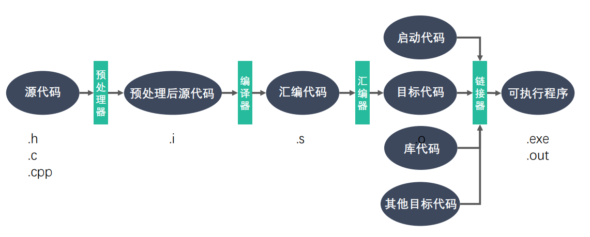

### 2. GCC 编译选项

| GCC 编译选项                            | 说明                                                         |
| --------------------------------------- | ------------------------------------------------------------ |
| -E                                      | 预处理指定的源文件，不进行编译                               |
| -S                                      | 编译指定的源文件，但是不进行汇编                             |
| -c                                      | 编译、汇编指定的源文件，但是不进行链接                       |
| [file2] -o [file1] / -o [file1] [file2] | 将文件 file2 编译成可执行文件 file1                          |
| -I directorcy                           | （大写 i ）指定 include 包含文件的搜索目录                   |
| -g                                      | 在编译的时候，生成调试信息，该程序可以被调试器调试           |
| -D                                      | 在程序编译的时候，指定一个宏                                 |
| -w                                      | 不生成任何警告信息                                           |
| -Wall                                   | 生成所有警告信息                                             |
| -On                                     | n的取值范围：0~3。编译器的优化选项的4个级别，-O0表 示没有优化，-O1为缺省值，-O3优化级别最高 |
| -l                                      | （小写 L）在程序编译的时候，指定使用的库                     |
| -L                                      | 指定编译的时候，搜索的库的路径                               |
| -fPIC/fpic                              | 生成与位置无关的代码                                         |
| -shared                                 | 生成共享目标文件，通常用在建立共享库时                       |
| -std                                    | 指定C方言，如:-std=c99，gcc默认的方言是GNU C                 |

### 3. GCC 和 G++ 的区别

gcc 和 g++ 都是 GNU（组织）的一个编译器。

**误区一：gcc 只能编译 c 代码，g++ 只能编译 c++ 代码**。

两者都可以，请注意： 

- 后缀为 .c 的，gcc 把它当作是 C 程序，而 g++ 当作是 c++ 程序 

- 后缀为 .cpp 的，两者都会认为是 C++ 程序，C++ 的语法规则更加严谨一些 

- 编译阶段，g++ 会调用 gcc，对于 C++ 代码，两者是等价的，但是因为 gcc 命令不能自动和 C++ 程序使用的库联接，所以通常用 g++ 来完成链接，为了统一起见，干脆编译/链接统统用 g++ 了，这就给人一种错觉，好像 cpp 程序只能用 g++ 似的

**误区二：gcc 不会定义 __cplusplus 宏，而 g++ 会** 

实际上，这个宏只是标志着编译器将会把代码按 C 还是 C++ 语法来解释

如上所述，如果后缀为 .c，并且采用 gcc 编译器，则该宏就是未定义的，否则， 就是已定义 

**误区三：编译只能用 gcc，链接只能用 g++**

- 严格来说，这句话不算错误，但是它混淆了概念，应该这样说：编译可以用 gcc/g++，而链接可以用 g++ 或者 gcc -lstdc++。
- gcc 命令不能自动和C++程序使用的库联接，所以通常使用 g++ 来完成联接。 但在编译阶段，g++ 会自动调用 gcc，二者等价


## 四、库文件

### 1. 什么是库

库文件是计算机上的一类文件，可以简单的把库文件看成一种代码仓库，它提供给使用者一些可以直接拿来用的变量、函数或类。 

库是特殊的一种程序，编写库的程序和编写一般的程序区别不大，只是库不能单独运行。

库文件有两种，静态库和动态库（共享库），区别是：静**态库在程序的链接阶段被复制到了程序中**；**动态库在链接阶段没有被复制到程序中，而是程序在运行时由系统动态加载到内存中供程序调用**。

库的好处

① 代码保密  ②方便部署和分发

静态库: GCC 进行链接时，会把静态库中代码打包到可执行程序中

动态库: GCC 进行链接时，动态库的代码不会被打包到可执行程序中

程序启动之后，动态库会被动态加载到内存中，通过  ldd （list dynamic dependencies）命令检查动态库依赖关系

**如何定位共享库文件呢？**

当系统加载可执行代码时候，能够知道其所依赖的库的名字，但是还需要知道绝对路径。此时就需要**系统的动态载入器来获取该绝对路径**。对于 elf 格式的可执行程序，是由 ld-linux.so 来完成的，它先后搜索 elf 文件的 DT_ RPATH 段->环境变量 LD_LIBRARY_PATH 一> /etc/ld.so.cache 文件列表 一> /lib/, /usr/lib 目录找到库文件后将其载入内存。

### 2. 静态库的制作

**命名规则**

- Linux：libxxx.a
  - lib：前缀（固定）
  - xxx：库的名字，自己起
  - .a：后缀（固定）
- Windows：libxxx.lib

**静态库的制作**

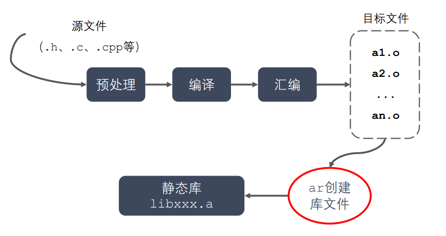

- gcc 获得 .o 文件

- 将 .o 文件打包，使用 ar 工具（archive）

  ```shell
  ar rcs libxxx.a xxx.o xxx.o
  # r - 将文件插入备存文件中
  # c - 建立备存文件
  # s - 索引
  ```

### 3. 动态库的制作

**命名规则**

- Linux：libxxx.so
  - lib：前缀（固定）
  - xxx：库的名字，自己起
  - .so：后缀（固定）
- Windows：libxxx.dll

**动态库的制作**

- gcc 获得 .o 文件，得到和位置无关的代码

  ```shell
  gcc -c -fpic/-fPIC a.c b.c
  ```

- gcc 得到动态库

  ```shell
  gcc -shared a.o b.o -o libcalc.so
  ```

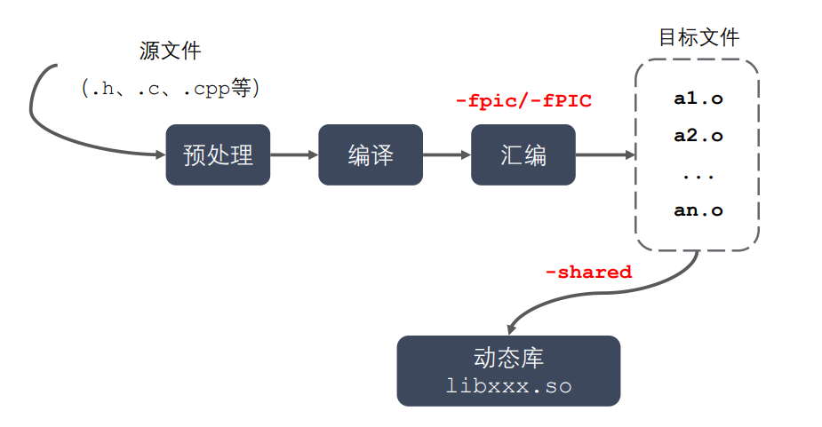

### 4. 静态库和动态库的对比

**程序编译成可执行程序的过程**

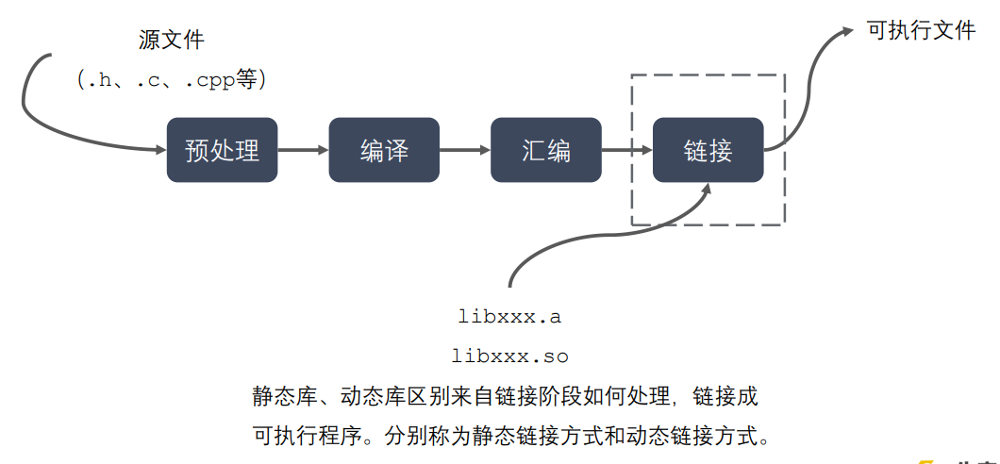

**静态库的优缺点**

- 优点
  - 静态库被打包到应用程序中加载速度快
  - 发布程序无需提供静态库，移植方便
- 缺点
  - 消耗系统资源，浪费内存
  - 更新、部署、发布麻烦

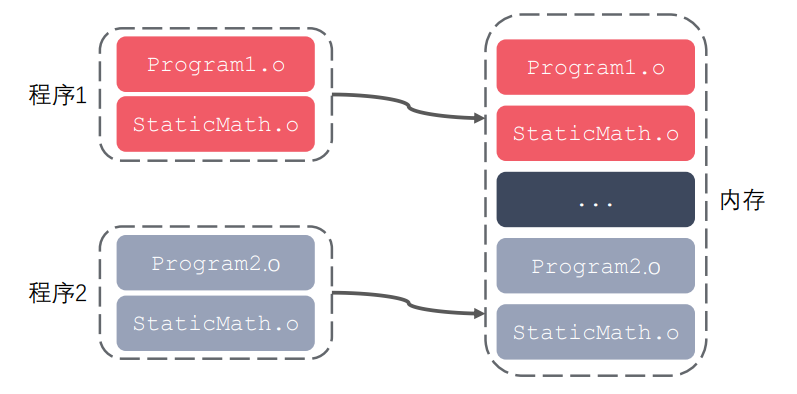

**动态库的优缺点**

- 优点
  - 可以实现进程间资源共享（共享库）
  - 更新、部署、发布简单
  - 可以控制何时加载动态库
- 缺点
  - 加载速度比静态库慢
  - 发布程序时需要提供依赖的动态库

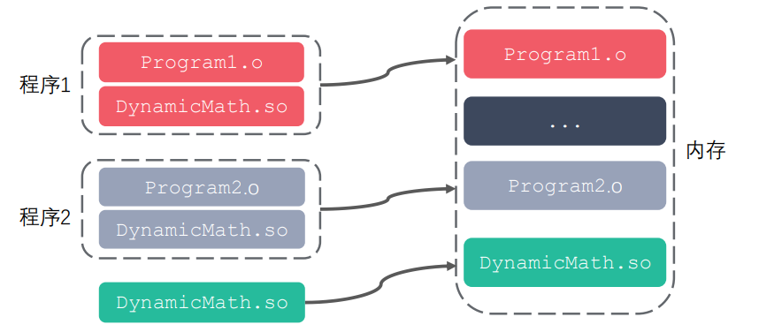


## 五、Makefile

### 1. 什么是 Makefile

- 一个工程中的源文件不计其数，其按类型、功能、模块分别放在若干个目录中， Makefile 文件定义了一系列的规则来指定哪些文件需要先编译，哪些文件需要后编译，哪些文件需要重新编译，甚至于进行更复杂的功能操作，因为 Makefile 文件就像一个 Shell 脚本一样，也可以执行操作系统的命令。

- Makefile 带来的好处就是 “自动化编译” ，一旦写好，只需要一个 make 命令，整个工程完全自动编译，极大的提高了软件开发的效率。make 是一个命令工具，是一个解释 Makefile 文件中指令的命令工具，一般来说，大多数的 IDE 都有这个命令， 比如 Delphi 的 make，Visual C++ 的 nmake，Linux 下 GNU 的 make。

### 2. Makefile 的规则

**文件命名**

makefile 或者 Makefile

**Makefile 规则**

- 一个 Makefile 文件中可以有一个或多个规则

  ```shell
  目标 ...: 依赖 ...
  	命令（shell 命令）
  	...
  ```

  目标：最终要生成的文件（伪目标除外）

  依赖：生成目标所需要的文件或是目标

  命令：通过执行命令对依赖操作生成目标（命令前必须 Tab 缩进）

- Makefile 中的其它规则一般都是为第一条规则服务的

- 命令执行前，需要先检查规则中的依赖是否存在

  - 如果存在，执行命令
  - 如果不存在，向下检查其它的规则，检查有没有一个规则是用来生成这个依赖的， 如果找到了，则执行该规则中的命令

- 检测更新，在执行规则中的命令时，会比较目标和依赖文件的时间

  - 如果依赖的时间比目标的时间晚，需要重新生成目标
  - 如果依赖的时间比目标的时间早，目标不需要更新，对应规则中的命令不需要被 执行

**变量**

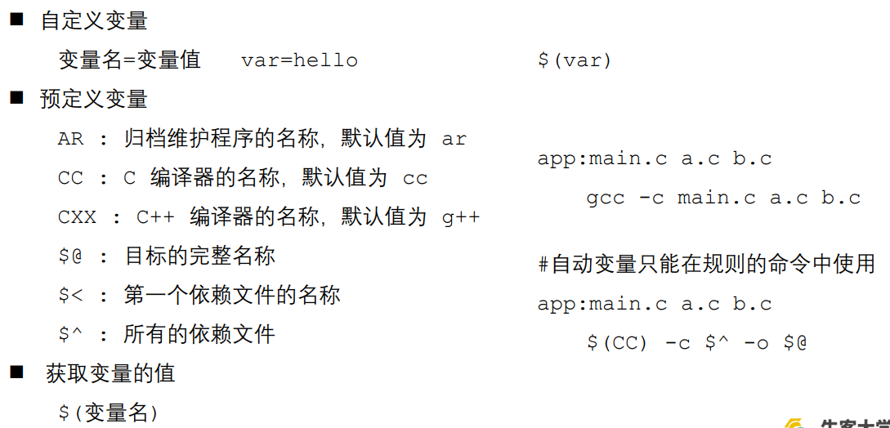

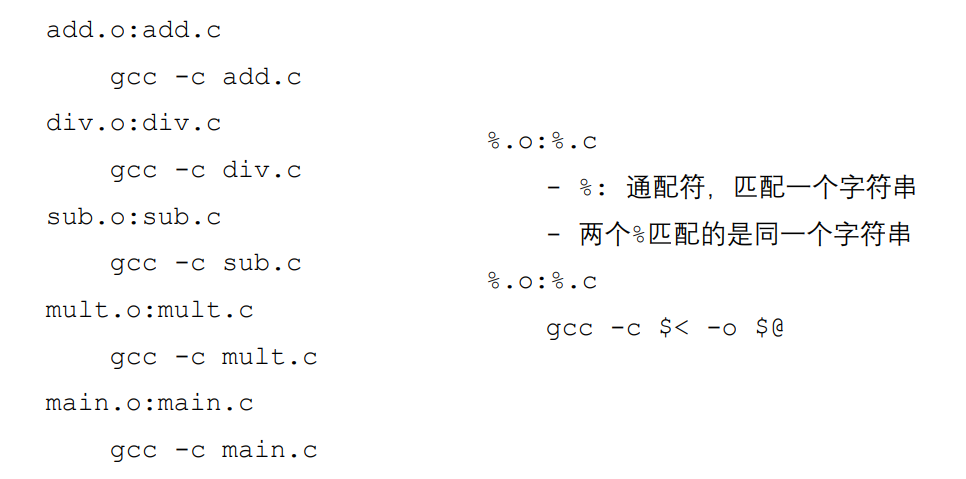

**函数**

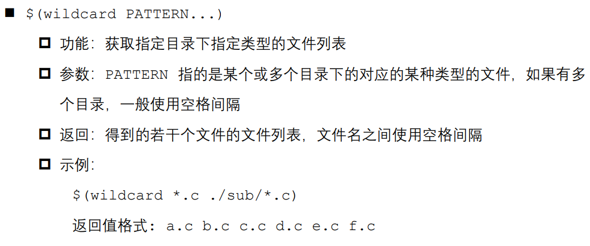

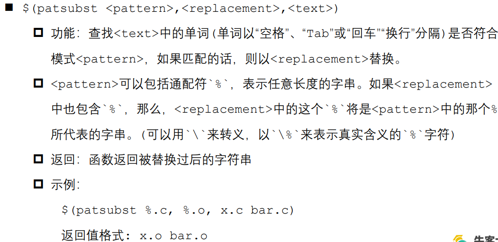


## 六、GDB 调试

### 1. 什么 GDB

GDB 是由 GNU 软件系统社区提供的调试工具，同 GCC 配套组成了一套完整的开发环境，GDB 是 Linux 和许多类 Unix 系统中的标准开发环境。 

一般来说，GDB 主要帮助你完成下面四个方面的功能： 

1. 启动程序，可以按照自定义的要求随心所欲的运行程序 
2. 可让被调试的程序在所指定的调置的断点处停住（断点可以是条件表达式）
3. 当程序被停住时，可以检查此时程序中所发生的事
4. 可以改变程序，将一个 BUG 产生的影响修正从而测试其他 BUG

### 2. 准备工作

通常，在为调试而编译时，我们会关掉编译器的优化选项（`-O`）， 并打开调试选项（`-g`）。另外，`-Wall` 在尽量不影响程序行为的情况下选项打开所有 warning，也可以发现许多问题，避免一些不必要的 BUG。 

```shell
gcc -g -Wall program.c -o program 
```

`-g` 选项的作用是在可执行文件中加入源代码的信息，比如可执行文件中第几条机 器指令对应源代码的第几行，但并不是把整个源文件嵌入到可执行文件中，所以在调 试时必须保证 gdb 能找到源文件。

### 3. GDB 命令

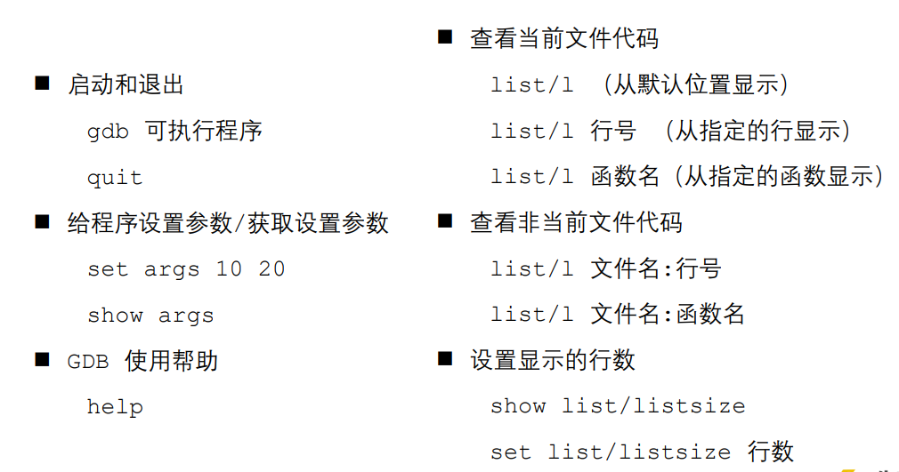

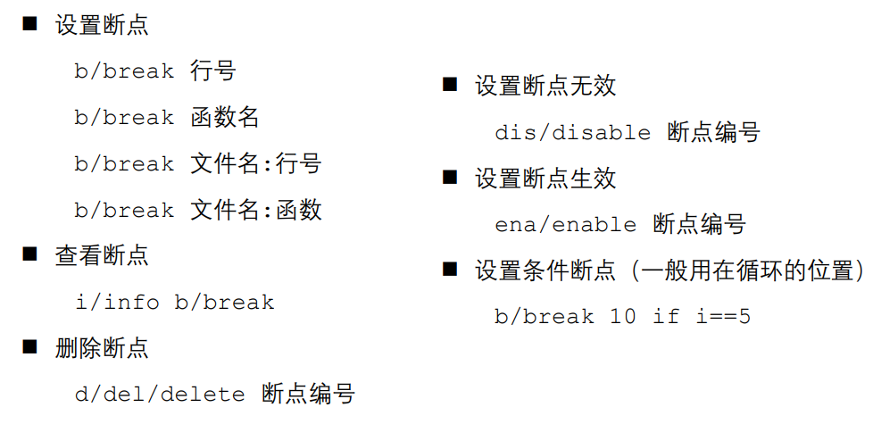

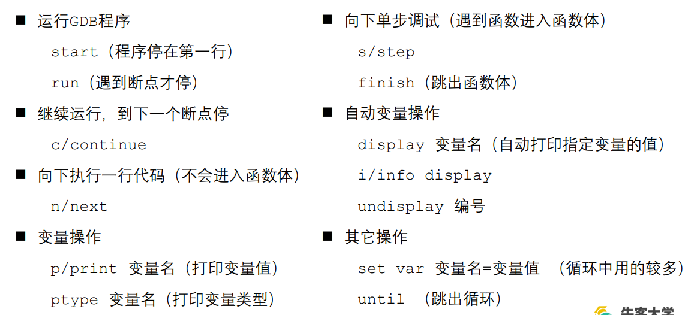


## 七、文件 IO

### 1. 标准 C 库 IO

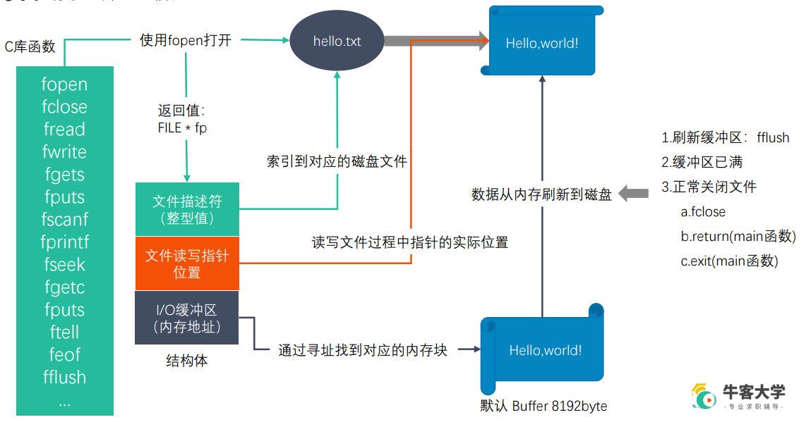

### 2. 标准 C 库 IO 和 Linux 系统 IO 的关系

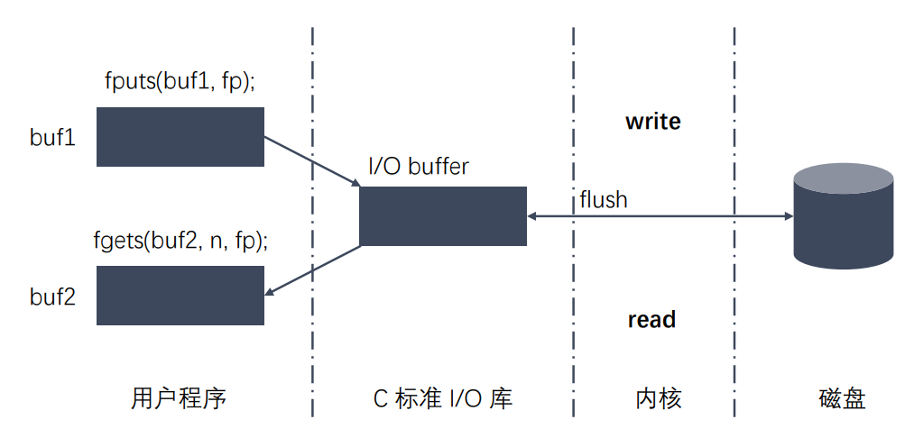

### 3. 虚拟地址空间

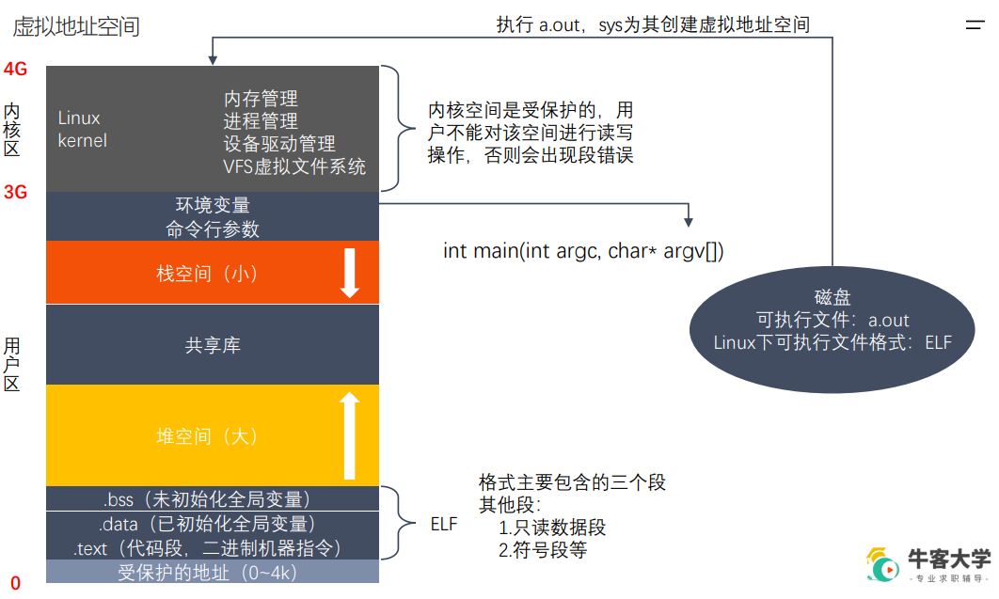

### 4. 文件描述符

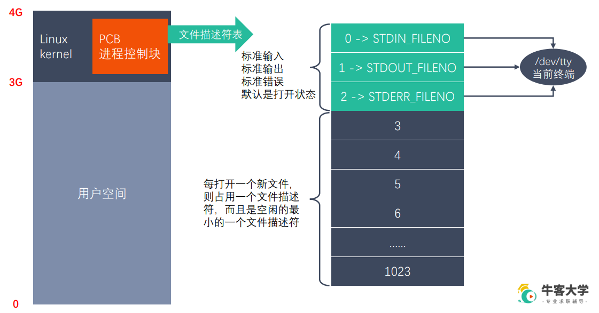

### 5. 常用函数

**Linux 系统 IO 函数**

```cpp
int open(const char *pathname, int flags);
int open(const char *pathname, int flags, mode_t mode);
int close(int fd);

#include <sys/types.h>
#include <sys/stat.h>
#include <fcntl.h>

// 打开一个已经存在的文件
int open(const char *pathname, int flags);
    参数：
        - pathname：要打开的文件路径
        - flags：对文件的操作权限设置还有其他的设置
        O_RDONLY,  O_WRONLY,  O_RDWR  这三个设置是互斥的
    返回值：返回一个新的文件描述符，如果调用失败，返回-1

errno：属于Linux系统函数库，库里面的一个全局变量，记录的是最近的错误号。

#include <stdio.h>
void perror(const char *s);
	作用：打印errno对应的错误描述
	参数：用户描述，比如hello,最终输出的内容是  hello:xxx(实际的错误描述)
    

// 创建一个新的文件
int open(const char *pathname, int flags, mode_t mode);

#include <sys/types.h>
#include <sys/stat.h>
#include <fcntl.h>

int open(const char *pathname, int flags, mode_t mode);
    参数：
        - pathname：要创建的文件的路径
        - flags：对文件的操作权限和其他的设置
        - 必选项：O_RDONLY,  O_WRONLY, O_RDWR  这三个之间是互斥的
        - 可选项：O_CREAT 文件不存在，创建新文件
        - mode：八进制的数，表示创建出的新的文件的操作权限，比如：0775
        最终的权限是：mode & ~umask
        0777   ->   111111111
        &   0775   ->   111111101
        ----------------------------
        111111101
        按位与：0和任何数都为0
        umask的作用就是抹去某些权限。

        flags参数是一个int类型的数据，占4个字节，32位。
        flags 32个位，每一位就是一个标志位。
```

```cpp
ssize_t read(int fd, void *buf, size_t count);
ssize_t write(int fd, const void *buf, size_t count);

#include <unistd.h>
ssize_t read(int fd, void *buf, size_t count);
    参数：
        - fd：文件描述符，open得到的，通过这个文件描述符操作某个文件
        - buf：需要读取数据存放的地方，数组的地址（传出参数）
        - count：指定的数组的大小
    返回值：
        - 成功：
            >0: 返回实际的读取到的字节数
            =0：文件已经读取完了
        - 失败：-1 ，并且设置errno

#include <unistd.h>
ssize_t write(int fd, const void *buf, size_t count);
    参数：
        - fd：文件描述符，open得到的，通过这个文件描述符操作某个文件
        - buf：要往磁盘写入的数据，数据
        - count：要写的数据的实际的大小
    返回值：
        成功：实际写入的字节数
        失败：返回-1，并设置errno
```

```cpp
off_t lseek(int fd, off_t offset, int whence);

// 标准C库的函数
#include <stdio.h>
int fseek(FILE *stream, long offset, int whence);

// Linux系统函数
#include <sys/types.h>
#include <unistd.h>
off_t lseek(int fd, off_t offset, int whence);
    参数：
        - fd：文件描述符，通过open得到的，通过这个fd操作某个文件
        - offset：偏移量
        - whence:
    		SEEK_SET
        	设置文件指针的偏移量
        	SEEK_CUR
        	设置偏移量：当前位置 + 第二个参数offset的值
        	SEEK_END
        	设置偏移量：文件大小 + 第二个参数offset的值
    返回值：返回文件指针的位置

    作用：
        1.移动文件指针到文件头
            lseek(fd, 0, SEEK_SET);

        2.获取当前文件指针的位置
            lseek(fd, 0, SEEK_CUR);

        3.获取文件长度
            lseek(fd, 0, SEEK_END);

        4.拓展文件的长度，当前文件10b, 110b, 增加了100个字节
            lseek(fd, 100, SEEK_END)
            注意：需要写一次数据
```

```cpp
int stat(const char *pathname, struct stat *statbuf);
int lstat(const char *pathname, struct stat *statbuf);

struct stat {
    dev_t st_dev; // 文件的设备编号
    ino_t st_ino; // 节点
    mode_t st_mode; // 文件的类型和存取的权限
    nlink_t st_nlink; // 连到该文件的硬连接数目
    uid_t st_uid; // 用户ID
    gid_t st_gid; // 组ID
    dev_t st_rdev; // 设备文件的设备编号
    off_t st_size; // 文件字节数(文件大小)
    blksize_t st_blksize; // 块大小
    blkcnt_t st_blocks; // 块数
    time_t st_atime; // 最后一次访问时间
    time_t st_mtime; // 最后一次修改时间
    time_t st_ctime; // 最后一次改变时间(指属性)
};

#include <sys/types.h>
#include <sys/stat.h>
#include <unistd.h>

int stat(const char *pathname, struct stat *statbuf);
    作用：获取一个文件相关的一些信息
    参数:
    	- pathname：操作的文件的路径
        - statbuf：结构体变量，传出参数，用于保存获取到的文件的信息
    返回值：
        成功：返回0
        失败：返回-1 设置errno

int lstat(const char *pathname, struct stat *statbuf);
    参数:
    	- pathname：操作的文件的路径
        - statbuf：结构体变量，传出参数，用于保存获取到的文件的信息
    返回值：
        成功：返回0
        失败：返回-1 设置errno
```

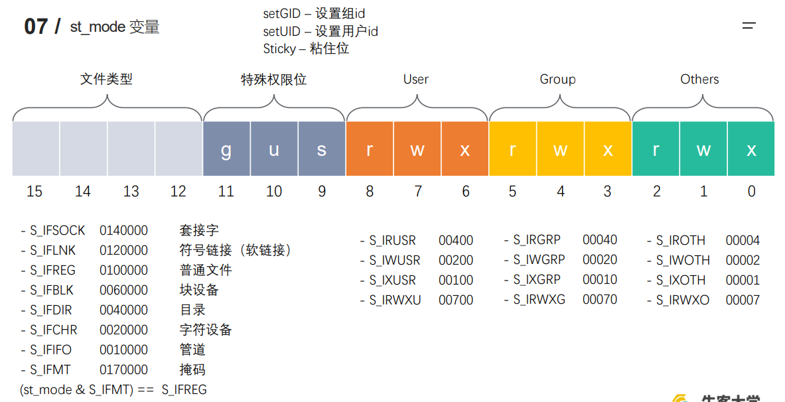

**文件属性操作函数**

```cpp
int access(const char *pathname, int mode);

#include <unistd.h>
int access(const char *pathname, int mode);
    作用：判断某个文件是否有某个权限，或者判断文件是否存在
    参数：
        - pathname: 判断的文件路径
        - mode:
			R_OK: 判断是否有读权限
    		W_OK: 判断是否有写权限
        	X_OK: 判断是否有执行权限
            F_OK: 判断文件是否存在
    返回值：成功返回0， 失败返回-1
```

```cpp
int chmod(const char *filename, int mode);

#include <sys/stat.h>
int chmod(const char *pathname, mode_t mode);
    作用：修改文件的权限
    参数：
        - pathname: 需要修改的文件的路径
        - mode: 需要修改的权限值，八进制的数
    返回值：成功返回0，失败返回-1
```

```cpp
int chown(const char *path, uid_t owner, gid_t group);
int truncate(const char *path, off_t length);

#include <unistd.h>
#include <sys/types.h>
int truncate(const char *path, off_t length);
    作用：缩减或者扩展文件的尺寸至指定的大小
    参数：
        - path: 需要修改的文件的路径
        - length: 需要最终文件变成的大小
    返回值：
        成功返回0， 失败返回-1
```

**目录操作函数**

```cpp
int rename(const char *oldpath, const char *newpath);
int chdir(const char *path);
char *getcwd(char *buf, size_t size);
int mkdir(const char *pathname, mode_t mode);
int rmdir(const char *pathname);


#include <unistd.h>
int chdir(const char *path);
    作用：修改进程的工作目录
        比如在/home/nowcoder 启动了一个可执行程序a.out, 进程的工作目录 /home/nowcoder
    参数：
        path : 需要修改的工作目录

#include <unistd.h>
char *getcwd(char *buf, size_t size);
    作用：获取当前工作目录
    参数：
        - buf : 存储的路径，指向的是一个数组（传出参数）
        - size: 数组的大小
    返回值：
    	返回的指向的一块内存，这个数据就是第一个参数
            
#include <sys/stat.h>
#include <sys/types.h>
int mkdir(const char *pathname, mode_t mode);
    作用：创建一个目录
    参数：
        pathname: 创建的目录的路径
        mode: 权限，八进制的数
    返回值：
        成功返回0， 失败返回-1
```

**目录遍历函数**

```cpp
DIR *opendir(const char *name);
struct dirent *readdir(DIR *dirp);
int closedir(DIR *dirp);

// 打开一个目录
#include <sys/types.h>
#include <dirent.h>
DIR *opendir(const char *name);
	参数：
    	- name: 需要打开的目录的名称
    返回值：
        DIR * 类型，理解为目录流
        错误返回NULL

// 读取目录中的数据
#include <dirent.h>
struct dirent *readdir(DIR *dirp);
	- 参数：dirp是opendir返回的结果
    - 返回值：
    	struct dirent，代表读取到的文件的信息
        读取到了末尾或者失败了，返回NULL

struct dirent {
    // 此目录进入点的inode
    ino_t d_ino; 
    // 目录文件开头至此目录进入点的位移
    off_t d_off; 
    // d_name 的长度, 不包含NULL字符
    unsigned short int d_reclen; 
    // d_name 所指的文件类型
    unsigned char d_type; 
    // 文件名
    char d_name[256];
};

d_type
    DT_BLK - 块设备
    DT_CHR - 字符设备
    DT_DIR - 目录
    DT_LNK - 软连接
    DT_FIFO - 管道
    DT_REG - 普通文件
    DT_SOCK - 套接字
    DT_UNKNOWN - 未知
            
// 关闭目录
#include <sys/types.h>
#include <dirent.h>
int closedir(DIR *dirp);
```

**dup、dup2、fcntl**

```cpp
// 复制文件描述符
int dup(int oldfd);
// 重定向文件描述符
int dup2(int oldfd, int newfd);
//复制文件描述符
//设置/获取文件的状态标志
int fcntl(int fd, int cmd, ... /* arg */ );


#include <unistd.h>
int dup(int oldfd);
    作用：复制一个新的文件描述符
        fd=3, int fd1 = dup(fd),
        fd指向的是a.txt, fd1也是指向a.txt
        从空闲的文件描述符表中找一个最小的，作为新的拷贝的文件描述符

            
#include <unistd.h>
int dup2(int oldfd, int newfd);
    作用：重定向文件描述符
        oldfd 指向 a.txt, newfd 指向 b.txt
        调用函数成功后：newfd 和 b.txt 做close, newfd 指向了 a.txt
        oldfd 必须是一个有效的文件描述符
        oldfd和newfd值相同，相当于什么都没有做

        
#include <unistd.h>
#include <fcntl.h>
int fcntl(int fd, int cmd, ...);
    参数：
        fd : 表示需要操作的文件描述符
        cmd: 表示对文件描述符进行如何操作
            - F_DUPFD : 复制文件描述符,复制的是第一个参数fd，得到一个新的文件描述符（返回值）
                int ret = fcntl(fd, F_DUPFD);

            - F_GETFL : 获取指定的文件描述符文件状态flag
              获取的flag和我们通过open函数传递的flag是一个东西。

            - F_SETFL : 设置文件描述符文件状态flag
              必选项：O_RDONLY, O_WRONLY, O_RDWR 不可以被修改
              可选性：O_APPEND, O)NONBLOCK
                O_APPEND 表示追加数据
                NONBLOK 设置成非阻塞
        
        阻塞和非阻塞：描述的是函数调用的行为。
```


## 八、进程概述

### 1. 程序与进程

程序是包含一系列信息的文件，这些信息描述了如何在运行时创建一个进程： 

- 二进制格式标识：每个程序文件都包含用于描述可执行文件格式的元信息。内核利用此信息来解释文件中的其他信息。（ELF可执行连接格式）
- 机器语言指令：对程序算法进行编码。
- 程序入口地址：标识程序开始执行时的起始指令位置。
- 数据：程序文件包含的变量初始值和程序使用的字面量值（比如字符串）。
- 符号表及重定位表：描述程序中函数和变量的位置及名称。这些表格有多重用途，其中包括调试和运行时的符号解析（动态链接）。
- 共享库和动态链接信息：程序文件所包含的一些字段，列出了程序运行时需要使用的共享库，以及加载共享库的动态连接器的路径名。
- 其他信息：程序文件还包含许多其他信息，用以描述如何创建进程。

**进程是正在运行的程序的实例**。是一个具有一定独立功能的程序关于某个数据集合的一次运行活动。它是操作系统动态执行的基本单元，在传统的操作系统中，进程既是基本的分配单元，也是基本的执行单元。

可以用一个程序来创建多个进程，进程是由内核定义的抽象实体，并为该实体分配用以执行程序的各项系统资源。从内核的角度看，进程由用户内存空间和一系列内核数据结构组成，其中用户内存空间包含了程序代码及代码所使用的变量，而内核数据结构则用于维护进程状态信息。记录在内核数据结构中的信息包括许多与进程相关的标识号（IDs）、虚拟内存表、打开文件的描述符表、信号传递及处理的有关信息、进程资源使用及限制、当前工作目录和大量的其他信息。

### 2. 单道、多道程序设计

单道程序，即在计算机内存中只允许一个的程序运行。

多道程序设计技术是在计算机内存中同时存放几道相互独立的程序，使它们在管理程序控制下，相互穿插运行，两个或两个以上程序在计算机系统中同处于开始到结束之间的状态，这些程序共享计算机系统资源。引入多道程序设计技术的根本目的是为了提高 CPU 的利用率。 

对于一个单 CPU 系统来说，程序同时处于运行状态只是一种宏观上的概念，他们虽然都已经开始运行，但就微观而言，任意时刻，CPU 上运行的程序只有一个。

在多道程序设计模型中，多个进程轮流使用 CPU。而当下常见 CPU 为纳秒级，1秒可以执行大约 10 亿条指令。由于人眼的反应速度是毫秒级，所以看似同时在运行。

### 3. 时间片

时间片（timeslice）又称为 “量子（quantum）” 或  “处理器片（processor slice）” 是操作系统分配给每个正在运行的进程微观上的一段 CPU 时间。事实上，虽然一台计算机通常可能有多个 CPU，但是同一个 CPU 永远不可能真正地同时运行多个任务。

在只考虑一个 CPU 的情况下，这些进程“看起来像”同时运行的，实则是轮番穿插地运行， 由于时间片通常很短（在 Linux 上为 5ms－800ms），用户不会感觉到。 

时间片由操作系统内核的调度程序分配给每个进程。首先，内核会给每个进程分配相等的初始时间片，然后每个进程轮番地执行相应的时间，当所有进程都处于时间片耗尽的状态时，内核会重新为每个进程计算并分配时间片，如此往复。

### 4. 并行与并发

- 并行（parallel）：指在同一时刻，有多条指令在多个处理器上同时执行。
- 并发（concurrency）：指在同一时刻只能有一条指令执行，但多个进程指令被快速的轮换执行，使得在宏观上具有多个进程同时执行的效果，但在微观上并不是同时执行的，只是把时间分成若干段，使多个进程快速交替的执行。

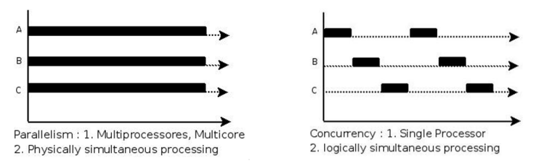

### 5. 进程控制块 PCB

为了管理进程，内核必须对每个进程所做的事情进行清楚的描述。内核为每个进程分配一个 PCB（Processing Control Block）进程控制块，维护进程相关的信息，Linux 内核的进程控制块是 task_struct 结构体。

在 /usr/src/linux-headers-xxx/include/linux/sched.h 文件中可以查看 struct task_struct 结构体定义。其内部成员有很多，我们只需要掌握以下部分即可：

- 进程 id：系统中每个进程有唯一的 id，用 pid_t 类型表示，其实就是一个非负整数
- 进程的状态：有就绪、运行、挂起、停止等状态
- 进程切换时需要保存和恢复的一些 CPU 寄存器
- 描述虚拟地址空间的信息
- 描述控制终端的信息
- 当前工作目录（Current Working Directory）
- umask 掩码
- 文件描述符表，包含很多指向 file 结构体的指针
- 和信号相关的信息
- 用户 id 和组 id
- 会话（Session）和进程组
- 进程可以使用的资源上限（Resource Limit）


## 九、进程状态转换

### 1. 进程的状态

进程状态反映进程执行过程的变化。这些状态随着进程的执行和外界条件的变化而转换。

在三态模型中，进程状态分为三个基本状态，即就绪态，运行态，阻塞态。

在五态模型 中，进程分为新建态、就绪态，运行态，阻塞态，终止态。

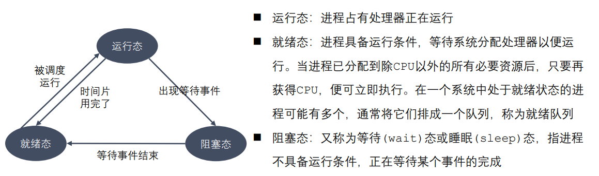

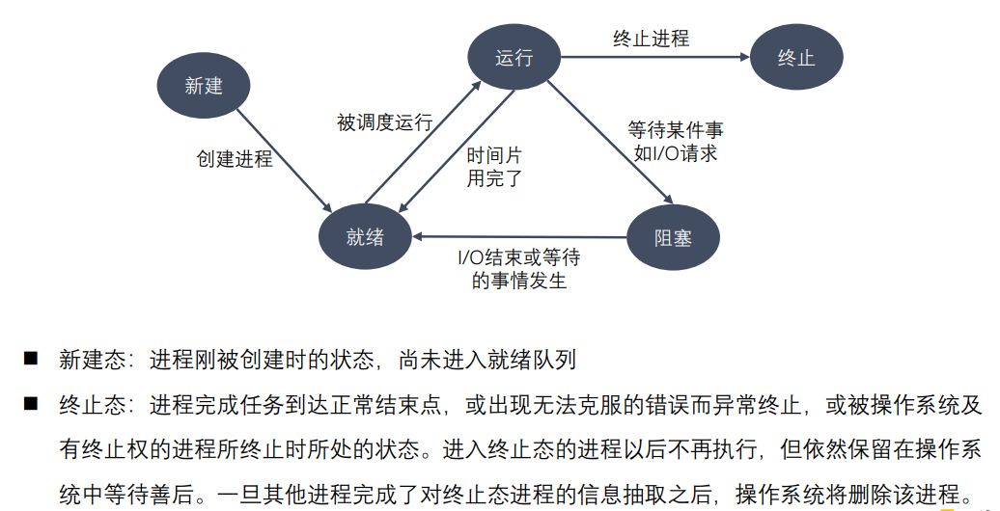

```shell
# 查看进程
ps aux / ajx
	# a：显示终端上的所有进程，包括其他用户的进程
	# u：显示进程的详细信息
	# x：显示没有控制终端的进程
	# j：列出与作业控制相关的信息

# STAT参数意义：
	# D 不可中断 Uninterruptible（usually IO）
    # R 正在运行，或在队列中的进程
    # S(大写) 处于休眠状态
    # T 停止或被追踪
    # Z 僵尸进程
    # W 进入内存交换（从内核2.6开始无效）
    # X 死掉的进程
    # < 高优先级
    # N 低优先级
    # s 包含子进程
    # + 位于前台的进程组
```

```shell
# 实时显示进程动态
top
#可以在使用 top 命令时加上 -d 来指定显示信息更新的时间间隔，在 top 命令
#执行后，可以按以下按键对显示的结果进行排序：
	# M 根据内存使用量排序
	# P 根据 CPU 占有率排序
	# T 根据进程运行时间长短排序
	# U 根据用户名来筛选进程
	# K 输入指定的 PID 杀死进程
```

```shell
# 杀死进程
kill [-signal] pid
kill –l 列出所有信号
kill –SIGKILL 进程ID
kill -9 进程ID
killall name 根据进程名杀死进程
```

### 2. 进程号和相关函数

每个进程都由进程号来标识，其类型为 pid_t（整型），进程号的范围：0～32767。 **进程号总是唯一的，但可以重用**。当一个进程终止后，其进程号就可以再次使用。 

**任何进程（除 init 进程）都是由另一个进程创建**，该进程称为被创建进程的父进程， 对应的进程号称为父进程号（PPID）。

进程组是一个或多个进程的集合。他们之间相互关联，进程组可以接收同一终端的各种信号，关联的进程有一个进程组号（PGID）。默认情况下，当前的进程号会当做当前的进程组号。

进程号和进程组相关函数：

- `pid_t getpid(void); `
- `pid_t getppid(void); `
- `pid_t getpgid(pid_t pid);`


## 十、进程创建

### 1. 进程创建

系统允许一个进程创建新进程，新进程即为子进程，子进程还可以创建新的子进程，形成进程树结构模型。 

```cpp
#include <sys/types.h>
#include <unistd.h>
pid_t fork(void);

// 返回值：
// 		成功：子进程中返回 0，父进程中返回子进程 ID
// 		失败：返回 -1
// 失败的两个主要原因：
// 		1. 当前系统的进程数已经达到了系统规定的上限，这时 errno 的值被设置为 EAGAIN
// 		2. 系统内存不足，这时 errno 的值被设置为 ENOMEM
```

### 2. GDB 多进程调试

使用 GDB 调试的时候，GDB 默认只能跟踪一个进程，可以在 fork 函数调用之前，通过指令设置 GDB 调试工具跟踪父进程或者是跟踪子进程，默认跟踪父进程。

设置调试父进程或者子进程：`set follow-fork-mode [parent（默认）| child]`

设置调试模式：`set detach-on-fork [on | off]` 默认为 on，表示调试当前进程的时候，其它的进程继续运行，如果为 off，调试当前进 程的时候，其它进程被 GDB 挂起。

查看调试的进程：`info inferiors`

切换当前调试的进程：`inferior id`

使进程脱离 GDB 调试：`detach inferiors id`